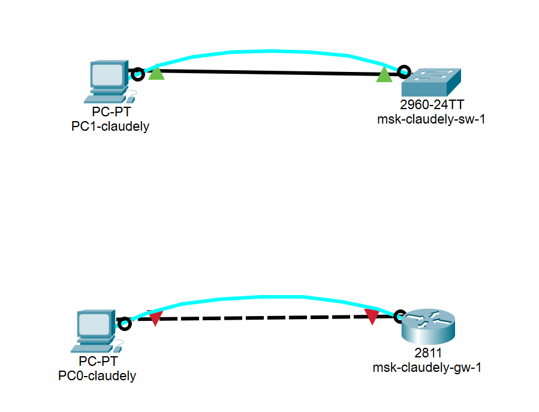
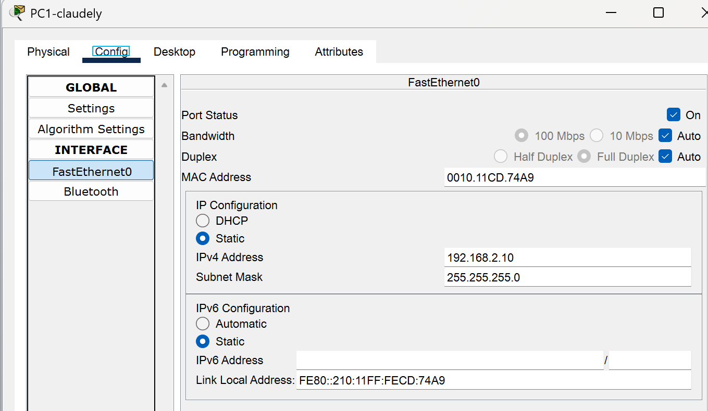
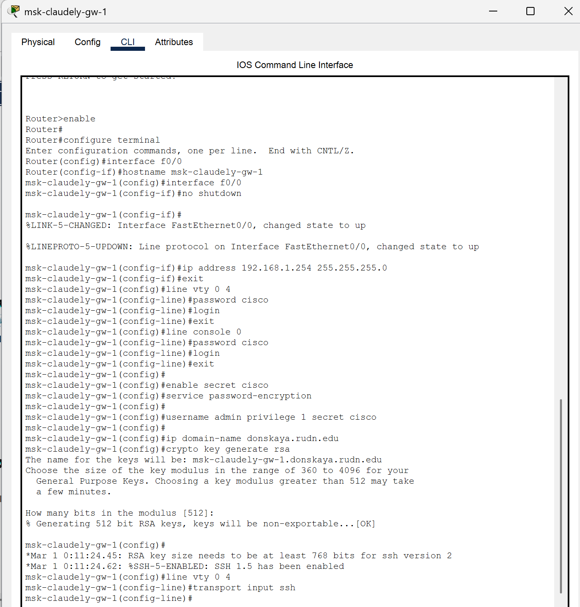
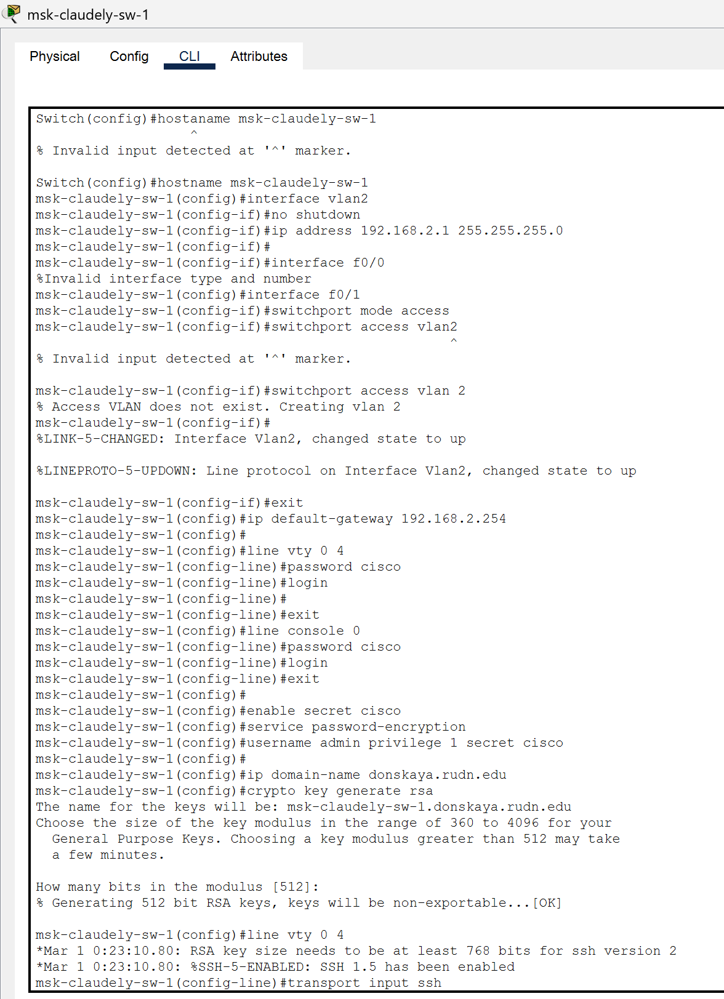
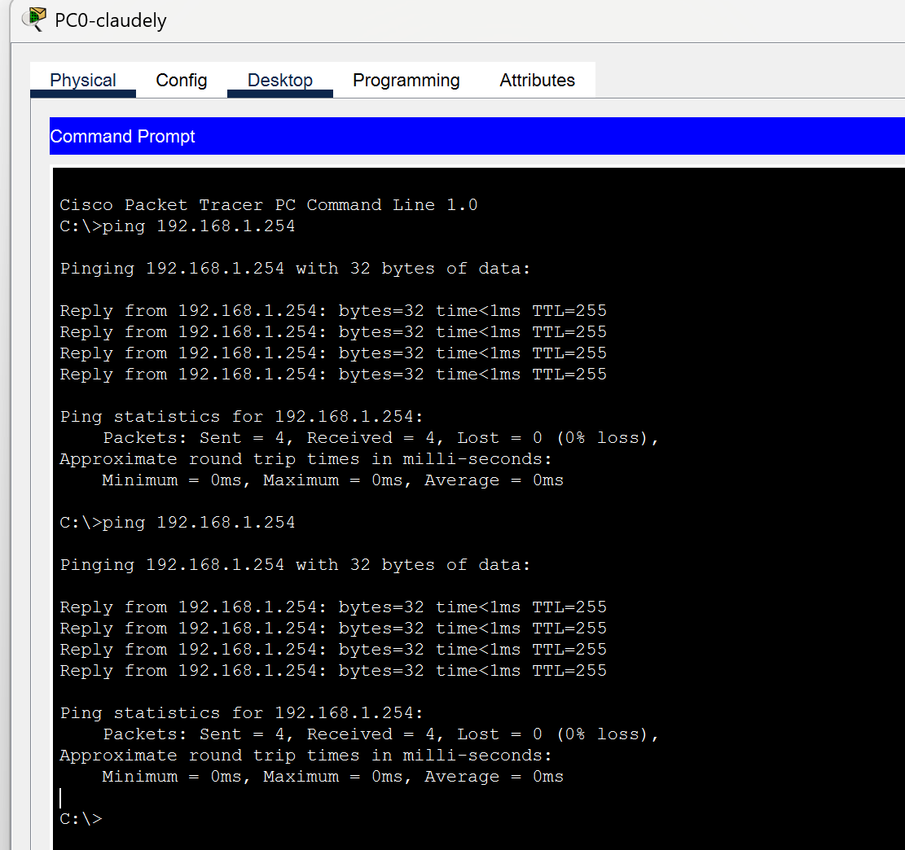

---
## Front matter
lang: ru-RU
title: Лабораторная работа №2
subtitle: Администрирование локальных сетей
author:
  - Бансимба К. Д.
institute:
  - Российский университет дружбы народов, Москва, Россия
date: 25/03/2025

## i18n babel
babel-lang: russian
babel-otherlangs: english

## Formatting pdf
toc: false
toc-title: Содержание
slide_level: 2
aspectratio: 169
section-titles: true
theme: metropolis
header-includes:
 - \metroset{progressbar=frametitle,sectionpage=progressbar,numbering=fraction}
---

# Информация

## Докладчик

:::::::::::::: {.columns align=center}
::: {.column width="70%"}

  * Бансимба Клодели Дьегра
  * студент
  * Российский университет дружбы народов
  * [1032215651@pfur.ru](mailto:1032215651@pfur.ru)
 
:::
::: {.column width="30%"}

:::
::::::::::::::

## Цель работы

Получить основные навыки по начальному конфигурированию оборудования Cisco.

## Выполнение лабораторной работы

Создадим новый проект с названием lab_PT-02.pkt.

{#fig:001 width=70%}

## Выполнение лабораторной работы

В логической рабочей области Packet Tracer разместим коммутатор, маршрутизатор и 2 оконечных устройства типа PC, соединим один PC с маршрутизатором, другой PC — с коммутатором. После чего, щёлкнув последовательно на каждом оконечном устройстве, зададим статические IP-адреса : 
192.168.1.10
192.168.2.10 
с маской подсети 255.255.255.0 

## Выполнение лабораторной работы

{#fig:002 width=50%}

## Выполнение лабораторной работы

{#fig:003 width=70%}

## Выполнение лабораторной работы

Проведём настройку маршрутизатора в соответствии с заданием.

{#fig:004 width=40%}

## Выполнение лабораторной работы

Теперь проведём настройку коммутатора в соответствии с заданием 

## Выполнение лабораторной работы

{#fig:005 width=30%}

## Выполнение лабораторной работы

Далее проверим работоспособность соединений с помощью команды ping

## Выполнение лабораторной работы

{#fig:006 width=40%}

# Выводы

В ходе выполнения лабораторной работы были получены основные навыки по начальному конфигурированию оборудования Cisco.

