---
## Front matter
lang: ru-RU
title: Лабораторная работа №3
subtitle: Администрирование локальных сетей
author:
  - Бансимба К. Д.
institute:
  - Российский университет дружбы народов, Москва, Россия
date: 25/03/2025

## i18n babel
babel-lang: russian
babel-otherlangs: english

## Formatting pdf
toc: false
toc-title: Содержание
slide_level: 2
aspectratio: 169
section-titles: true
theme: metropolis
header-includes:
 - \metroset{progressbar=frametitle,sectionpage=progressbar,numbering=fraction}
---

# Информация

## Докладчик

:::::::::::::: {.columns align=center}
::: {.column width="70%"}

  * Бансимба Клодели Дьегра
  * студент
  * Российский университет дружбы народов
  * [1032215651@pfur.ru](mailto:1032215651@pfur.ru)
 
:::
::: {.column width="30%"}

:::
::::::::::::::

## Цель работы

Познакомиться с принципами планирования локальной сети организации.

## задачи
1. Используя графический редактор (например, Dia), требуется повторить схемы L1, L2, L3, а также сопутствующие им таблицы VLAN, IP-адресов и портов подключения оборудования планируемой сети.
2. Рассмотренный выше пример планирования адресного пространства сети базируется на разбиении сети 10.128.0.0/16 на соответствующие подсети.Требуется сделать аналогичный план адресного пространства для сетей 172.16.0.0/12 и 192.168.0.0/16 с соответствующими схемами сети и сопутствующими таблицами VLAN, IP-адресов и портов подключения оборудования.
3. При выполнении работы необходимо учитывать соглашение об именовании.

## Выполнение лабораторной работы

Используя графический редактор (Dia), повторим схемы L1 , L2, L3, а также сопутствующие им таблицы VLAN, IP-адресов и портов подключения оборудования планируемой сети.

## Выполнение лабораторной работы

{#fig:001 width=70%}

## Выполнение лабораторной работы

{#fig:002 width=70%}

## Выполнение лабораторной работы

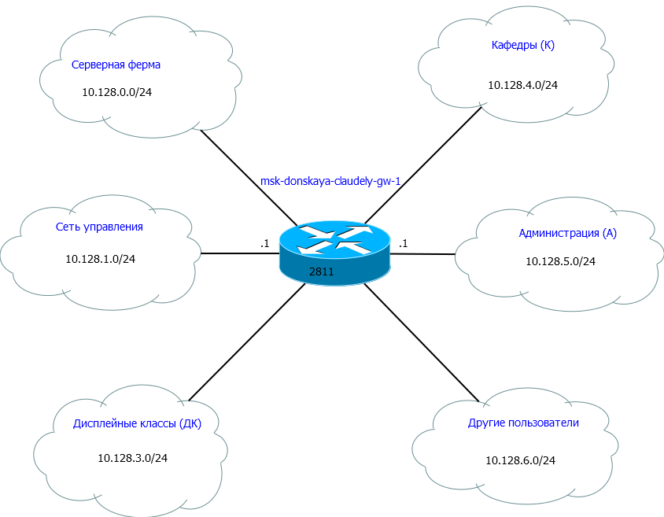{#fig:003 width=40%}

## Выполнение лабораторной работы

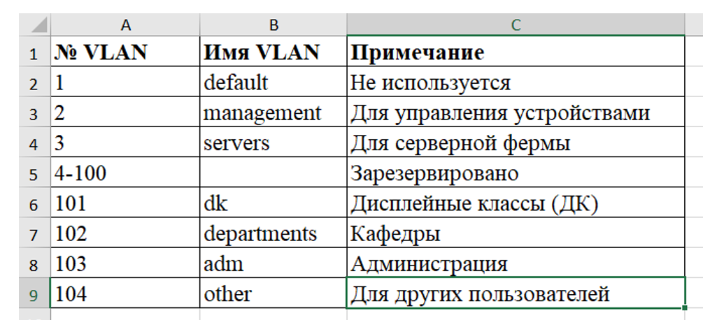{#fig:004 width=70%}

## Выполнение лабораторной работы

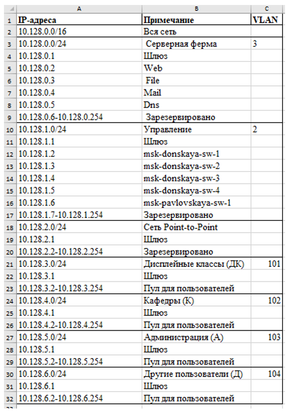{#fig:005 width=30%}

## Выполнение лабораторной работы

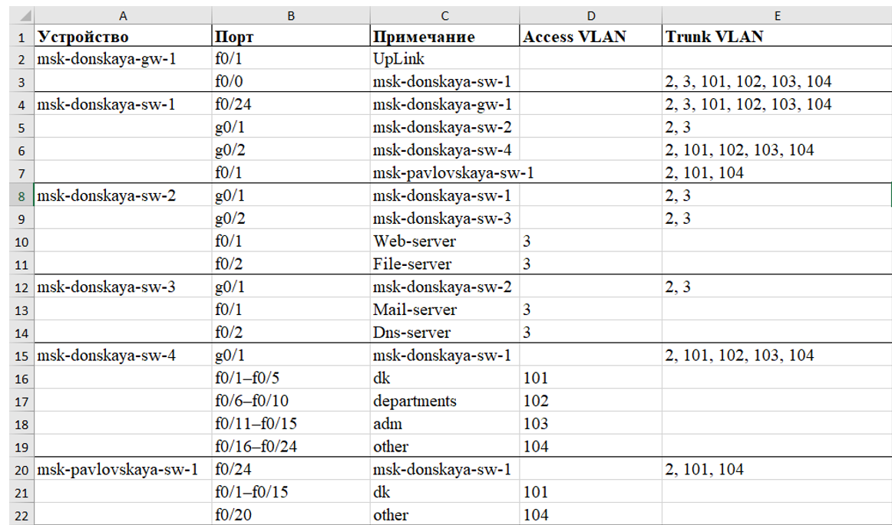{#fig:006 width=70%}

## Выполнение лабораторной работы

Теперь сделаем аналогичный план адресного пространства для сетей 172.16.0.0/12 и 192.168.0.0/16 с соответствующими схемами сети (L1, L2, L3) и сопутствующими таблицами VLAN, IP-адресов и портов подключения оборудования:

## Выполнение лабораторной работы

{#fig:007 width=70%}

## Выполнение лабораторной работы

{#fig:008 width=70%}

## Выполнение лабораторной работы

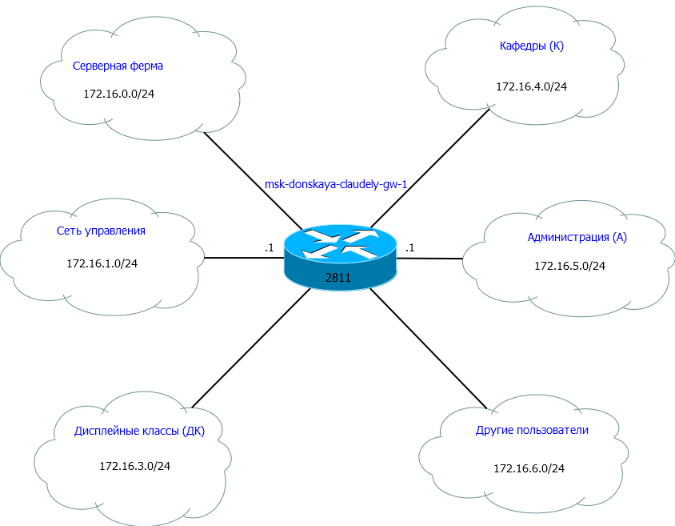{#fig:009 width=60%}

## Выполнение лабораторной работы

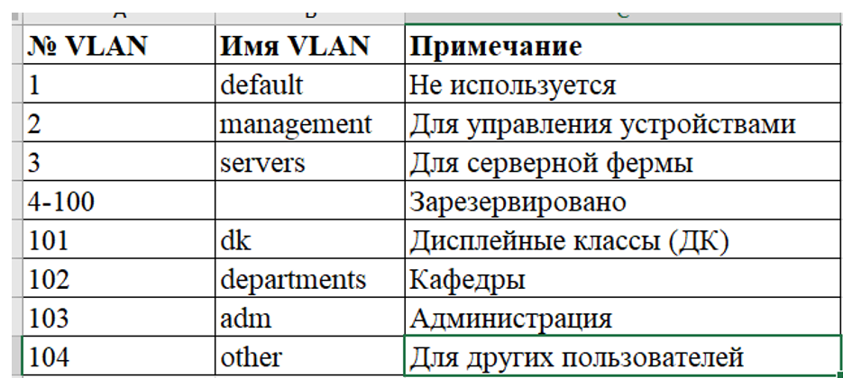{#fig:010 width=70%}

## Выполнение лабораторной работы

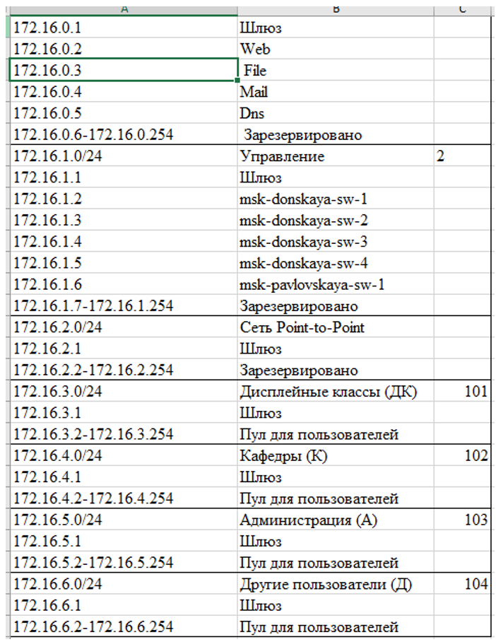{#fig:011 width=30%}

## Выполнение лабораторной работы

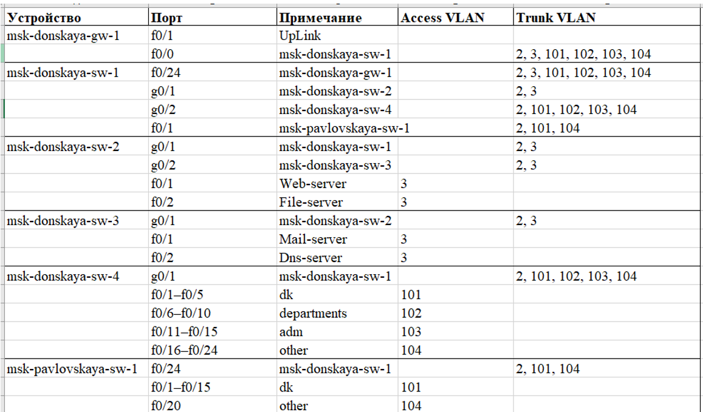{#fig:012 width=70%}

## Выполнение лабораторной работы

{#fig:013 width=70%}

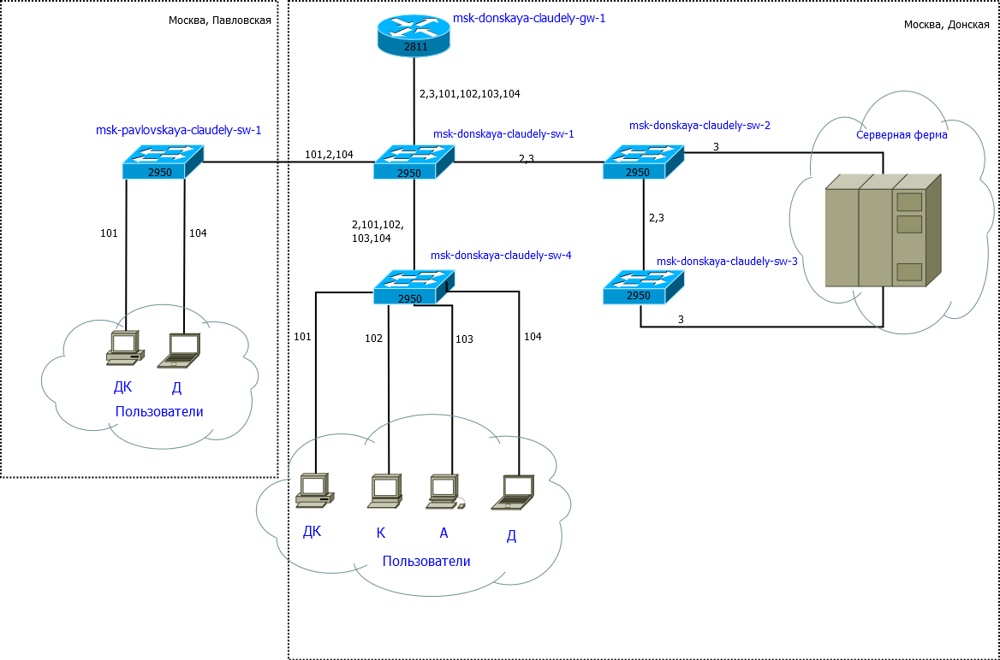{#fig:014 width=30%}

## Выполнение лабораторной работы

{#fig:015 width=70%}

## Выполнение лабораторной работы

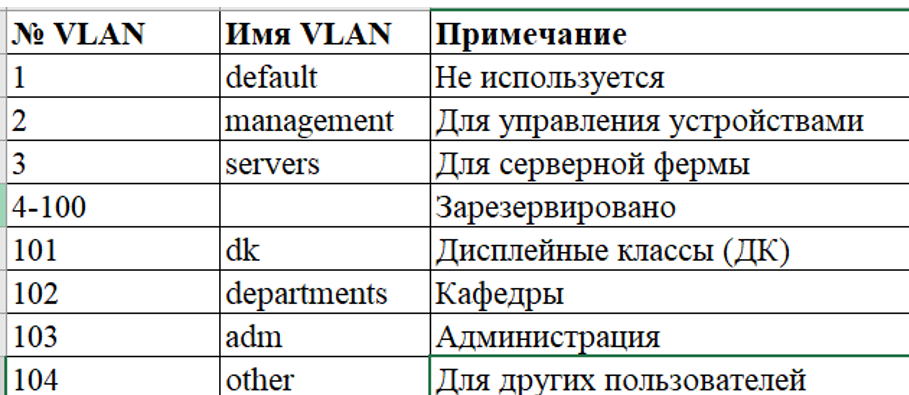{#fig:016 width=70%}

## Выполнение лабораторной работы

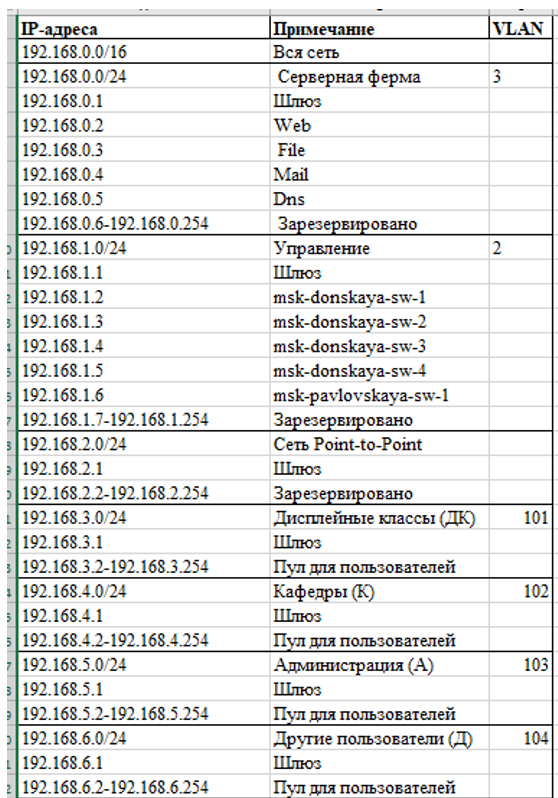{#fig:017 width=30%}

## Выполнение лабораторной работы

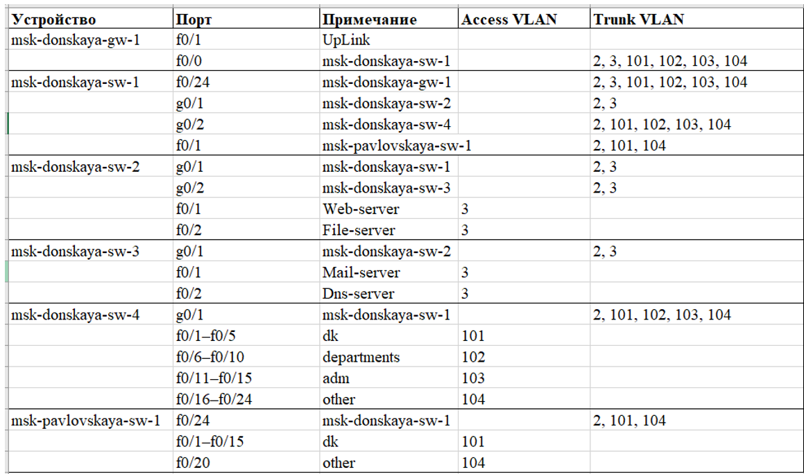{#fig:018 width=70%}

# Выводы

В ходе выполнения лабораторной работы мы познакомились с принципами планирования локальной сети организации.

