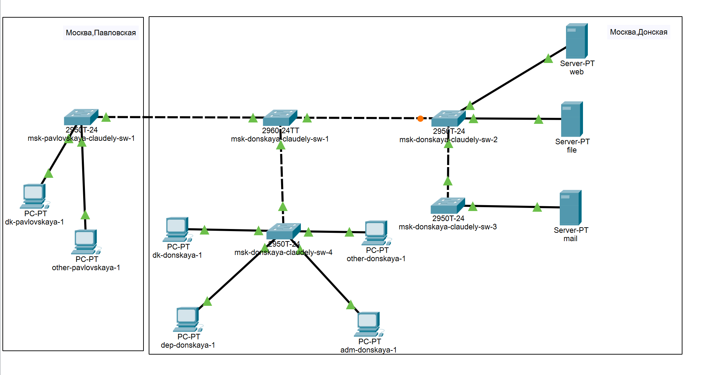
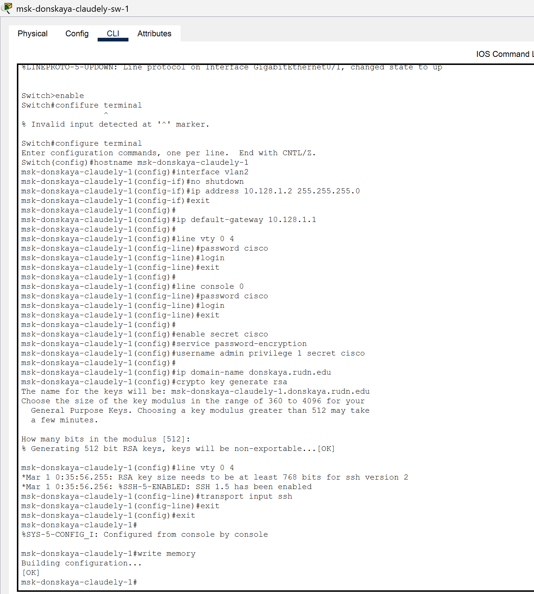
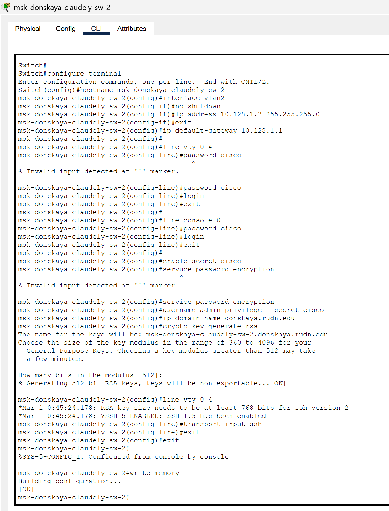
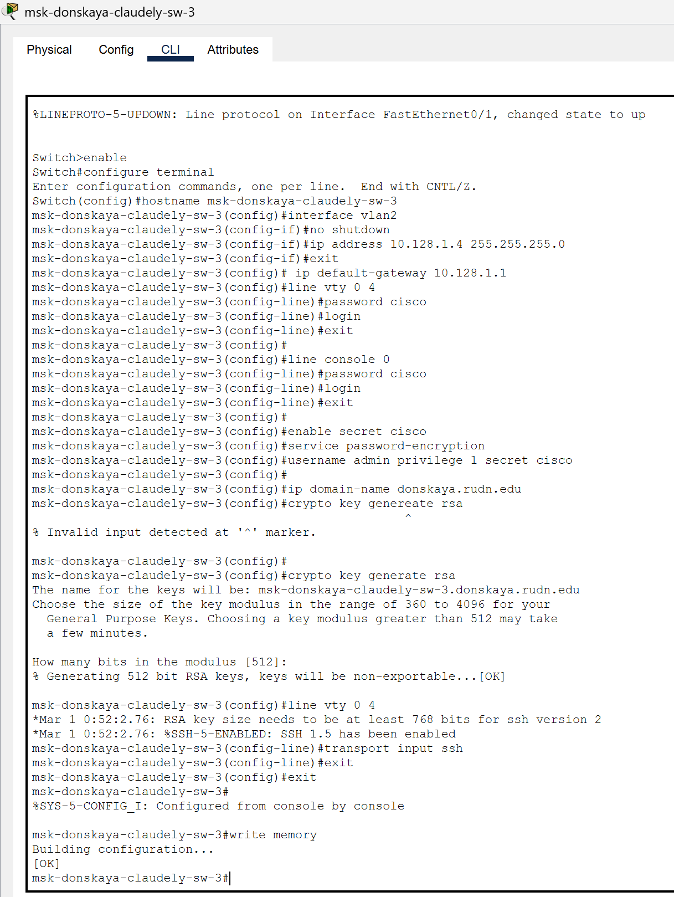
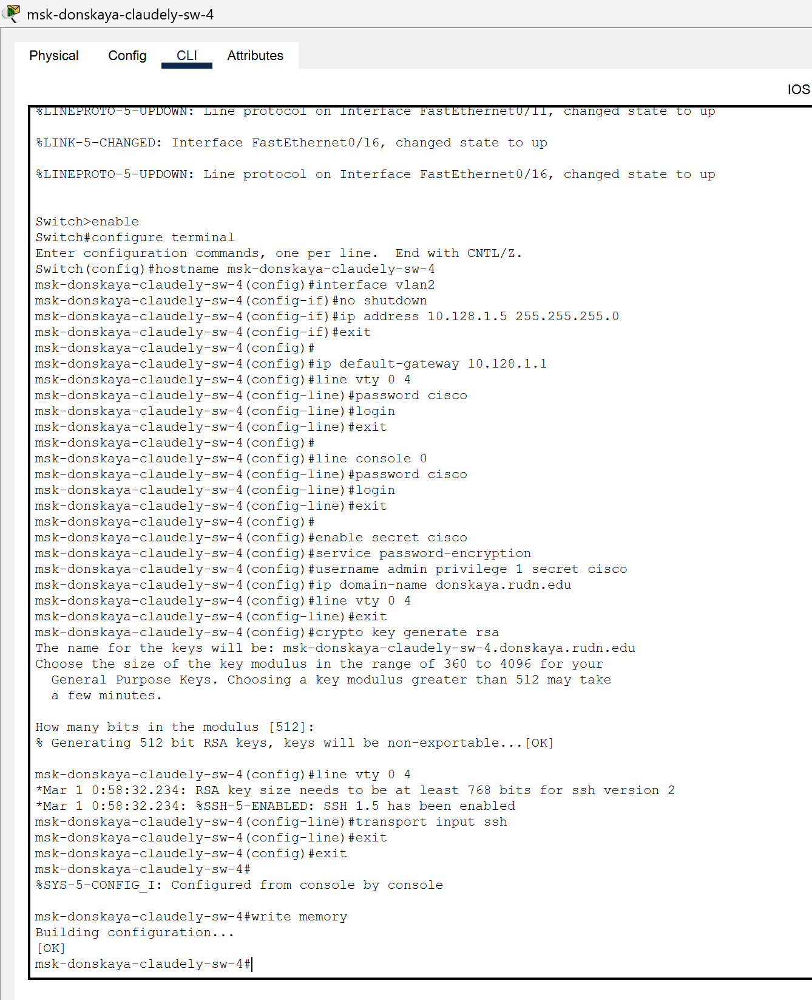
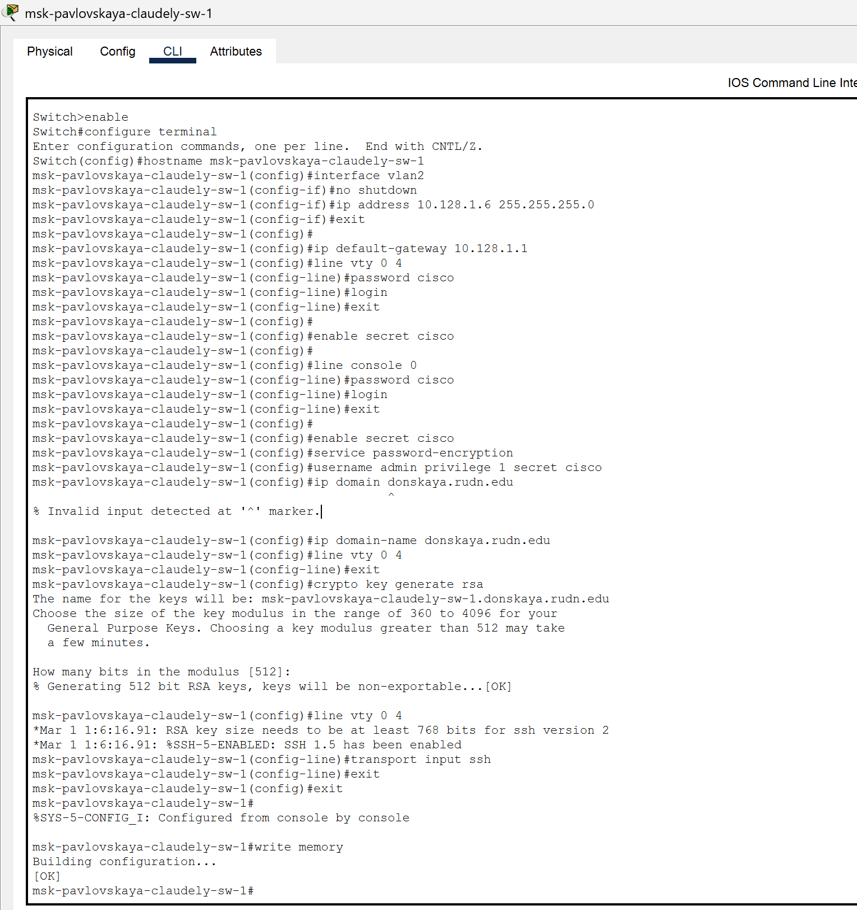

---
## Front matter
lang: ru-RU
title: Лабораторная работа №1
subtitle: Первоначальное конфигурирование сети
author:
  - Бансимба К. Д.
institute:
  - Российский университет дружбы народов, Москва, Россия
date: 13/03/2025

## i18n babel
babel-lang: russian
babel-otherlangs: english

## Formatting pdf
toc: false
toc-title: Содержание
slide_level: 2
aspectratio: 169
section-titles: true
theme: metropolis
header-includes:
 - \metroset{progressbar=frametitle,sectionpage=progressbar,numbering=fraction}
---

# Информация

## Докладчик

:::::::::::::: {.columns align=center}
::: {.column width="70%"}

  * Бансимба Клодели Дьегра
  * студент
  * Российский университет дружбы народов
  * [1032215651@pfur.ru](mailto:1032215651@pfur.ru)
 
:::
::: {.column width="30%"}

:::
::::::::::::::

## Цель работы

Провести подготовительную работу по первоначальной настройке коммутаторов сети.

## Задания
Требуется сделать первоначальную настройку коммутаторов сети, представленной на схеме L1 (см. рис. 3.1 из раздела 3.3). 
Под первоначальной настройкой понимается указание имени устройства, его IP-адреса, настройка доступа по паролю к виртуальным терминалам и консоли, настройка удалённого доступа к устройству по ssh.

## Выполнение лабораторной работы

Создадим новый проект с названием lab_PT-04.pkt.

{#fig:001 width=70%}

## Выполнение лабораторной работы

В логической рабочей области Packet Tracer разместим коммутаторы и оконечные устройства согласно схеме сети L1 (схема приведена в лабораторной работе) и соединим их через соответствующие интерфейсы.

## Выполнение лабораторной работы

{#fig:002 width=70%}

## Выполнение лабораторной работы

устройств согласно схеме сети L1.
Используя типовую конфигурацию коммутатора, настроем все коммутаторы, изменяя название устройства и его IP-адрес согласно плану IP 

## Выполнение лабораторной работы

{#fig:003 width=70%}

## Выполнение лабораторной работы

{#fig:004 width=70%}

## Выполнение лабораторной работы

{#fig:005 width=70%}

## Выполнение лабораторной работы

{#fig:006 width=70%}

## Выполнение лабораторной работы

{#fig:007 width=70%}

# Выводы
В	ходе	выполнения	лабораторной	работы	мы	научились	проводить подготовительную работу по первоначальной настройке коммутаторов сети.

