---
## Front matter
lang: ru-RU
title: Лабораторная работа №5
subtitle: Конфигурирование VLAN
author:
  - Бансимба К. Д.
institute:
  - Российский университет дружбы народов, Москва, Россия
date: 15/03/2025

## i18n babel
babel-lang: russian
babel-otherlangs: english

## Formatting pdf
toc: false
toc-title: Содержание
slide_level: 2
aspectratio: 169
section-titles: true
theme: metropolis
header-includes:
 - \metroset{progressbar=frametitle,sectionpage=progressbar,numbering=fraction}
---

# Информация

## Докладчик

:::::::::::::: {.columns align=center}
::: {.column width="70%"}

  * Бансимба Клодели Дьегра
  * студент
  * Российский университет дружбы народов
  * [1032215651@pfur.ru](mailto:1032215651@pfur.ru)
 
:::
::: {.column width="30%"}

:::
::::::::::::::

## Цель работы

Получить основные навыки по настройке VLAN на коммутаторах сети.

## Задания

1. На коммутаторах сети настроить Trunk-порты на соответствующих интерфейсах (см. табл. 3.2 из раздела 3.3), связывающих коммутаторы между собой.
2. Коммутатор msk-donskaya-claudely-sw-1 настроить как VTP-сервер и прописать на нём номера и названия VLAN согласно табл. 3.1 из раздела 3.3.
3. Коммутаторы msk-donskaya-sw-2 — msk-donskaya-sw-4, msk-pavlovskaya-claudely-sw-1 настроить как VTP-клиенты, на интерфейсах указать принадлежность к соответствующему VLAN (см. табл. 3.3 из раздела 3.3).
4. На серверах прописать IP-адреса, как указано в табл. 3.2 из раздела 3.3.
5. На оконечных устройствах указать соответствующий адрес шлюза и прописать статические IP-адреса из диапазона соответствующей сети, следуя регламенту выделения ip-адресов (см. табл. 3.4 из раздела 3.3).
6. Проверить доступность устройств, принадлежащих одному VLAN, и недоступность устройств, принадлежащих разным VLAN.
7. При выполнении работы необходимо учитывать соглашение об именовании (см. раздел 2.5).

## Выполнение лабораторной работы

В логической рабочей области Packet Tracer разместим коммутаторы и оконечные устройства согласно схеме сети L1 (схема приведена в лабораторной работе) и соединим их через соответствующие интерфейсы.

## Выполнение лабораторной работы

Откроем проект с названием lab_PT-04.pkt и сохраним под названием lab_PT-05.pkt. После чего откроем его для дальнейшего редактирования.

{#fig:001 width=70%}

## Выполнение лабораторной работы

Используя приведённую в лабораторной работе последовательность команд из примера по конфигурации Trunk-порта на интерфейсе g0/1 коммутатора mskdonskaya-sw-1, настроим Trunk-порты на соответствующих интерфейсах всех коммутаторов 

## Выполнение лабораторной работы

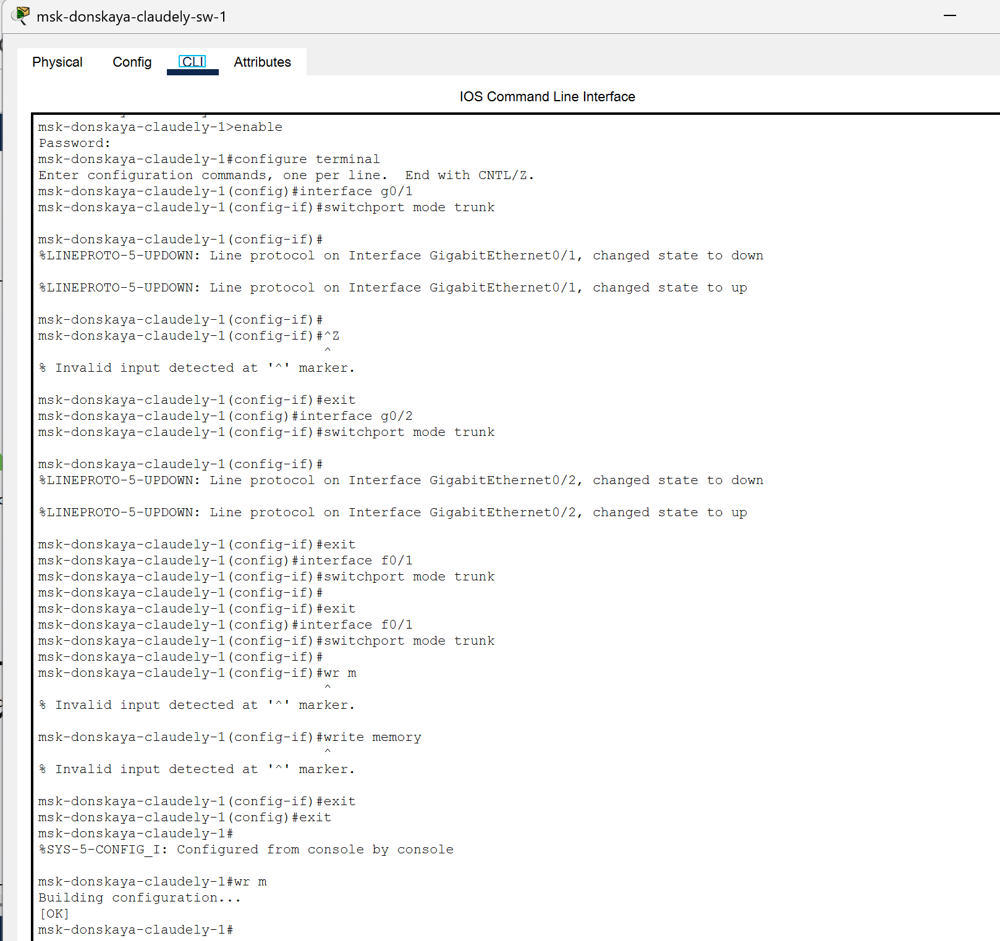{#fig:002 width=70%}

## Выполнение лабораторной работы

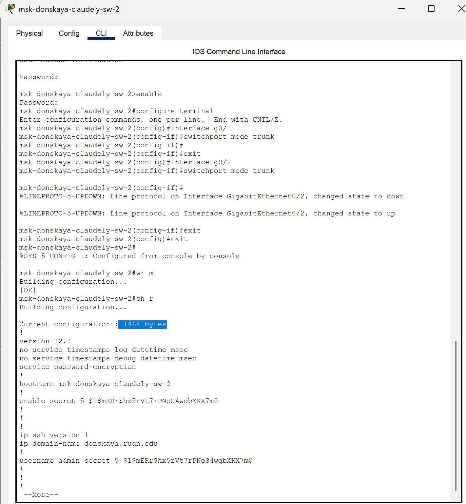{#fig:003 width=70%}

## Выполнение лабораторной работы

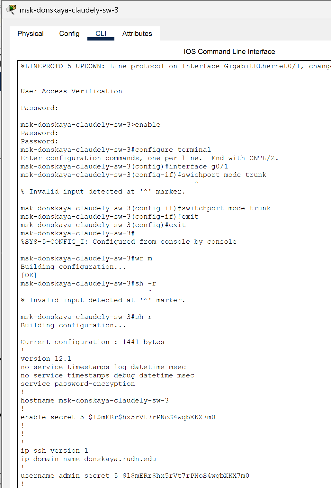{#fig:004 width=70%}

## Выполнение лабораторной работы

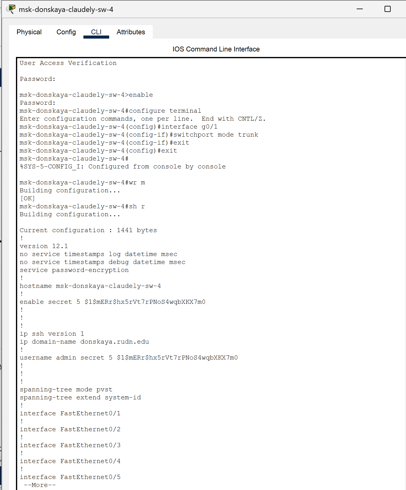{#fig:005 width=70%}

## Выполнение лабораторной работы

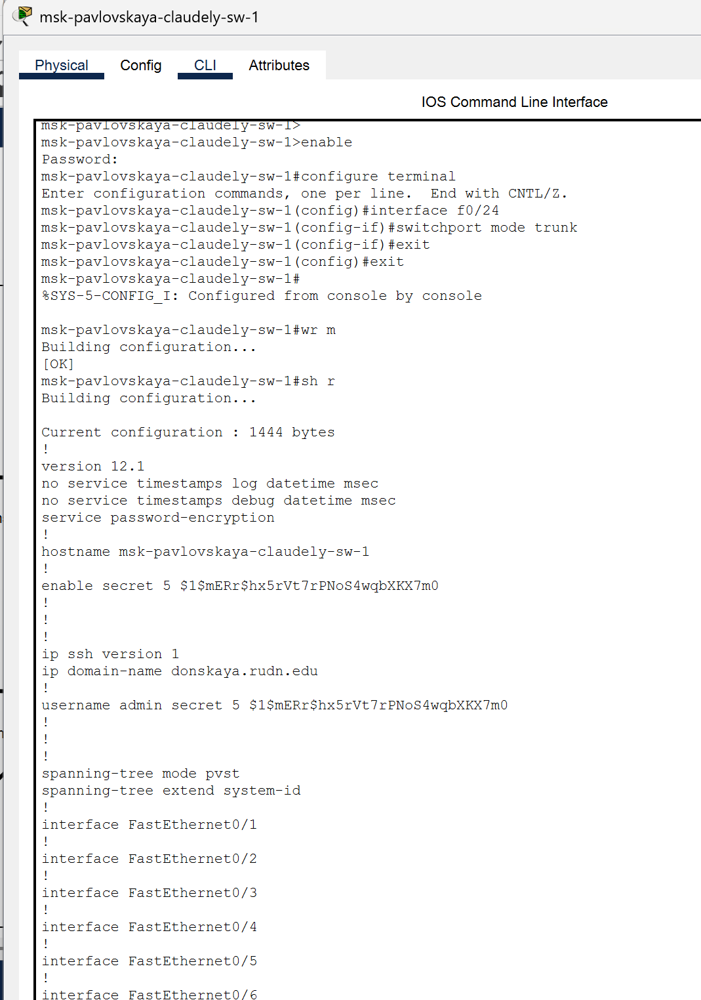{#fig:006 width=70%}

## Выполнение лабораторной работы

Далее настроим коммутатор msk-donskaya-claudely-sw-1 как VTP-сервер и пропишем на нём номера и названия VLAN.

## Выполнение лабораторной работы

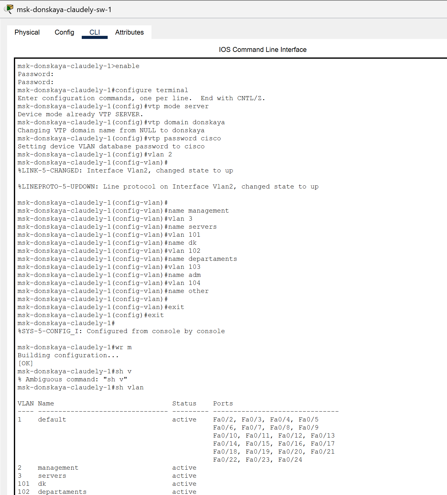{#fig:007 width=70%}

## Выполнение лабораторной работы

Теперь настроим коммутаторы msk-donskaya-claudely-sw-2, msk-donskaya-claudely-sw-3, msk-donskaya-claudely-sw-4 и msk-pavlovskaya-claudely-sw-1 как VTP-клиенты и на интерфейсах укажем принадлежность к VLAN

## Выполнение лабораторной работы

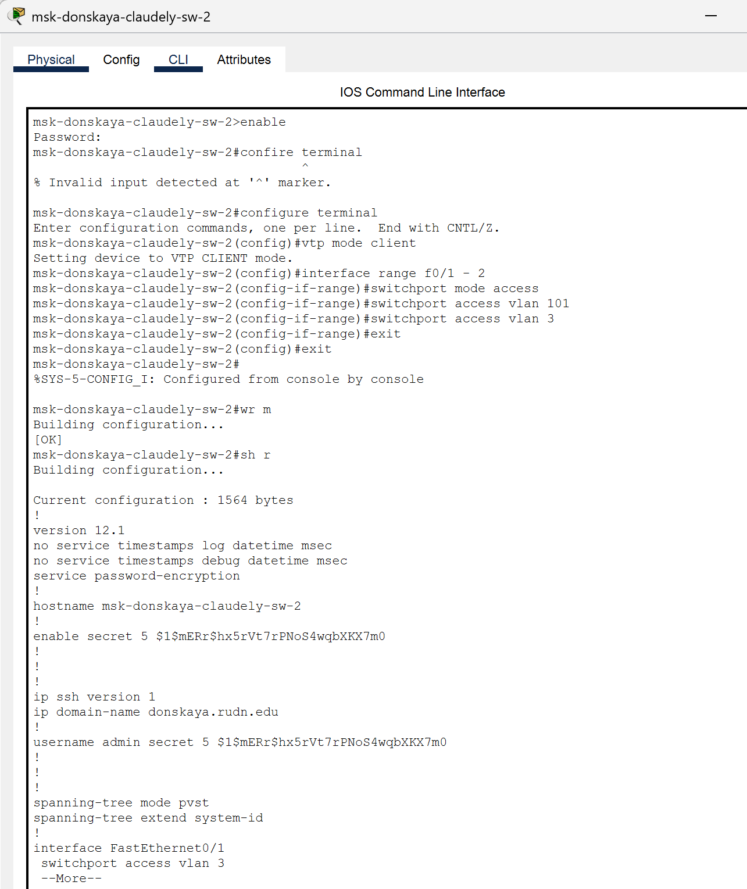{#fig:008 width=70%}

## Выполнение лабораторной работы

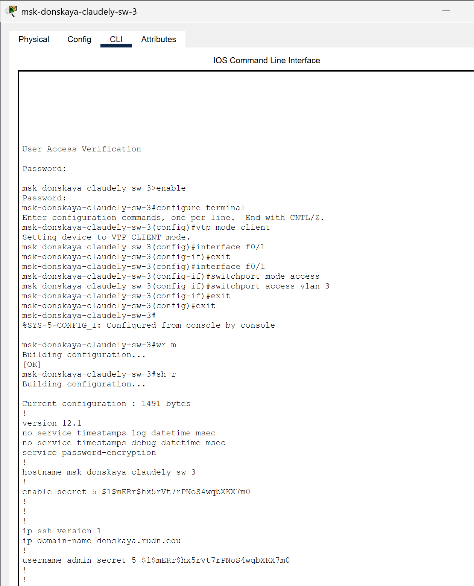{#fig:009 width=70%}

## Выполнение лабораторной работы

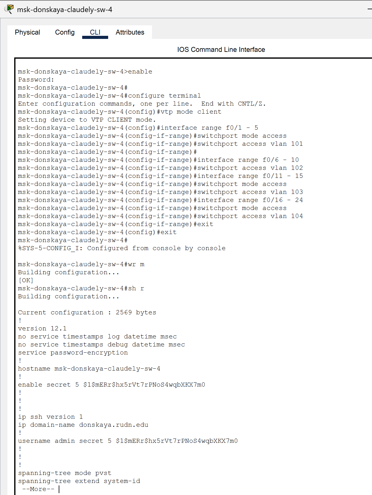{#fig:010 width=70%}

## Выполнение лабораторной работы

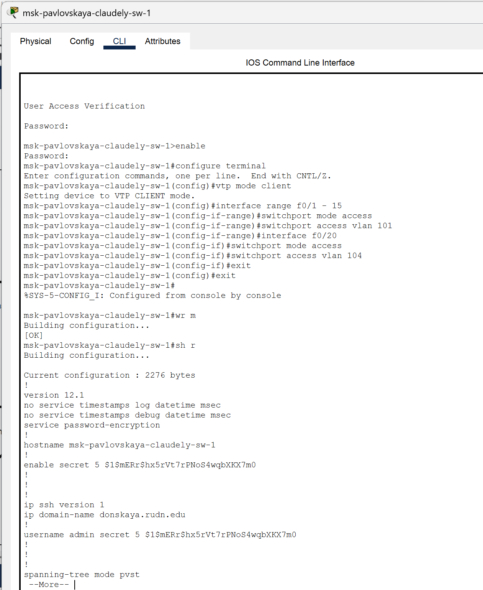{#fig:011 width=70%}

## Выполнение лабораторной работы

Затем требуется указать статические IP-адреса на оконечных устройствах 

## Выполнение лабораторной работы

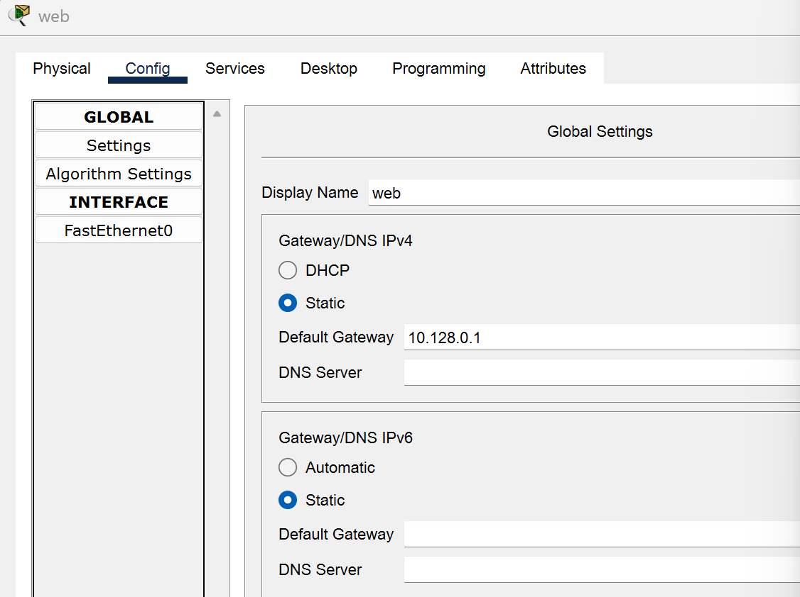{#fig:012 width=70%}

## Выполнение лабораторной работы

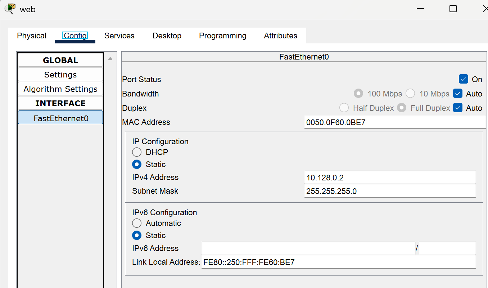{#fig:013 width=70%}

## Выполнение лабораторной работы

Используя режим симуляции в Packet Tracer, изучим процесс передвижения пакета ICMP по сети

## Выполнение лабораторной работы

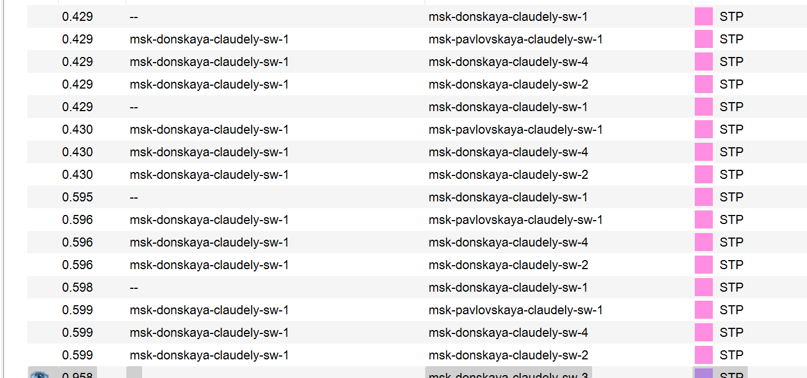{#fig:014 width=70%}

# Выводы

В ходе выполнения лабораторной работы мы получили основные навыки по настройке VLAN на коммутаторах сети.

