---
## Front matter
title: "Отчёт по лабораторной работе №5"
subtitle: "Администрирование локальных сетей"
author: "Бансимба Клодели Дьегра, НПИбд-02-22"

## Generic otions
lang: ru-RU
toc-title: "Содержание"

## Bibliography
bibliography: bib/cite.bib

## Pdf output format
toc: true # Table of contents
toc-depth: 2
lof: true # List of figures
lot: true # List of tables
fontsize: 12pt
linestretch: 1.5
papersize: a4
documentclass: scrreprt
## I18n polyglossia
polyglossia-lang:
  name: russian
  options:
	- spelling=modern
	- babelshorthands=true
polyglossia-otherlangs:
  name: english
## I18n babel
babel-lang: russian
babel-otherlangs: english
## Fonts
mainfont: IBM Plex Serif
romanfont: IBM Plex Serif
sansfont: IBM Plex Sans
monofont: IBM Plex Mono
mathfont: STIX Two Math
mainfontoptions: Ligatures=Common,Ligatures=TeX,Scale=0.94
romanfontoptions: Ligatures=Common,Ligatures=TeX,Scale=0.94
sansfontoptions: Ligatures=Common,Ligatures=TeX,Scale=MatchLowercase,Scale=0.94
monofontoptions: Scale=MatchLowercase,Scale=0.94,FakeStretch=0.9
mathfontoptions:
## Biblatex
biblatex: true
biblio-style: "gost-numeric"
biblatexoptions:
  - parentracker=true
  - backend=biber
  - hyperref=auto
  - language=auto
  - autolang=other*
  - citestyle=gost-numeric
## Pandoc-crossref LaTeX customization
figureTitle: "Рис."
tableTitle: "Таблица"
listingTitle: "Листинг"
lofTitle: "Список иллюстраций"
lotTitle: "Список таблиц"
lolTitle: "Листинги"
## Misc options
indent: true
header-includes:
  - \usepackage{indentfirst}
  - \usepackage{float} # keep figures where there are in the text
  - \floatplacement{figure}{H} # keep figures where there are in the text
---

# Цель работы

Получить основные навыки по настройке VLAN на коммутаторах сети.

# Выполнение лабораторной работы
Откроем проект с названием lab_PT-04.pkt и сохраним под названием lab_PT-05.pkt. После чего откроем его для дальнейшего редактирования (рис. @fig:001).

{#fig:001 width=70%}

Используя приведённую в лабораторной работе последовательность команд из примера по конфигурации Trunk-порта на интерфейсе g0/1 коммутатора mskdonskaya-sw-1, настроим Trunk-порты на соответствующих интерфейсах всех коммутаторов 

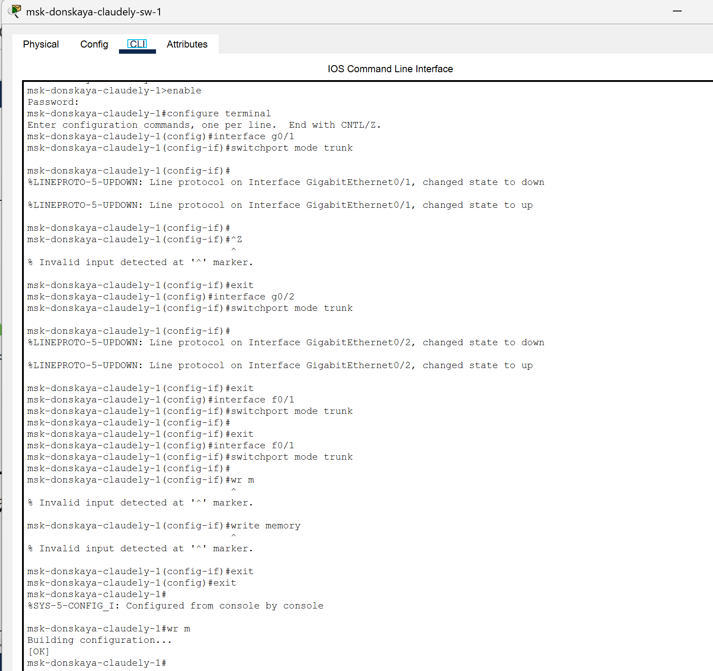{#fig:002 width=70%}

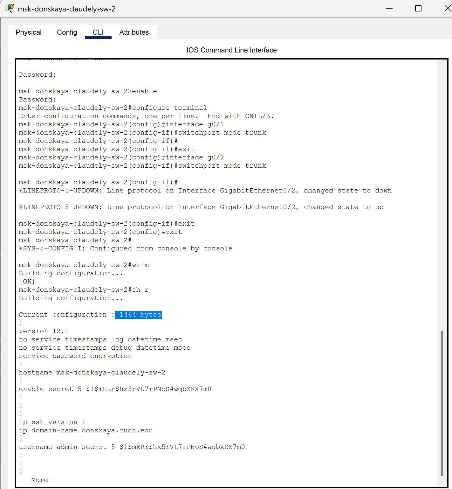{#fig:003 width=70%}

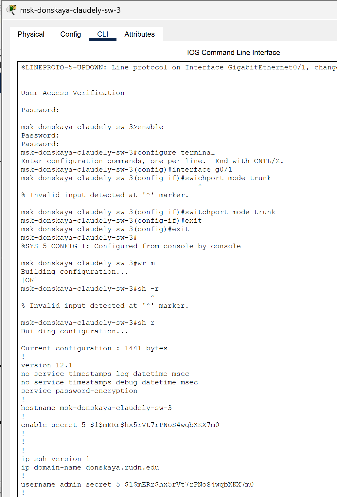{#fig:004 width=70%}

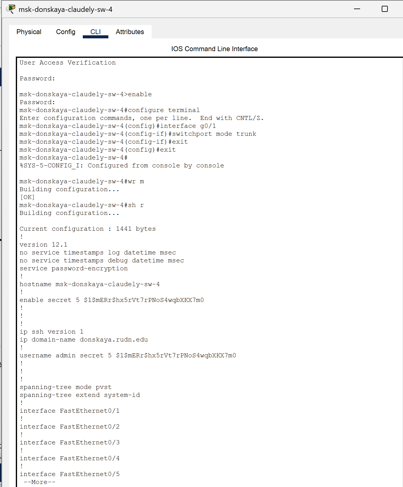{#fig:005 width=70%}

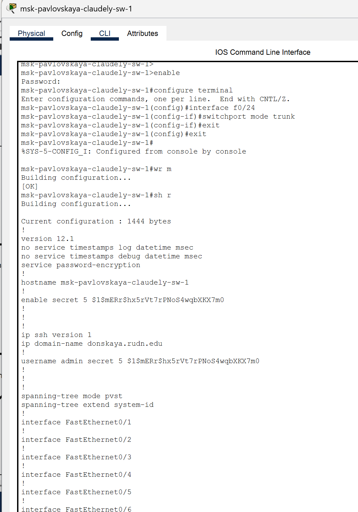{#fig:006 width=70%}

Далее настроим коммутатор msk-donskaya-claudely-sw-1 как VTP-сервер и пропишем на нём номера и названия VLAN (рис. @fig:007).

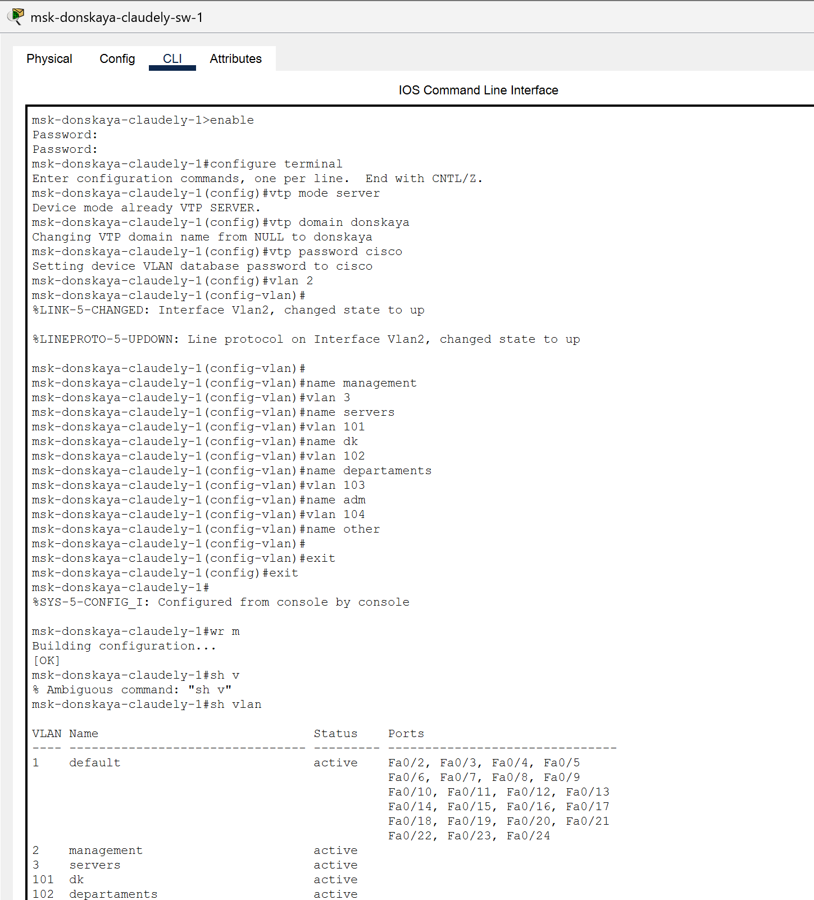{#fig:007 width=70%}

Теперь настроим коммутаторы msk-donskaya-claudely-sw-2, msk-donskaya-claudely-sw-3, msk-donskaya-claudely-sw-4 и msk-pavlovskaya-claudely-sw-1 как VTP-клиенты и на интерфейсах укажем принадлежность к VLAN

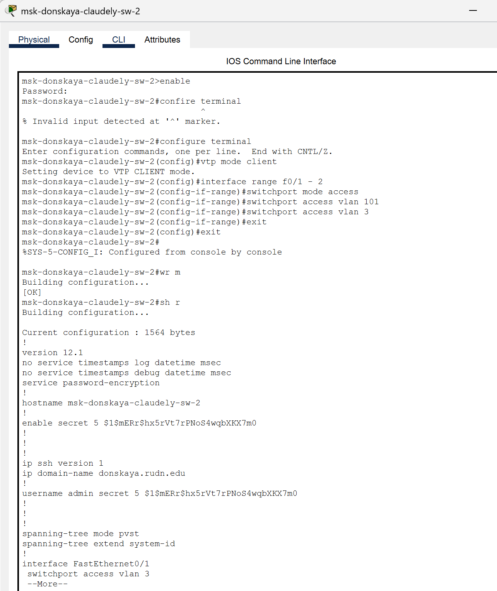{#fig:008 width=70%}

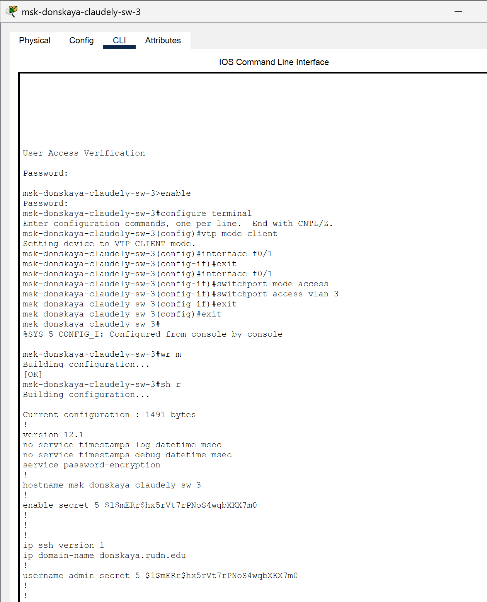{#fig:009 width=70%}

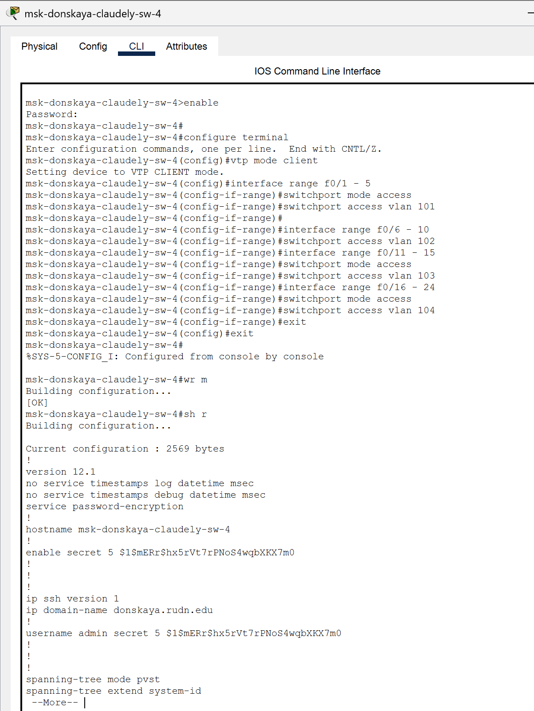{#fig:010 width=70%}

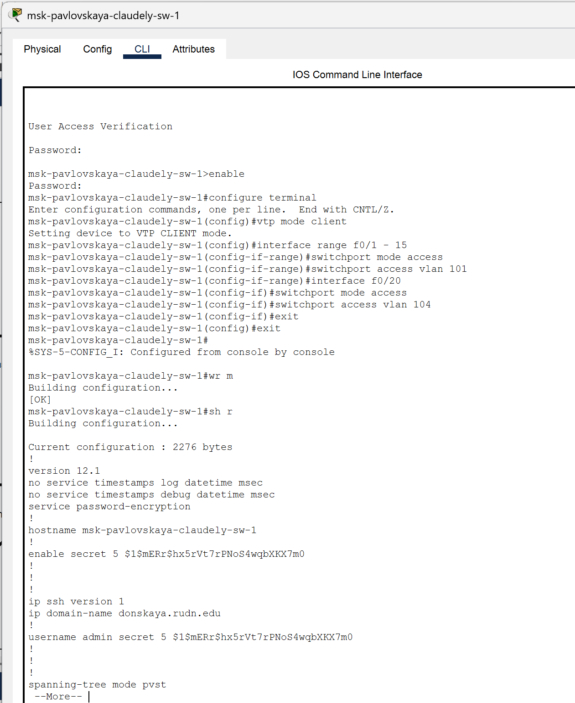{#fig:011 width=70%}

Затем требуется указать статические IP-адреса на оконечных устройствах 

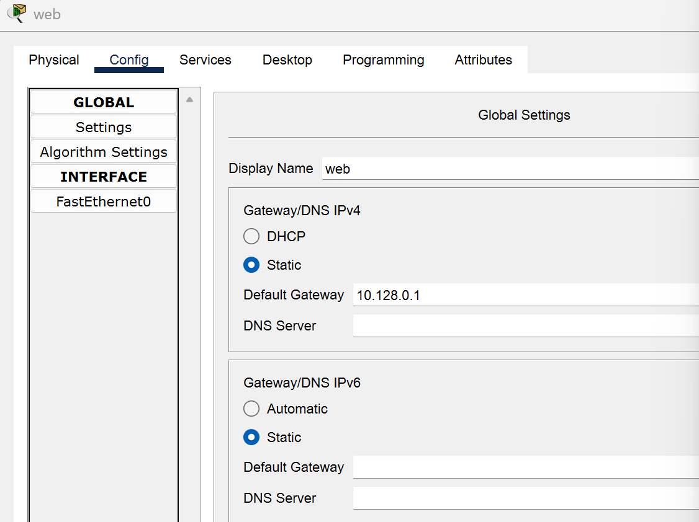{#fig:012 width=70%}

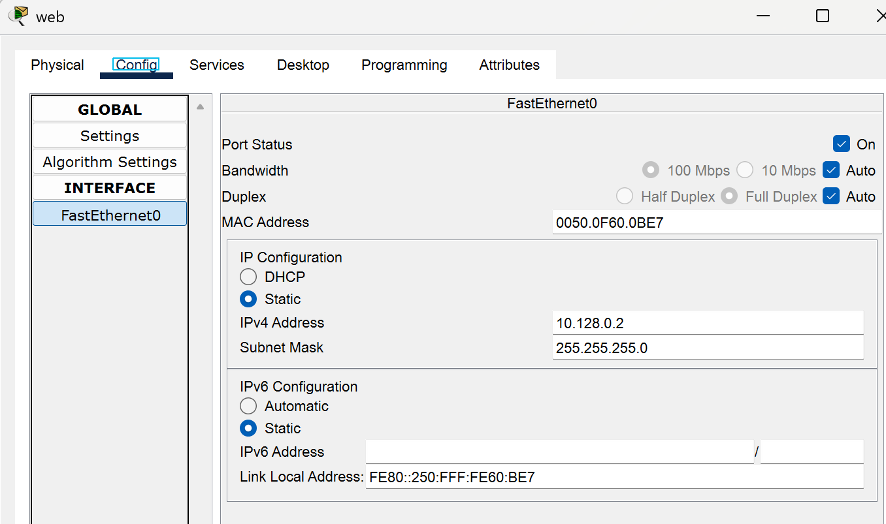{#fig:013 width=70%}

Используя режим симуляции в Packet Tracer, изучим процесс передвижения пакета ICMP по сети

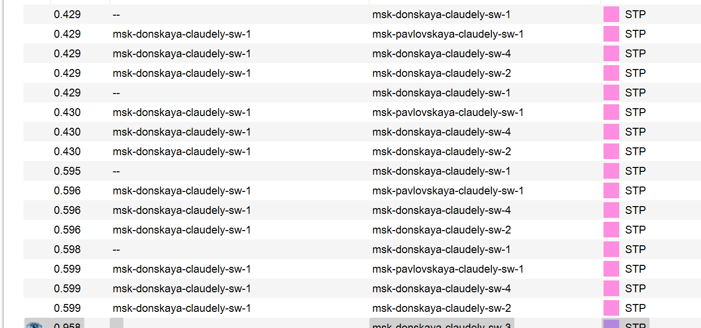{#fig:014 width=70%}

# Выводы

В ходе выполнения лабораторной работы мы получили основные навыки по настройке VLAN на коммутаторах сети.

# Ответы на контрольные вопросы:

1.  Какая команда используется для просмотра списка VLAN на сетевом устройстве? - show vlan
2.  Охарактеризуйте VLAN Trunking Protocol (VTP). Приведите перечень команд с пояснениями для настройки и просмотра информации о VLAN. – 
switchport mode trunk/access:
switchport mode trunk: устанавливает порт в режим транка (trunk), который передает данные для нескольких VLAN через один физический интерфейс.
switchport mode access: устанавливает порт в режим доступа (access), который предназначен для работы с одним определенным VLAN.
switchport access vlan <номер_VLAN>: назначает определенный VLAN для порта в режиме доступа.
vtp mode server/client:
vtp mode server: устанавливает коммутатор в режим сервера VTP, позволяя ему рассылать информацию о VLAN другим коммутаторам в сети.
vtp mode client: устанавливает коммутатор в режим клиента VTP, что позволяет ему принимать информацию о VLAN от серверов VTP.
vtp domain <имя_домена>: устанавливает домен VTP, в котором находится коммутатор. Для синхронизации информации о VLAN, все коммутаторы в сети должны находиться в одном домене VTP с одинаковым именем.
vtp password <пароль>: устанавливает пароль VTP для доступа к домену VTP. Это помогает обеспечить безопасность и предотвратить несанкционированные изменения конфигурации VLAN.
vlan <номер_VLAN>: создает новый VLAN с указанным номером.
name <имя_VLAN>: присваивает имя VLAN, что делает его более понятным для администраторов сети.
3.  Охарактеризуйте Internet Control Message Protocol (ICMP). Опишите формат пакета ICMP. – Это протокол в семействе протоколов интернета, который используется для передачи сообщений об ошибках и других исключительных ситуациях, возникших при передаче данных в компьютерных сетях. ICMP также выполняет некоторые сервисные функции, такие как проверка доступности хостов и диагностика сетевых проблем.
Формат пакета ICMP обычно состоит из заголовка и полезной нагрузки, которая может включать в себя различные поля, зависящие от типа сообщения ICMP. Основные поля заголовка ICMP включают в себя:
Тип: определяет тип сообщения ICMP, например, сообщение об ошибках, запрос эхо и т. д.
Код: подтип сообщения, который помогает уточнить тип сообщения. Например, для сообщения об ошибке этот код может указывать на конкретный тип ошибки.
Контрольная сумма: используется для обеспечения целостности пакета ICMP.
Дополнительные данные: в зависимости от типа и кода сообщения, может содержать дополнительные поля с информацией о сетевой проблеме или другой полезной информацией.
4.  Охарактеризуйте Address Resolution Protocol (ARP). Опишите формат пакета ARP. - Это протокол, используемый в компьютерных сетях для связывания IP-адресов с физическими MAC-адресами устройств в локальной сети. Он позволяет устройствам в сети определять MAC-адреса других устройств на основе их IP-адресов.
Когда устройству требуется отправить пакет данных другому устройству в сети, оно сначала проверяет свою локальную таблицу ARP, чтобы узнать MAC-адрес получателя. Если необходимый MAC-адрес отсутствует в таблице ARP, устройство отправляет ARP-запрос на всю сеть, запрашивая MAC-адрес соответствующего IP-адреса. Устройство, которое имеет этот IP-адрес, отвечает на запрос, предоставляя свой MAC-адрес.
Формат пакета ARP обычно состоит из следующих полей:
Тип аппаратного адреса: определяет тип физического аппаратного адреса в сети, такой как Ethernet (значение 1).
Тип протокола: указывает на протокол сетевого уровня, для которого запрашивается соответствие адресов, обычно IPv4 (значение 0x0800).
Длина аппаратного адреса: указывает на размер физического адреса, обычно 6 байт для MAC-адресов Ethernet.
Длина адреса протокола: указывает на размер адреса протокола, обычно 4 байта для IPv4.
Код операции: определяет тип операции ARP, например, запрос (значение 1) или ответ (значение 2).
MAC-адрес отправителя: физический адрес отправителя.
IP-адрес отправителя: IP-адрес отправителя.
MAC-адрес получателя: физический адрес получателя (обычно пустой в ARP-запросах).
IP-адрес получателя: IP-адрес получателя, для которого запрашивается соответствие MAC-адреса.
5.  Что такое MAC-адрес? Какова его структура? - MAC-адрес (Media Access Control address) - Это уникальный идентификатор, присваиваемый каждому устройству или интерфейсу активного оборудования в компьютерных сетях Ethernet. Этот адрес используется для уникальной идентификации устройства в сети и обеспечения корректной передачи данных между устройствами.
Структура MAC-адреса следующая:
MAC-адрес состоит из 6 байт (или 48 бит). Каждый байт разбивается на две части:
Префикс: это первые три байта (24 бита) MAC-адреса. Префикс обычно определяет производителя устройства (Organizationally Unique Identifier, OUI). Это уникальный идентификатор, выданный Институтом инженеров электротехники и электроники (IEEE) производителям сетевого оборудования.
Идентификатор устройства: это оставшиеся три байта (24 бита) MAC-адреса. Идентификатор устройства является уникальным номером, присвоенным самим производителем идентификатора.
MAC-адрес записывается в шестнадцатеричной системе счисления и обычно разделяется двоеточием или дефисом между каждыми двумя байтами (например, 01:23:45:67:89:ab).
Использование уникальных MAC-адресов позволяет коммутирующим устройствам в сети Ethernet правильно маршрутизировать кадры данных и устанавливать точные соединения между устройствами в сети.

# Список литературы{.unnumbered}

::: {#refs}
:::
