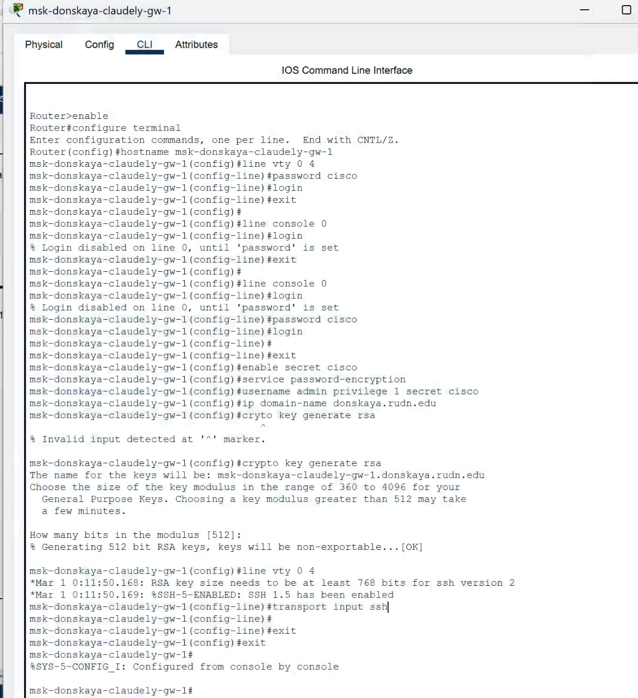
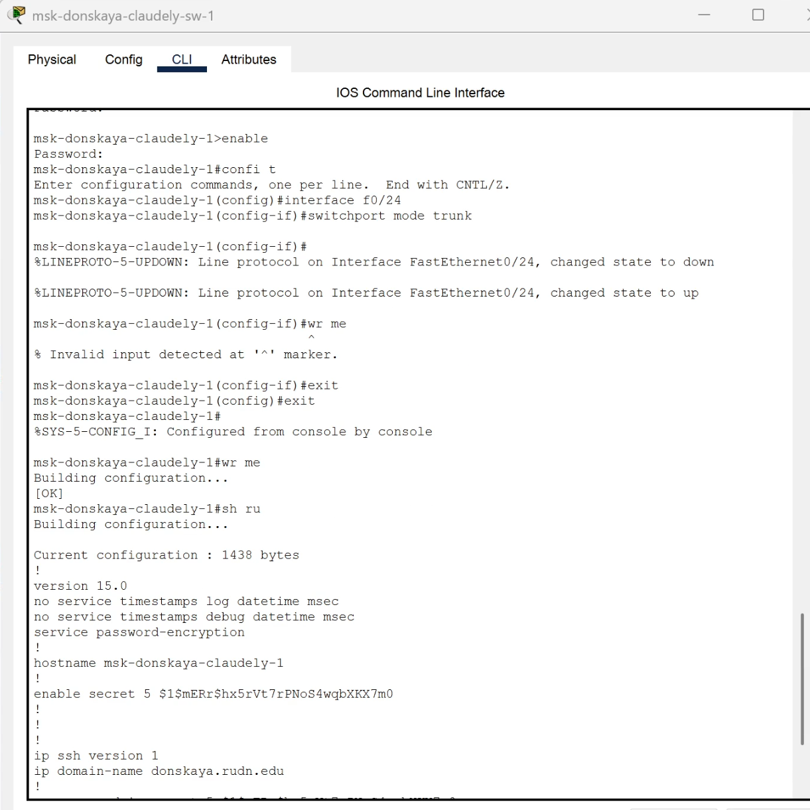
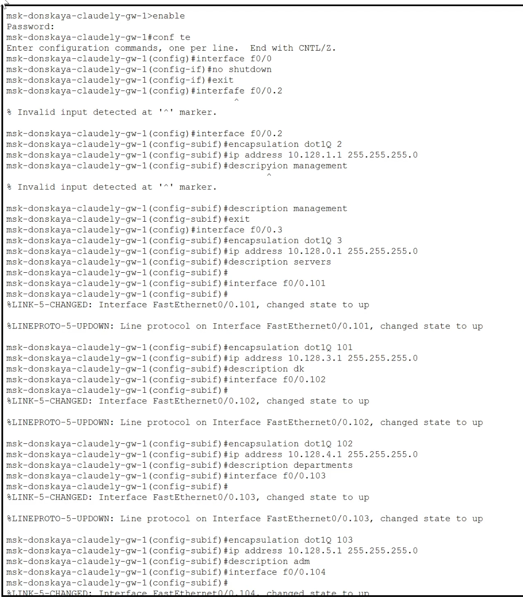
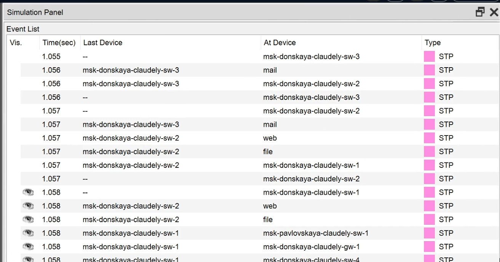

---
## Front matter
title: "Отчёт по лабораторной работе №6"
subtitle: "Администрирование локальных сетей"
author: "Бансимба Клодели Дьегра, НПИбд-02-22"

## Generic otions
lang: ru-RU
toc-title: "Содержание"

## Bibliography
bibliography: bib/cite.bib

## Pdf output format
toc: true # Table of contents
toc-depth: 2
lof: true # List of figures
lot: true # List of tables
fontsize: 12pt
linestretch: 1.5
papersize: a4
documentclass: scrreprt
## I18n polyglossia
polyglossia-lang:
  name: russian
  options:
	- spelling=modern
	- babelshorthands=true
polyglossia-otherlangs:
  name: english
## I18n babel
babel-lang: russian
babel-otherlangs: english
## Fonts
mainfont: IBM Plex Serif
romanfont: IBM Plex Serif
sansfont: IBM Plex Sans
monofont: IBM Plex Mono
mathfont: STIX Two Math
mainfontoptions: Ligatures=Common,Ligatures=TeX,Scale=0.94
romanfontoptions: Ligatures=Common,Ligatures=TeX,Scale=0.94
sansfontoptions: Ligatures=Common,Ligatures=TeX,Scale=MatchLowercase,Scale=0.94
monofontoptions: Scale=MatchLowercase,Scale=0.94,FakeStretch=0.9
mathfontoptions:
## Biblatex
biblatex: true
biblio-style: "gost-numeric"
biblatexoptions:
  - parentracker=true
  - backend=biber
  - hyperref=auto
  - language=auto
  - autolang=other*
  - citestyle=gost-numeric
## Pandoc-crossref LaTeX customization
figureTitle: "Рис."
tableTitle: "Таблица"
listingTitle: "Листинг"
lofTitle: "Список иллюстраций"
lotTitle: "Список таблиц"
lolTitle: "Листинги"
## Misc options
indent: true
header-includes:
  - \usepackage{indentfirst}
  - \usepackage{float} # keep figures where there are in the text
  - \floatplacement{figure}{H} # keep figures where there are in the text
---

# Цель работы

Настроить статическую маршрутизацию VLAN в сети

# Выполнение лабораторной работы

Откроем проект с названием lab_PT-05.pkt и сохраним под названием lab_PT-06.pkt. После чего откроем его для дальнейшего редактирования (рис. @fig:001).

{#fig:001 width=70%}

В логической области проекта разместим маршрутизатор Cisco 2811, подключим его к порту 24 коммутатора msk-donskaya-claudely-sw-1 в соответствии с таблицей портов

{#fig:002 width=70%}  

Используя приведённую последовательность команд в лабораторной работе по первоначальной настройке маршрутизатора, сконфигурируем маршрутизатор, задав на нём имя, пароль для доступа к консоли и настроим удалённое подключение к нему по ssh

{#fig:003 width=70%}

Теперь настроим порт 24 коммутатора msk-donskaya-claudely-sw-1 как trunk-порт

{#fig:004 width=70%}

Изменим на схеме наименование маршрутизатора Cisco 2811 на msk-donskaya-claudely-gw-1

{#fig:005 width=70%}

На интерфейсе f0/0 маршрутизатора msk-donskaya-claudely-gw-1 настроим виртуальные интерфейсы, соответствующие номерам VLAN. Согласно таблице IP-адресов зададим соответствующие IP-адреса на виртуальных интерфейсах 

{#fig:006 width=70%}

{#fig:007 width=70%}

После всех настроек проверим доступность оконечных устройств из разных VLAN 

{#fig:008 width=70%}

Используя режим симуляции в Packet Tracer, изучим процесс передвижения пакета ICMP по сети

{#fig:009 width=70%}

# Выводы

В ходе выполнения лабораторной работы мы научились настраивать статическую маршрутизацию VLAN в сети.

# Ответы на контрольные вопросы:

1.  Охарактеризуйте стандарт IEEE 802.1Q - открытый стандарт, который описывает процедуру тегирования трафика для передачи информации о принадлежности к VLAN по сетям стандарта IEEE 802.3 Ethernet.
2.  Опишите формат кадра IEEE 802.1Q - добавляет 32-битное поле между MAC-адресом источника и полями EtherType исходного кадра. В соответствии с 802.1Q минимальный размер кадра остается 64 байта, но мост может увеличить минимальный размер кадра с 64 до 68 байтов при передаче IEEE 802.1Q.

