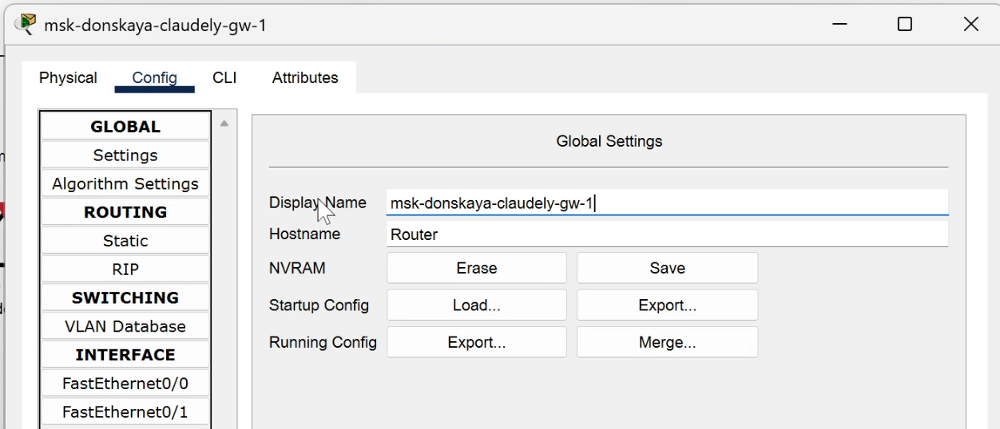

---
## Front matter
lang: ru-RU
title: Лабораторная работа №6
subtitle: Статическая маршрутизация VLAN
author:
  - Бансимба К. Д.
institute:
  - Российский университет дружбы народов, Москва, Россия
date: 20/03/2025

## i18n babel
babel-lang: russian
babel-otherlangs: english

## Formatting pdf
toc: false
toc-title: Содержание
slide_level: 2
aspectratio: 169
section-titles: true
theme: metropolis
header-includes:
 - \metroset{progressbar=frametitle,sectionpage=progressbar,numbering=fraction}
---

# Информация

## Докладчик

:::::::::::::: {.columns align=center}
::: {.column width="70%"}

  * Бансимба Клодели Дьегра
  * студент
  * Российский университет дружбы народов
  * [1032215651@pfur.ru](mailto:1032215651@pfur.ru)
 
:::
::: {.column width="30%"}

:::
::::::::::::::

## Цель работы

Получить основные навыки по настройке VLAN на коммутаторах сети.

## Выполнение лабораторной работы

Откроем проект с названием lab_PT-05.pkt и сохраним под названием lab_PT-06.pkt. После чего откроем его для дальнейшего редактирования.

{#fig:001 width=70%}

## Выполнение лабораторной работы

В логической области проекта разместим маршрутизатор Cisco 2811, подключим его к порту 24 коммутатора msk-donskaya-claudely-sw-1 в соответствии с таблицей портов

## Выполнение лабораторной работы

{#fig:002 width=70%} 

## Выполнение лабораторной работы

Используя приведённую последовательность команд в лабораторной работе по первоначальной настройке маршрутизатора, сконфигурируем маршрутизатор, задав на нём имя, пароль для доступа к консоли и настроим удалённое подключение к нему по ssh

## Выполнение лабораторной работы

{#fig:003 width=40%}

## Выполнение лабораторной работы

Теперь настроим порт 24 коммутатора msk-donskaya-claudely-sw-1 как trunk-порт

{#fig:004 width=40%}

## Выполнение лабораторной работы

Изменим на схеме наименование маршрутизатора Cisco 2811 на msk-donskaya-claudely-gw-1

{#fig:005 width=50%}

## Выполнение лабораторной работы

На интерфейсе f0/0 маршрутизатора msk-donskaya-claudely-gw-1 настроим виртуальные интерфейсы, соответствующие номерам VLAN. Согласно таблице IP-адресов зададим соответствующие IP-адреса на виртуальных интерфейсах 

## Выполнение лабораторной работы

{#fig:006 width=40%}

## Выполнение лабораторной работы

{#fig:007 width=50%}

## Выполнение лабораторной работы

После всех настроек проверим доступность оконечных устройств из разных VLAN 

{#fig:008 width=40%}

## Выполнение лабораторной работы

Используя режим симуляции в Packet Tracer, изучим процесс передвижения пакета ICMP по сети

{#fig:009 width=70%}

# Выводы

В ходе выполнения лабораторной работы мы научились настраивать статическую маршрутизацию VLAN в сети.

