---
## Front matter
lang: ru-RU
title: Лабораторная работа №7
subtitle: Администрирование локальных сетей
author:
  - Бансимба К. Д.
institute:
  - Российский университет дружбы народов, Москва, Россия
date: 29/03/2025

## i18n babel
babel-lang: russian
babel-otherlangs: english

## Formatting pdf
toc: false
toc-title: Содержание
slide_level: 2
aspectratio: 169
section-titles: true
theme: metropolis
header-includes:
 - \metroset{progressbar=frametitle,sectionpage=progressbar,numbering=fraction}
---

# Информация

## Докладчик

:::::::::::::: {.columns align=center}
::: {.column width="70%"}

  * Бансимба Клодели Дьегра
  * студент
  * Российский университет дружбы народов
  * [1032215651@pfur.ru](mailto:1032215651@pfur.ru)
 
:::
::: {.column width="30%"}

:::
::::::::::::::

## Цель работы

Получить навыки работы с физической рабочей областью Packet Tracer, а также учесть физические параметры сети.

## Выполнение лабораторной работы

Откроем проект с названием lab_PT-06.pkt и сохраним под названием lab_PT-07.pkt. После чего откроем его для дальнейшего редактирования.

{#fig:001 width=70%}

## Выполнение лабораторной работы

Перейдём в физическую рабочую область Packet Tracer и присвоим название городу — Moscow

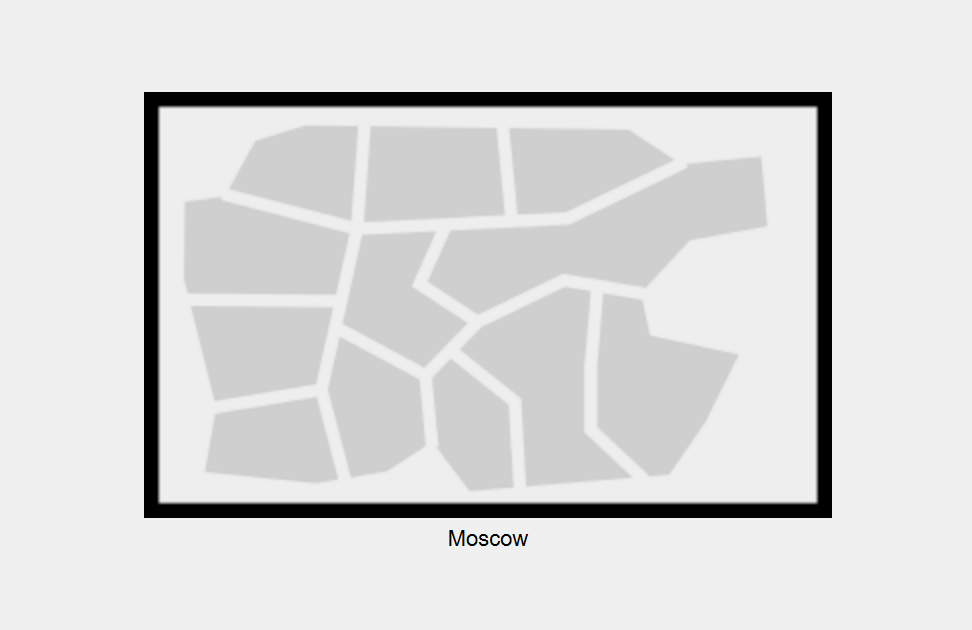{#fig:002 width=50%}

## Выполнение лабораторной работы

Щёлкнув на изображение города, мы видим изображение здания. Присвоим ему название Donskaya и добавим здание для территории Pavlovskaya

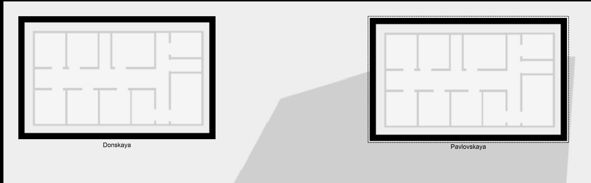{#fig:003 width=80%}

## Выполнение лабораторной работы

Щёлкнув на изображение здания Donskaya, переместим изображение, обозначающее серверное помещение, в него

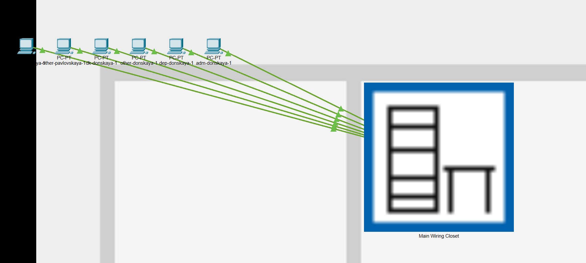{#fig:004 width=70%}

## Выполнение лабораторной работы

Затем, щёлкнув на изображение серверной, мы видим отображение серверных стоек. Переместим коммутатор msk-pavlovskaya-claudely-sw-1 и два оконечных устройства dk-pavlovskaya-1 и other-pavlovskaya-1 на территорию Pavlovskaya, используя меню “Move” физической рабочей области Packet Tracer.

## Выполнение лабораторной работы

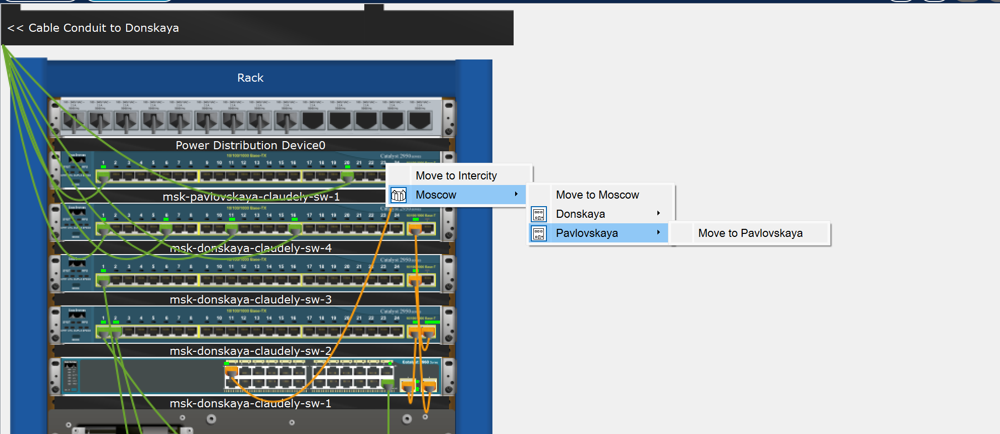{#fig:005 width=70%}

## Выполнение лабораторной работы

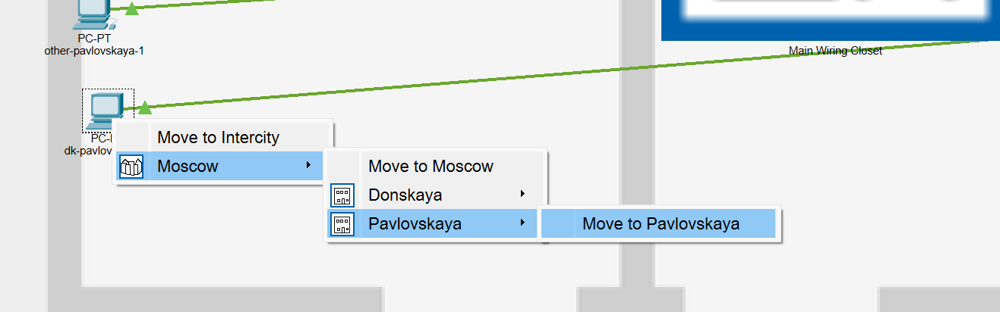{#fig:006 width=70%}

## Выполнение лабораторной работы

Далее в меню “Options”, “Preferences” во вкладке “Interface” активируем разрешение на учёт физических характеристик среды передачи (Enable Cable Length Effects).

## Выполнение лабораторной работы

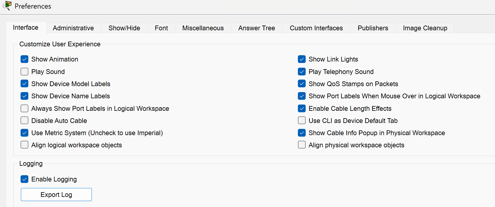{#fig:007 width=80%}

## Выполнение лабораторной работы

Теперь в физической рабочей области Packet Tracer разместим две территории на расстоянии более 100 м друг от друга

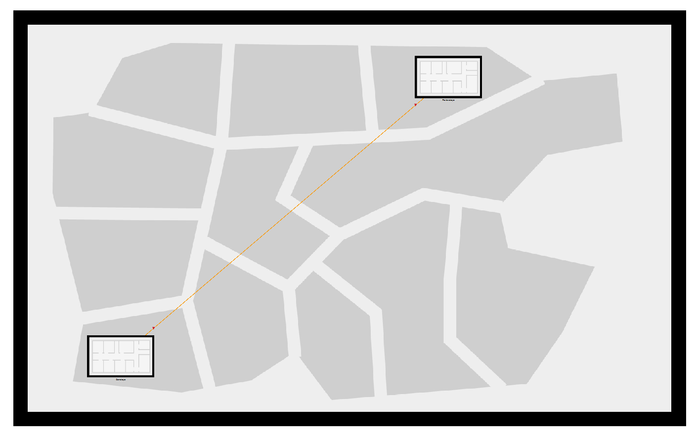{#fig:008 width=50%}

## Выполнение лабораторной работы

Вернувшись в логическую рабочую область Packet Tracer, пропингуем с коммутатора msk-donskaya-claudely-sw-1 коммутатор msk-pavlovskaya-claudely-sw-1 и убедимся в неработоспособности соединения 

## Выполнение лабораторной работы

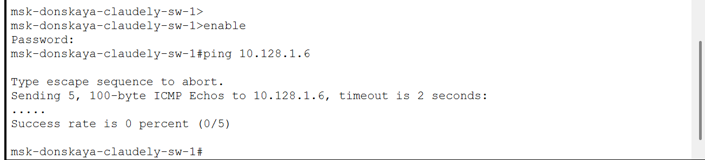{#fig:009 width=80%}

## Выполнение лабораторной работы

Далее удалим соединение между msk-donskaya-claudely-sw-1 и msk-pavlovskaya-claudely-sw-1 и добавим в логическую рабочую область два повторителя (Repeater-PT). Присвоим им соответствующие названия msk-donskaya-claudely-mc-1 и msk-pavlovskaya-claudely-mc-1. Внутри повторителей заменим имеющиеся модули на PT-REPEATERNM-1FFE и PT-REPEATER-NM-1CFE для подключения оптоволокна и витой пары по технологии Fast Ethernet :

## Выполнение лабораторной работы

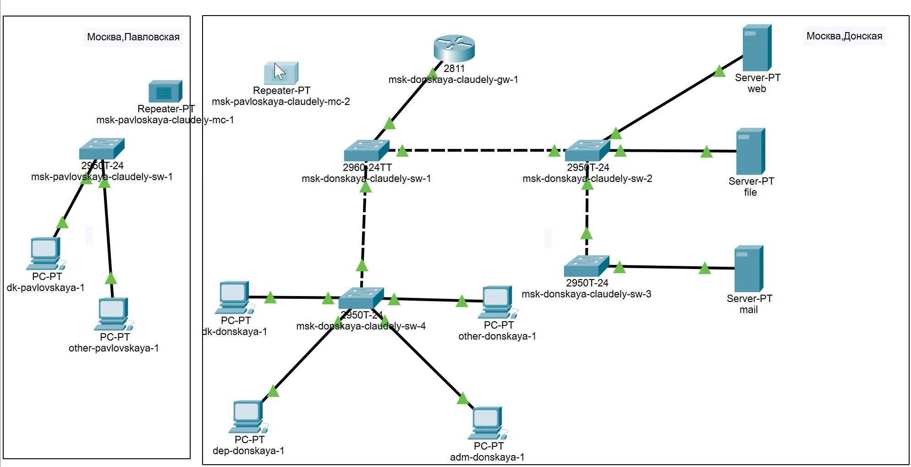{#fig:010 width=70%}

## Выполнение лабораторной работы

{#fig:011 width=80%}

## Выполнение лабораторной работы

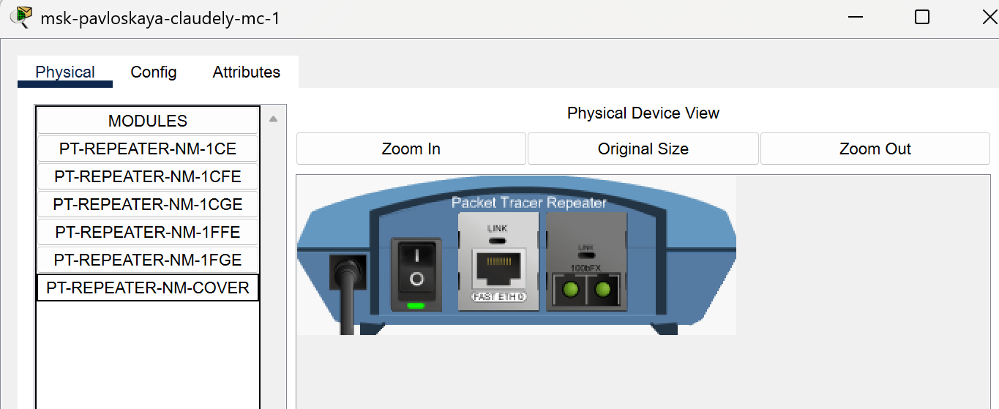{#fig:012 width=80%}

## Выполнение лабораторной работы

Переместим msk-pavlovskaya-claudely-mc-1 на территорию Pavlovskaya (в физической рабочей области Packet Tracer)

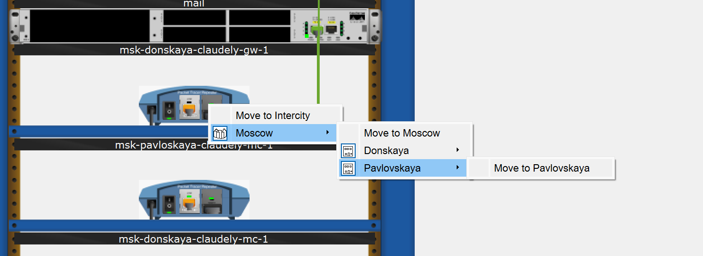{#fig:013 width=80%}

## Выполнение лабораторной работы

Теперь подключим коммутатор msk-donskaya-claudely-sw-1 к msk-donskaya-claudely-mc-1 по витой паре, msk-donskaya-claudely-mc-1 и msk-pavlovskaya-claudely-mc-1 — по оптоволокну, msk-pavlovskaya-claudely-sw-1 к msk-pavlovskaya-claudely-mc-1 — по витой паре 

## Выполнение лабораторной работы

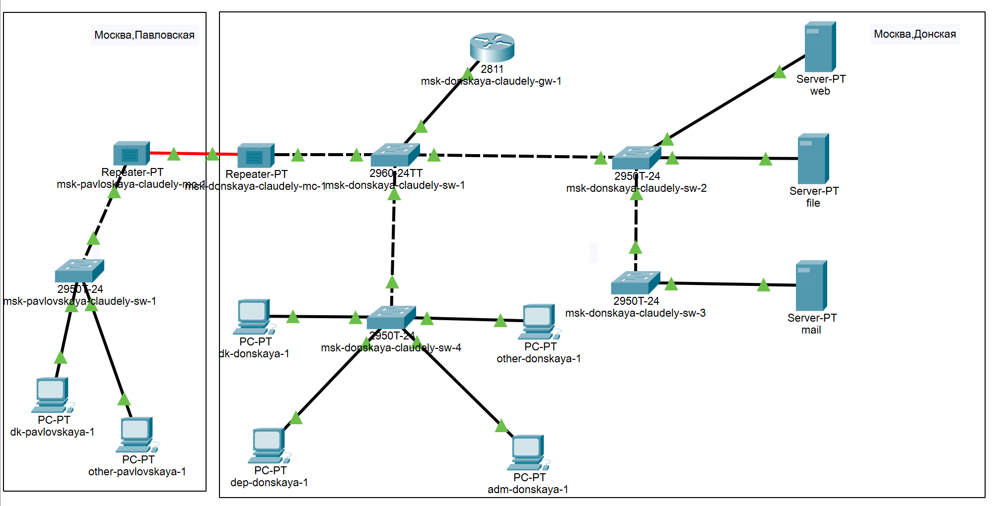{#fig:014 width=70%}

# Выводы

В ходе выполнения лабораторной работы мы получили навыки работы с физической рабочей областью Packet Tracer, а также научились учитывать физические параметры сети.

