---
## Front matter
title: "Отчёт по лабораторной работе №7"
subtitle: "Администрирование локальных сетей"
author: "Бансимба Клодели Дьегра, НПИбд-02-22"

## Generic otions
lang: ru-RU
toc-title: "Содержание"

## Bibliography
bibliography: bib/cite.bib

## Pdf output format
toc: true # Table of contents
toc-depth: 2
lof: true # List of figures
lot: true # List of tables
fontsize: 12pt
linestretch: 1.5
papersize: a4
documentclass: scrreprt
## I18n polyglossia
polyglossia-lang:
  name: russian
  options:
	- spelling=modern
	- babelshorthands=true
polyglossia-otherlangs:
  name: english
## I18n babel
babel-lang: russian
babel-otherlangs: english
## Fonts
mainfont: IBM Plex Serif
romanfont: IBM Plex Serif
sansfont: IBM Plex Sans
monofont: IBM Plex Mono
mathfont: STIX Two Math
mainfontoptions: Ligatures=Common,Ligatures=TeX,Scale=0.94
romanfontoptions: Ligatures=Common,Ligatures=TeX,Scale=0.94
sansfontoptions: Ligatures=Common,Ligatures=TeX,Scale=MatchLowercase,Scale=0.94
monofontoptions: Scale=MatchLowercase,Scale=0.94,FakeStretch=0.9
mathfontoptions:
## Biblatex
biblatex: true
biblio-style: "gost-numeric"
biblatexoptions:
  - parentracker=true
  - backend=biber
  - hyperref=auto
  - language=auto
  - autolang=other*
  - citestyle=gost-numeric
## Pandoc-crossref LaTeX customization
figureTitle: "Рис."
tableTitle: "Таблица"
listingTitle: "Листинг"
lofTitle: "Список иллюстраций"
lotTitle: "Список таблиц"
lolTitle: "Листинги"
## Misc options
indent: true
header-includes:
  - \usepackage{indentfirst}
  - \usepackage{float} # keep figures where there are in the text
  - \floatplacement{figure}{H} # keep figures where there are in the text
---

# Цель работы

Получить навыки работы с физической рабочей областью Packet Tracer, а также учесть физические параметры сети.

# Выполнение лабораторной работы

Откроем проект с названием lab_PT-06.pkt и сохраним под названием lab_PT-07.pkt. После чего откроем его для дальнейшего редактирования (рис. @fig:001).

{#fig:001 width=70%}

Перейдём в физическую рабочую область Packet Tracer и присвоим название городу — Moscow (рис. @fig:002).

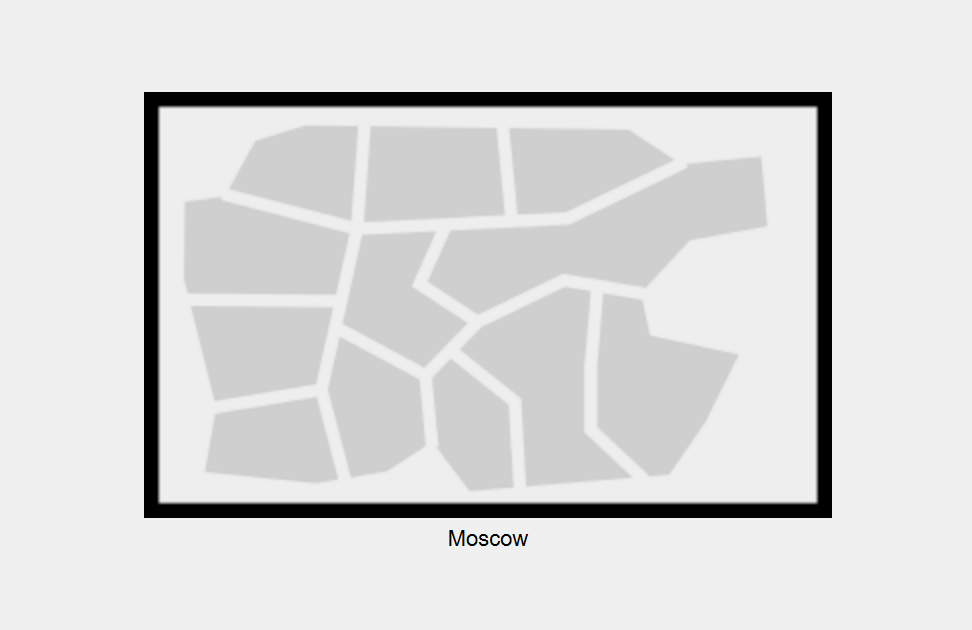{#fig:002 width=70%}

Щёлкнув на изображение города, мы видим изображение здания. Присвоим ему название Donskaya и добавим здание для территории Pavlovskaya (рис. @fig:003).

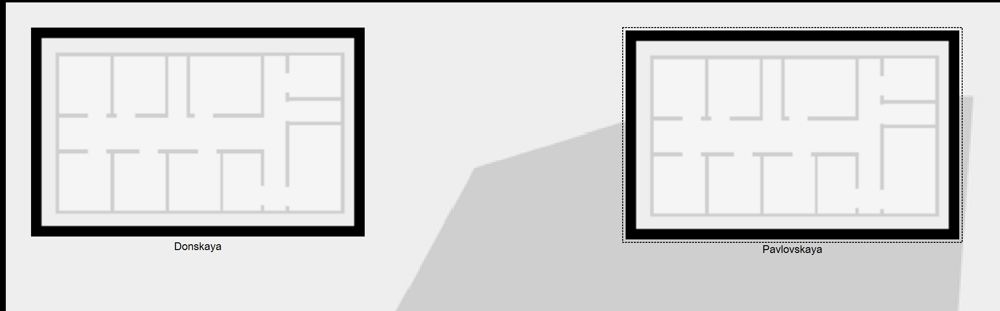{#fig:003 width=70%}

Щёлкнув на изображение здания Donskaya, переместим изображение, обозначающее серверное помещение, в него (рис. @fig:004).

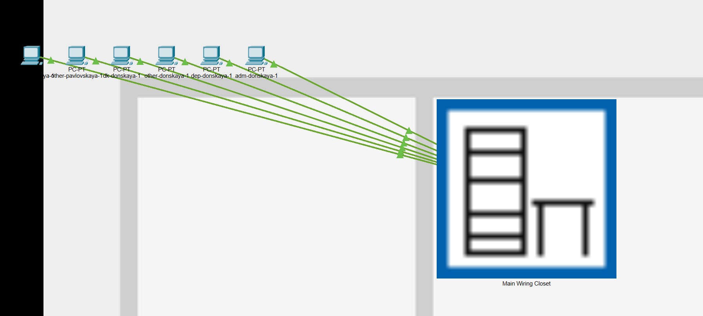{#fig:004 width=70%}

Затем, щёлкнув на изображение серверной, мы видим отображение серверных стоек. Переместим коммутатор msk-pavlovskaya-claudely-sw-1 (рис. @fig:005) и два оконечных устройства dk-pavlovskaya-1 и other-pavlovskaya-1 (рис. @fig:006) на территорию Pavlovskaya, используя меню “Move” физической рабочей области Packet Tracer.

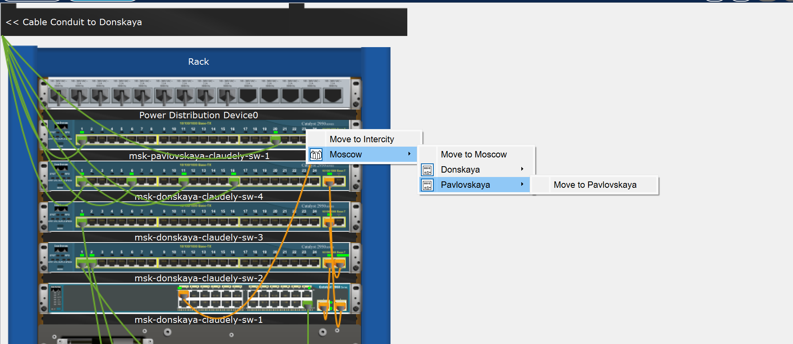{#fig:005 width=70%}

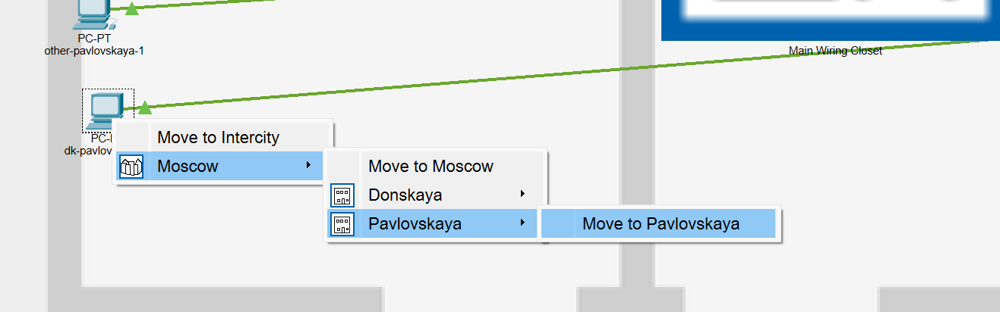{#fig:006 width=70%}

Далее в меню “Options”, “Preferences” во вкладке “Interface” активируем разрешение на учёт физических характеристик среды передачи (Enable Cable Length Effects) (рис. @fig:007).

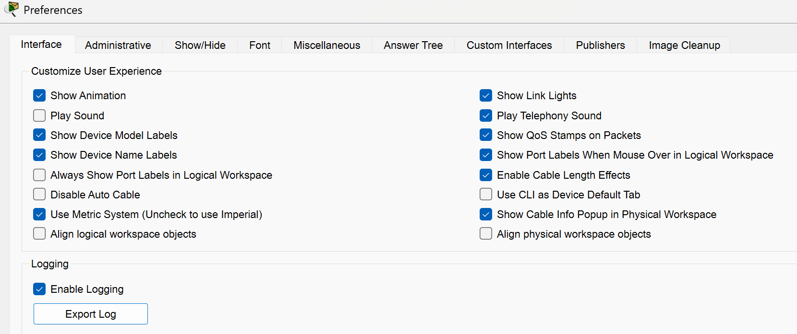{#fig:007 width=70%}

Теперь в физической рабочей области Packet Tracer разместим две территории на расстоянии более 100 м друг от друга (рис. @fig:008).

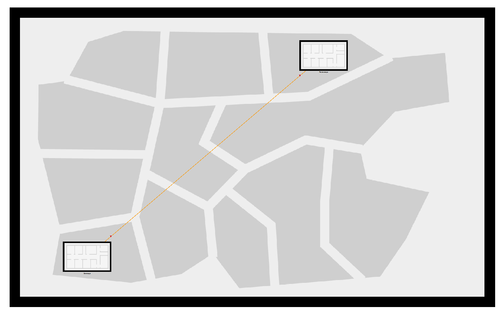{#fig:008 width=70%}

Вернувшись в логическую рабочую область Packet Tracer, пропингуем с коммутатора msk-donskaya-claudely-sw-1 коммутатор msk-pavlovskaya-claudely-sw-1 и убедимся в неработоспособности соединения 

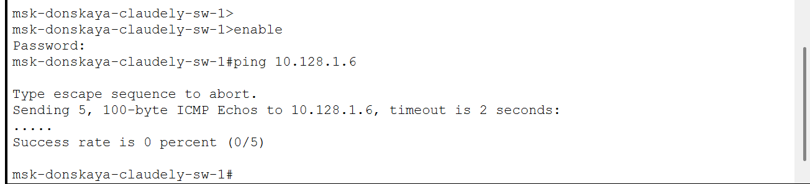{#fig:009 width=70%}

Далее удалим соединение между msk-donskaya-claudely-sw-1 и msk-pavlovskaya-claudely-sw-1 и добавим в логическую рабочую область два повторителя (Repeater-PT). Присвоим им соответствующие названия msk-donskaya-claudely-mc-1 и msk-pavlovskaya-claudely-mc-1 (рис. @fig:010). Внутри повторителей заменим имеющиеся модули на PT-REPEATERNM-1FFE и PT-REPEATER-NM-1CFE для подключения оптоволокна и витой пары по технологии Fast Ethernet (рис. @fig:011):

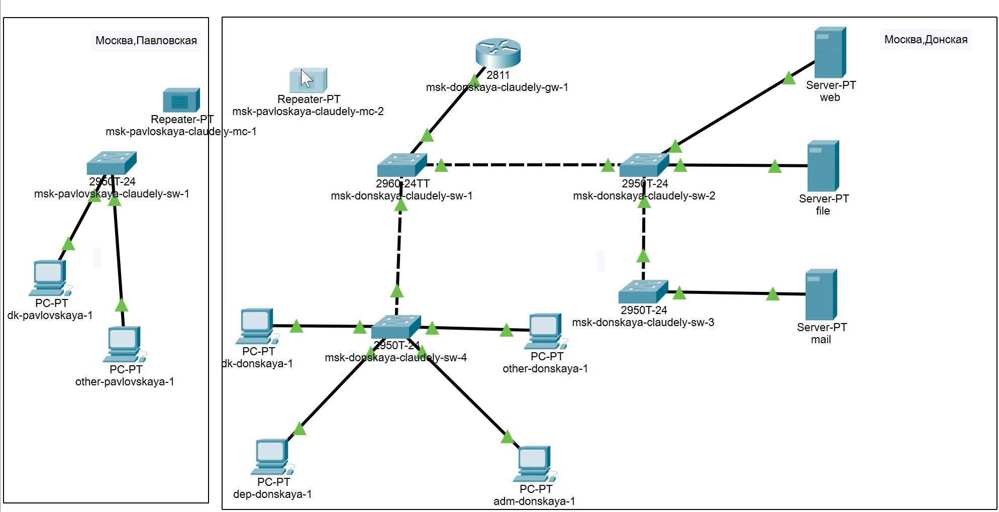{#fig:010 width=70%}

{#fig:011 width=70%}

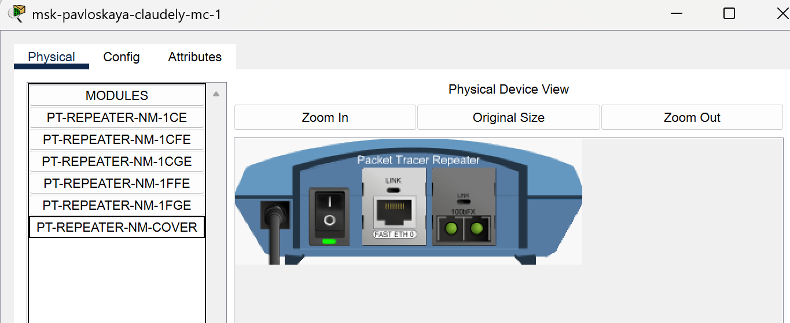{#fig:012 width=70%}

Переместим msk-pavlovskaya-claudely-mc-1 на территорию Pavlovskaya (в физической рабочей области Packet Tracer)

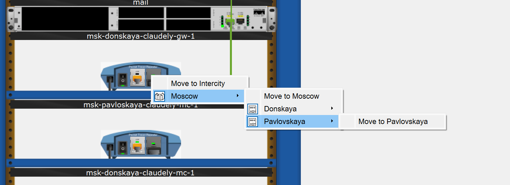{#fig:013 width=70%}

Теперь подключим коммутатор msk-donskaya-claudely-sw-1 к msk-donskaya-claudely-mc-1 по витой паре, msk-donskaya-claudely-mc-1 и msk-pavlovskaya-claudely-mc-1 — по оптоволокну, msk-pavlovskaya-claudely-sw-1 к msk-pavlovskaya-claudely-mc-1 — по витой паре 

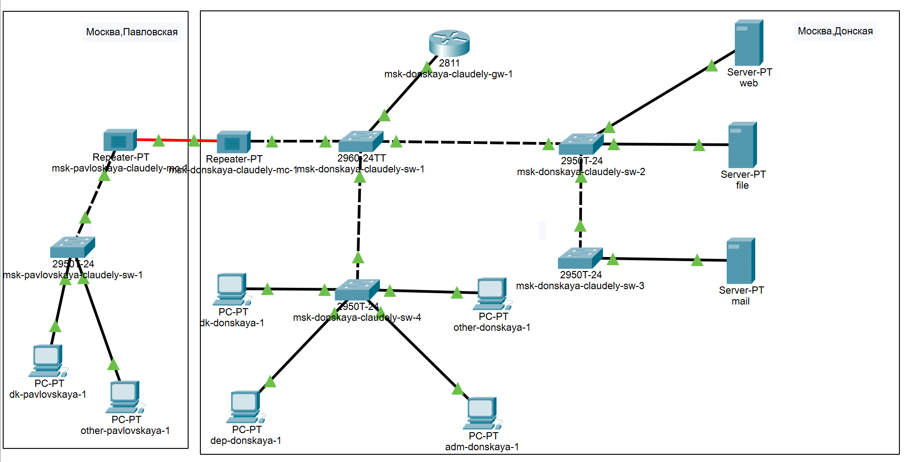{#fig:014 width=70%}

# Выводы

В ходе выполнения лабораторной работы мы получили навыки работы с физической рабочей областью Packet Tracer, а также научились учитывать физические параметры сети.

# Ответы на контрольные вопросы:

1.  Перечислите возможные среды передачи данных. На какие характеристики среды передачи данных следует обращать внимание при планировании сети? - Коаксиал, витая пара, оптоволокно, беспроводные. Допустимое расстояние, скорость передачи, реальные физические факторы для беспроводных сетей.
2.  Перечислите категории витой пары. Чем они отличаются? Какая категория в каких условиях может применяться? - Существует несколько категорий кабеля «витая пара», которые нумеруются от 1 до 8 и определяют эффективный пропускаемый частотный диапазон Категории отличаются диапазоном частот, строением кабелей, скоростью передачи. Применяются в зависимости от требуемой скорости передачи/века.
3.  В чем отличие одномодового и многомодового оптоволокна? Какой тип кабеля в каких условиях может применяться? - В количестве проходящих лучей. Одномодовые — дороже, многомодовые — охватывают меньшее расстояние.
4.  Какие разъёмы встречаются на патчах оптоволокна? Чем они отличаются? - SC — высокая скорость и плотность коммутации, ненадежный корпус. ST — меньшая плотность коммутации, надежный корпус. FC — большая сложность коммутации.
