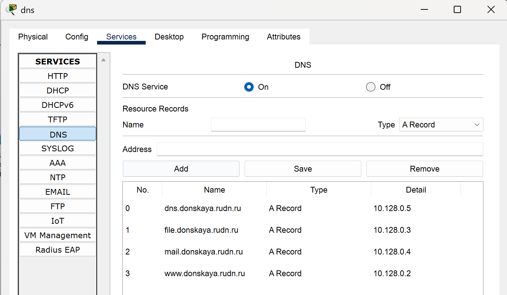
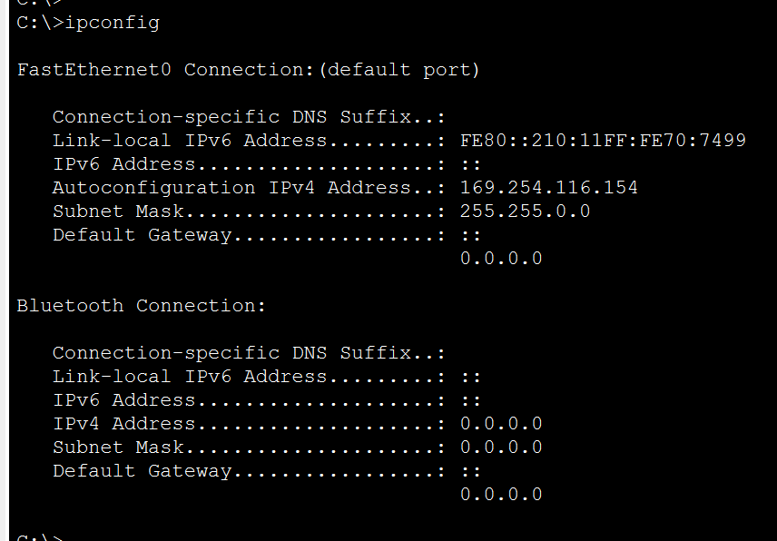
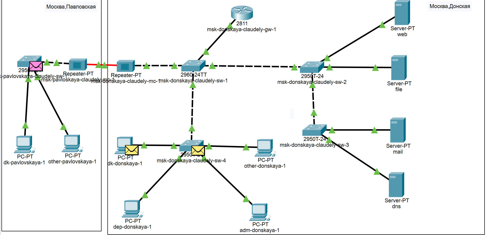

---
## Front matter
lang: ru-RU
title: Лабораторная работа №8
subtitle: Администрирование локальных сетей
author:
  - Бансимба К. Д.
institute:
  - Российский университет дружбы народов, Москва, Россия
date: 11/04/2025

## i18n babel
babel-lang: russian
babel-otherlangs: english

## Formatting pdf
toc: false
toc-title: Содержание
slide_level: 2
aspectratio: 169
section-titles: true
theme: metropolis
header-includes:
 - \metroset{progressbar=frametitle,sectionpage=progressbar,numbering=fraction}
---

# Информация

## Докладчик

:::::::::::::: {.columns align=center}
::: {.column width="70%"}

  * Бансимба Клодели Дьегра
  * студент
  * Российский университет дружбы народов
  * [1032215651@pfur.ru](mailto:1032215651@pfur.ru)
 
:::
::: {.column width="30%"}

:::
::::::::::::::

## Цель работы

Приобрести практические навыки по настройке динамического распределения IP-адресов посредством протокола DHCP (Dynamic Host Configuration Protocol) в локальной сети.

## Выполнение лабораторной работы

Откроем проект с названием lab_PT-07.pkt и сохраним под названием lab_PT-08.pkt. После чего откроем его для дальнейшего редактирования.

{#fig:001 width=70%}

## Выполнение лабораторной работы

В логическую рабочую область проекта добавим сервер dns и подключим его к коммутатору msk-donskaya-claudely-sw-3 через порт Fa0/2.

{#fig:002 width=70%}

## Выполнение лабораторной работы

Далее активируем порт при помощи соответствующих команд на коммутаторе.

{#fig:003 width=70%}

## Выполнение лабораторной работы

В конфигурации сервера укажем в качестве адреса шлюза 10.128.0.1, а в качестве адреса самого сервера — 10.128.0.5 с соответствующей маской 255.255.255.0

## Выполнение лабораторной работы

{#fig:004 width=70%}

## Выполнение лабораторной работы

Далее настроим сервис DNS : 
•  в конфигурации сервера выберем службу DNS, активируем её (выбрав флаг On); 
•  в поле Type в качестве типа записи DNS выберем записи типа A (A Record); 
•  в поле Name укажием доменное имя, по которому можно обратиться (к web-серверу — www.donskaya.rudn.ru), затем укажем его IP-адрес в соответствующем поле (10.128.0.2); 
•  нажав на кнопку Add, добавим DNS-запись на сервер; 
•  аналогичным образом добавим DNS-записи для серверов mail, file, dns; 
•  сохраним конфигурацию сервера.

## Выполнение лабораторной работы

{#fig:005 width=70%}

## Выполнение лабораторной работы

Настроим DHCP-сервис на маршрутизаторе, используя команды из лабораторной работы для каждой выделенной сети: 
•  укажем IP-адрес DNS-сервера; 
•  перейдём к настройке DHCP; 
•  зададим название конфигурируемому диапазону адресов (пулу адресов), укажем адрес сети, а также адреса шлюза и DNS-сервера; 
•  зададим пулы адресов, исключаемых из динамического распределения.

## Выполнение лабораторной работы

{#fig:006 width=50%}

## Выполнение лабораторной работы

На оконечных устройствах заменим в настройках статическое распределение адресов на динамическое

{#fig:007 width=40%}

## Выполнение лабораторной работы

Затем проверим, какие адреса выделяются оконечным устройствам 

{#fig:008 width=50%}

## Выполнение лабораторной работы

В режиме симуляции изучим, каким образом происходит запрос адреса по протоколу DHCP

{#fig:009 width=70%}

# Выводы

В ходе выполнения лабораторной работы мы приобрели практические навыки по настройке динамического распределения IP-адресов посредством протокола DHCP (Dynamic Host Configuration Protocol) в локальной сети.

