---
## Front matter
lang: ru-RU
title: Лабораторная работа №9
subtitle: Администрирование локальных сетей
author:
  - Бансимба К. Д.
institute:
  - Российский университет дружбы народов, Москва, Россия
date: 11/04/2025

## i18n babel
babel-lang: russian
babel-otherlangs: english

## Formatting pdf
toc: false
toc-title: Содержание
slide_level: 2
aspectratio: 169
section-titles: true
theme: metropolis
header-includes:
 - \metroset{progressbar=frametitle,sectionpage=progressbar,numbering=fraction}
---

# Информация

## Докладчик

:::::::::::::: {.columns align=center}
::: {.column width="70%"}

  * Бансимба Клодели Дьегра
  * студент
  * Российский университет дружбы народов
  * [1032215651@pfur.ru](mailto:1032215651@pfur.ru)
 
:::
::: {.column width="30%"}

:::
::::::::::::::

## Цель работы

Изучить возможности протокола STP и его модификаций по обеспечению отказоустойчивости сети, агрегированию интерфейсов и перераспределению нагрузки между ними.

## Выполнение лабораторной работы

Откроем проект с названием lab_PT-08.pkt и сохраним под названием lab_PT-09.pkt. После чего откроем его для дальнейшего редактирования

{#fig:001 width=70%}

## Выполнение лабораторной работы

Теперь сформируем резервное соединение между коммутаторами msk-donskaya-claudely-sw-1 и msk-donskaya-claudely-sw-3. Для этого заменим соединение между коммутаторами msk-donskaya-claudely-sw-1 (Gig0/2) и msk-donskaya-claudely-sw-4 (Gig0/1) на соединение между коммутаторами msk-donskaya-claudely-sw-1 (Gig0/2) и msk-donskaya-claudely-sw-3 (Gig0/2)

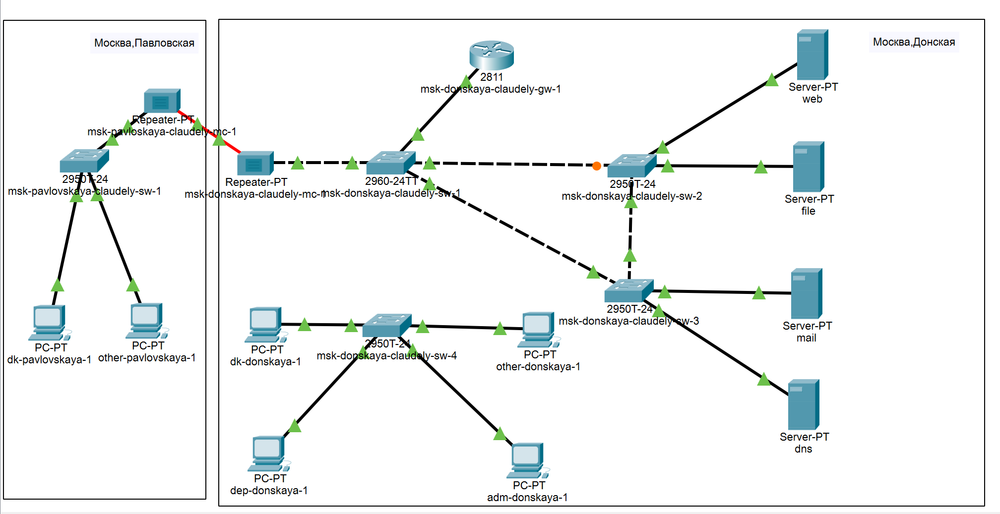{#fig:002 width=70%}

## Выполнение лабораторной работы

После чего сделаем порт на интерфейсе Gig0/2 коммутатора msk-donskaya-claudely-sw-3 транковым 

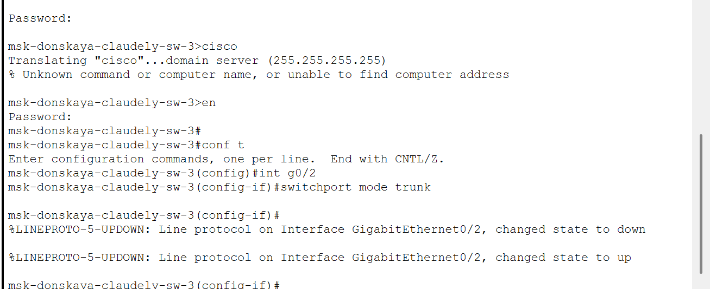{#fig:003 width=70%}

## Выполнение лабораторной работы

Теперь соединение между коммутаторами msk-donskaya-claudely-sw-1 и msk-donskaya-claudely-sw-4 сделаем через интерфейсы Fa0/23 (Рис. 1.4), не забыв активировать их в транковом режиме 

{#fig:004 width=70%}

## Выполнение лабораторной работы

оконечного устройства dk-donskaya-1 пропингуем серверы mail и web (Рис. 1.7). В режиме симуляции проследим движение пакетов ICMP и убедимся, что движение пакетов происходит через коммутатор msk-donskaya-claudely-sw-2

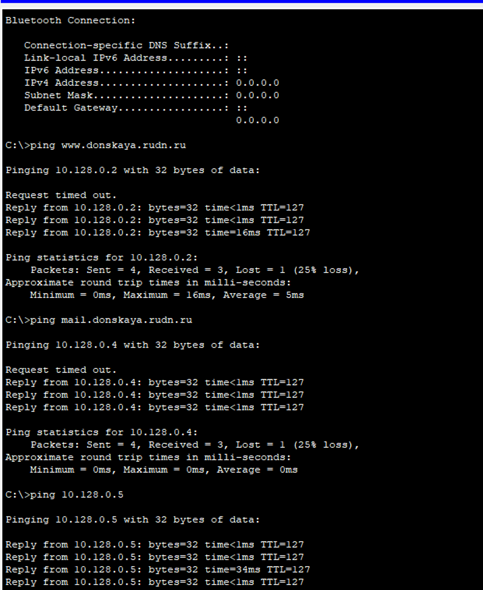{#fig:007 width=70%}

## Выполнение лабораторной работы

На коммутаторе msk-donskaya-claudely-sw-2 посмотрим состояние протокола STP для vlan 3 (указывается, что данное устройство является корневым (строка This bridge is the root))

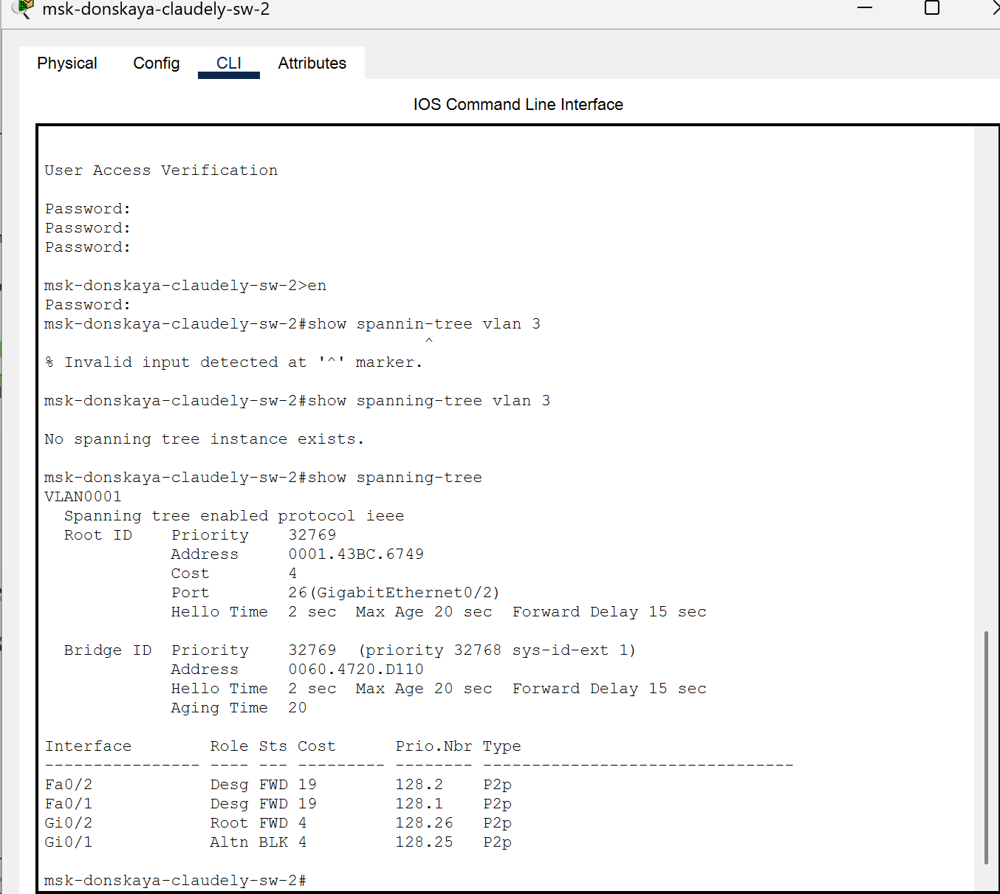{#fig:010 width=70%}

## Выполнение лабораторной работы

В качестве корневого коммутатора STP настроим коммутатор msk-donskaya-claudely-sw-1 

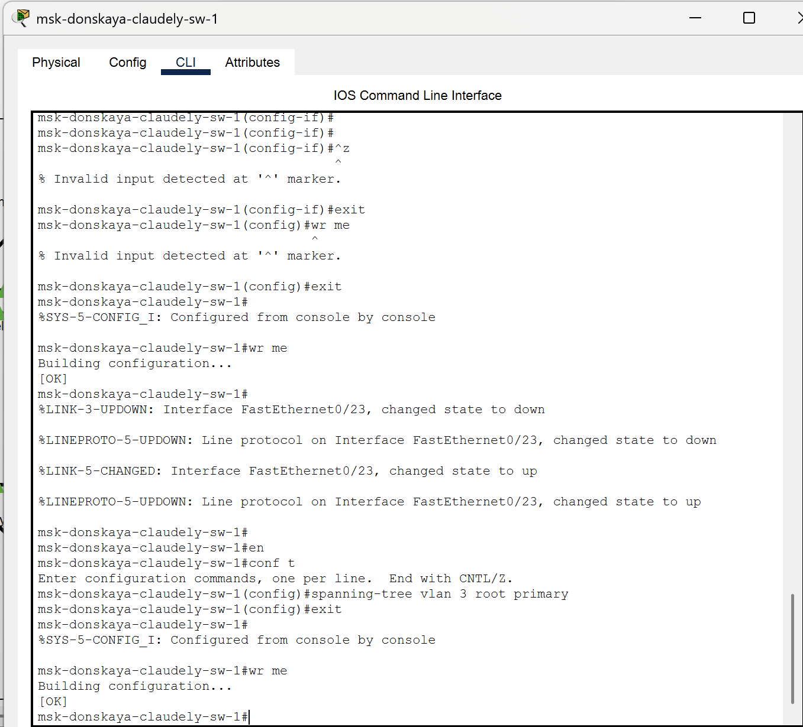{#fig:0q1 width=70%}

## Выполнение лабораторной работы

Используя режим симуляции, убедимся, что пакеты ICMP идут от хоста dk-donskaya-1 до mail через коммутаторы msk-donskaya-claudely-sw-1 и msk-donskaya-claudely-sw-3, а от хоста dk-donskaya-1 до web через коммутаторы msk-donskaya-claudely-sw-1 и msk-donskaya-claudely-sw-2

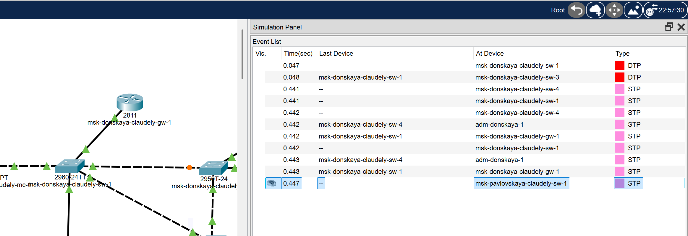{#fig:012 width=70%}

## Выполнение лабораторной работы

Настроим режим Portfast на тех интерфейсах коммутаторов, к которым подключены сервера

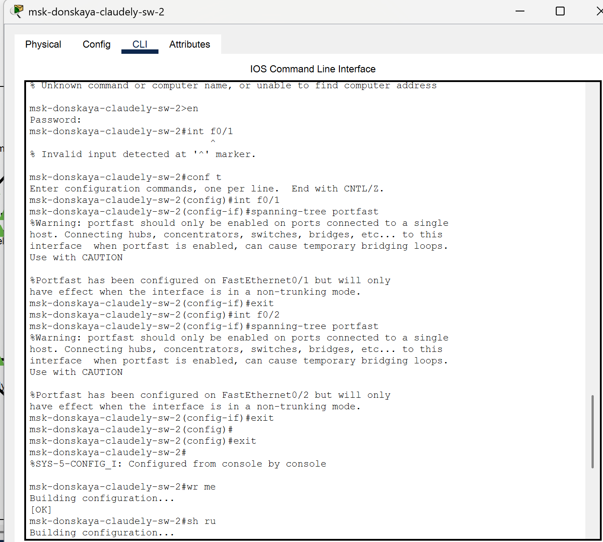{#fig:013 width=70%}

## Выполнение лабораторной работы

Теперь изучим отказоустойчивость протокола STP и время восстановления соединения при переключении на резервное соединение. Для этого используем команду ping -n 1000 mail.donskaya.rudn.ru на хосте dk-donskaya-1, а разрыв соединения обеспечим переводом соответствующего интерфейса коммутатора в состояние shutdown 

## Выполнение лабораторной работы

{#fig:014 width=70%}

## Выполнение лабораторной работы

[Изучение отказоустойчивости протокола STP и времени восстановления соединения при переключении на резервное соединение.](image/1.17.png){#fig:015 width=70%}

## Выполнение лабораторной работы

Далее переключим коммутаторы в режим работы по протоколу Rapid PVST+

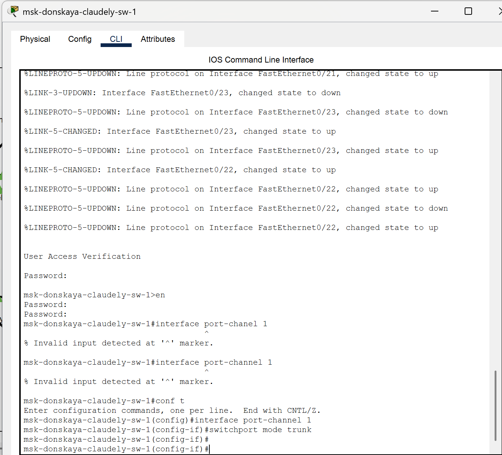{#fig:016 width=70%}

## Выполнение лабораторной работы

Изучим отказоустойчивость протокола Rapid PVST+ и время восстановления соединения при переключении на резервное соединение

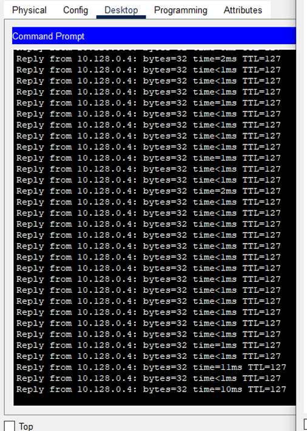{#fig:017 width=70%}

## Выполнение лабораторной работы

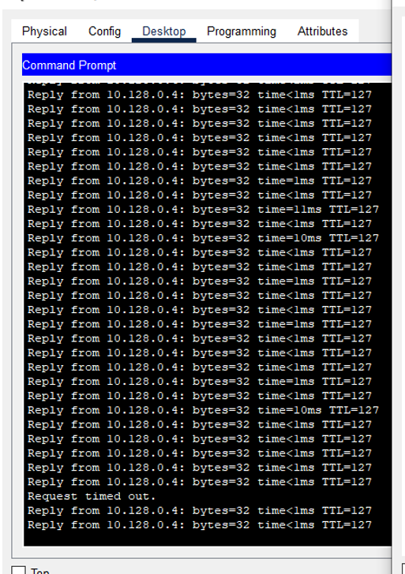{#fig:018 width=70%}

## Выполнение лабораторной работы

Сформируем агрегированное соединение интерфейсов Fa0/20 – Fa0/23 между коммутаторами msk-donskaya-claudely-sw-1 и msk-claudely-donskaya-sw-4

## Выполнение лабораторной работы

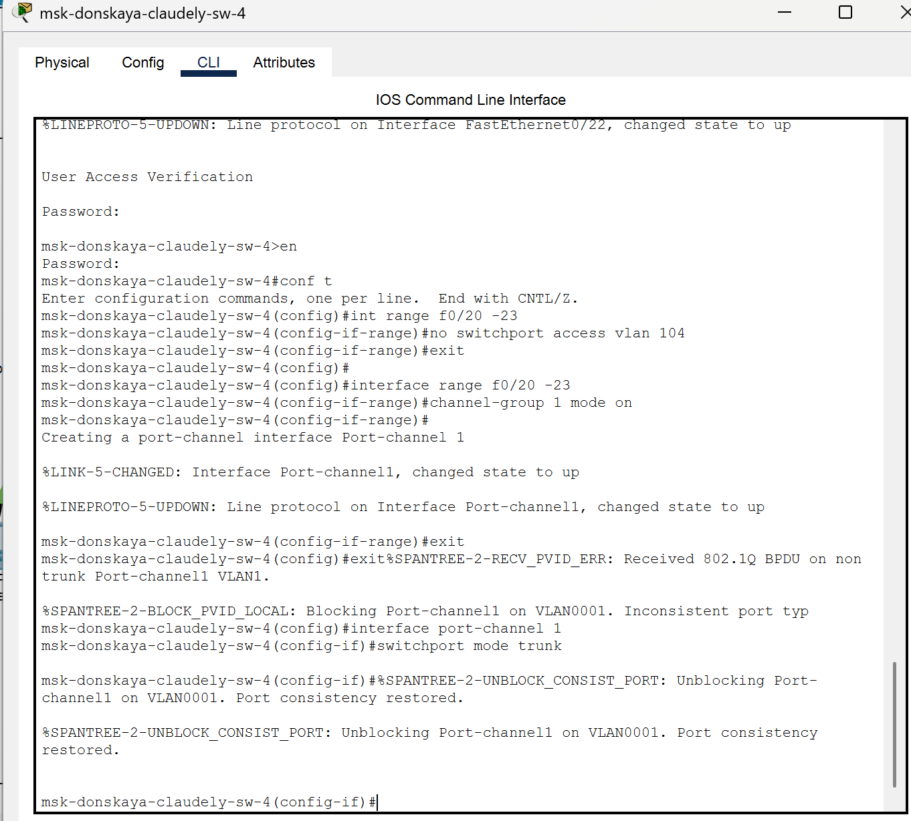{#fig:019 width=70%}

# Выводы

В ходе выполнения лабораторной работы мы изучили возможности протокола STP и его модификаций по обеспечению отказоустойчивости сети, агрегированию интерфейсов и перераспределению нагрузки между ними.

