---
## Front matter
lang: ru-RU
title: Лабораторная работа №10
subtitle: Администрирование локальных сетей
author:
  - Бансимба К. Д.
institute:
  - Российский университет дружбы народов, Москва, Россия
date: 11/04/2025

## i18n babel
babel-lang: russian
babel-otherlangs: english

## Formatting pdf
toc: false
toc-title: Содержание
slide_level: 2
aspectratio: 169
section-titles: true
theme: metropolis
header-includes:
 - \metroset{progressbar=frametitle,sectionpage=progressbar,numbering=fraction}
---

# Информация

## Докладчик

:::::::::::::: {.columns align=center}
::: {.column width="70%"}

  * Бансимба Клодели Дьегра
  * студент
  * Российский университет дружбы народов
  * [1032215651@pfur.ru](mailto:1032215651@pfur.ru)
 
:::
::: {.column width="30%"}

:::
::::::::::::::

## Цель работы

Освоить настройку прав доступа пользователей к ресурсам сети.

## Выполнение лабораторной работы

Откроем проект с названием lab_PT-09.pkt и сохраним под названием lab_PT-10.pkt. После чего откроем его для дальнейшего редактирования

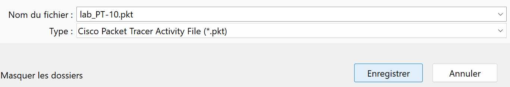{#fig:001 width=70%}

## Выполнение лабораторной работы

В рабочей области проекта подключим ноутбук администратора с именем admin к сети к other-donskaya-1 с тем, чтобы разрешить ему потом любые действия, связанные с управлением сетью. Для этого подсоединим ноутбук к порту 24 коммутатора msk-donskaya-claudely-sw-4

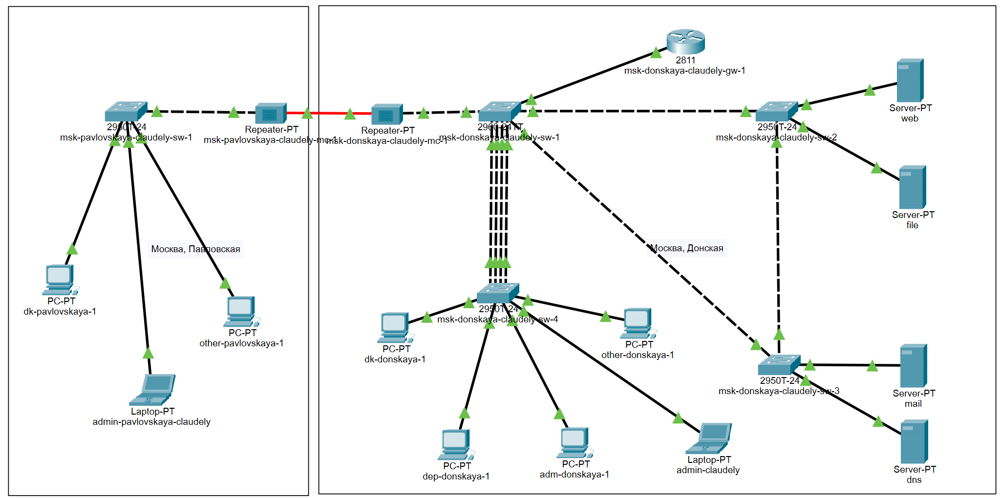{#fig:002 width=70%}

## Выполнение лабораторной работы

и присвоим ему статический адрес 10.128.6.200, указав в качестве gateway-адреса 10.128.6.1 и адреса DNS-сервера 10.128.0.5

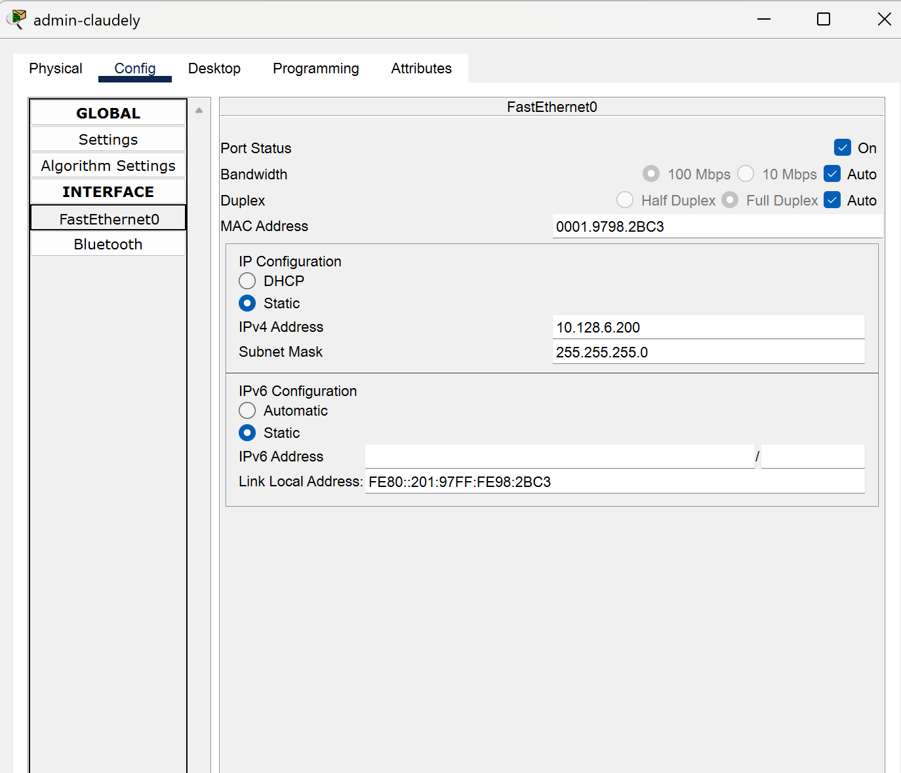{#fig:003 width=70%}

## Выполнение лабораторной работы

После чего пропингуем. Права доступа пользователей сети будем настраивать на маршрутизаторе msk-donskaya-claudely-gw-1, поскольку именно через него проходит весь трафик сети. Ограничения можно накладывать как на входящий (in), так и на исходящий (out) трафик. По отношению к маршрутизатору накладываемые ограничения будут касаться в основном исходящего трафика. Различают стандартные (standard) и расширенные (extended) списки контроля доступа (Access Control List, ACL)

## Выполнение лабораторной работы

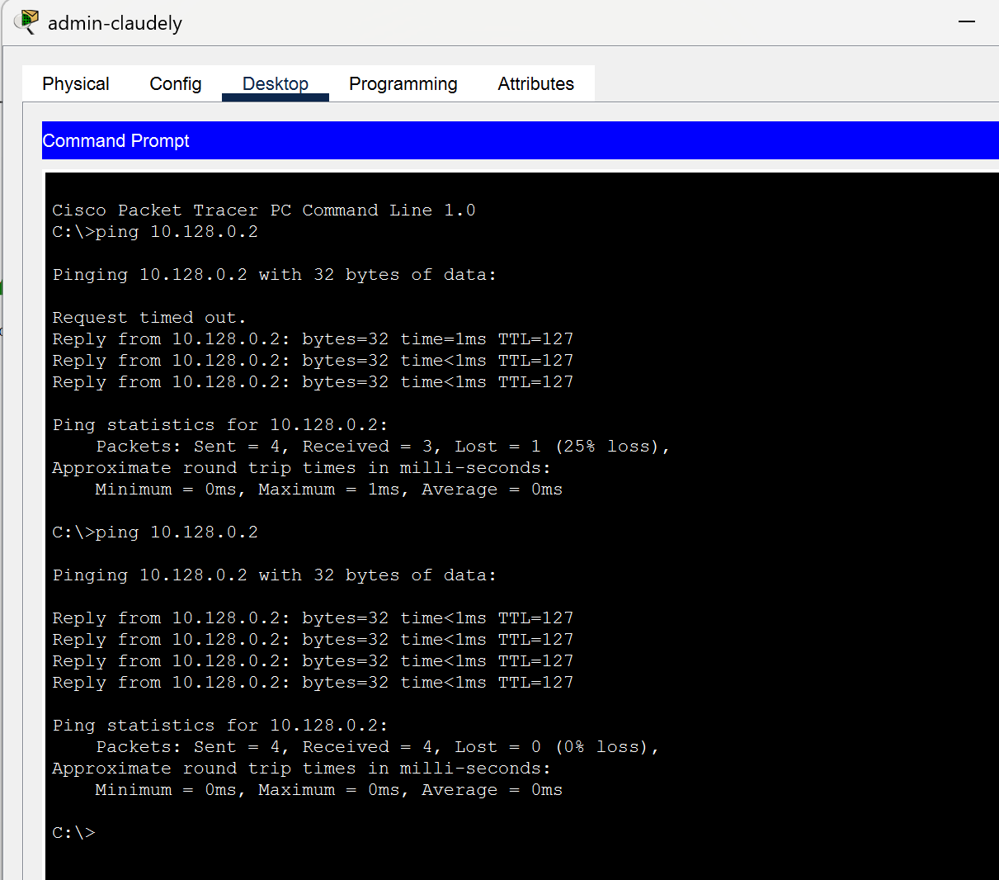{#fig:004 width=70%}

## Выполнение лабораторной работы

Далее настроим доступ к web-серверу по порту tcp 80. Здесь (Рис. 1.5):
1.  Создадим список контроля доступа с названием servers-out (так как предполагается ограничить доступ в конкретные подсети и по отношению к маршрутизатору это будет исходящий трафик); 
2.  Укажем (в качестве комментария-напоминания remark web), что ограничения предназначены для работы с web-сервером; 
3.  Дадим разрешение доступа (permit) по протоколу TCP всем (any) пользователям сети (host) на доступ к web-серверу, имеющему адрес 10.128.0.2, через порт 80.

## Выполнение лабораторной работы

{#fig:005 width=70%}

## Выполнение лабораторной работы

Добавим список управления доступом к интерфейсу. Здесь (Рис. 1.6): 
•  К интерфейсу f0/0.3 подключаем список прав доступа serversout и применяем к исходящему трафику (out). (Проверим, что доступ к web-серверу есть через протокол HTTP (введя в строке браузера хоста ip-адрес web-сервера). При этом команда ping будет демонстрировать недоступность web-сервера как по имени, так и по ip-адресу web-сервера)

## Выполнение лабораторной работы

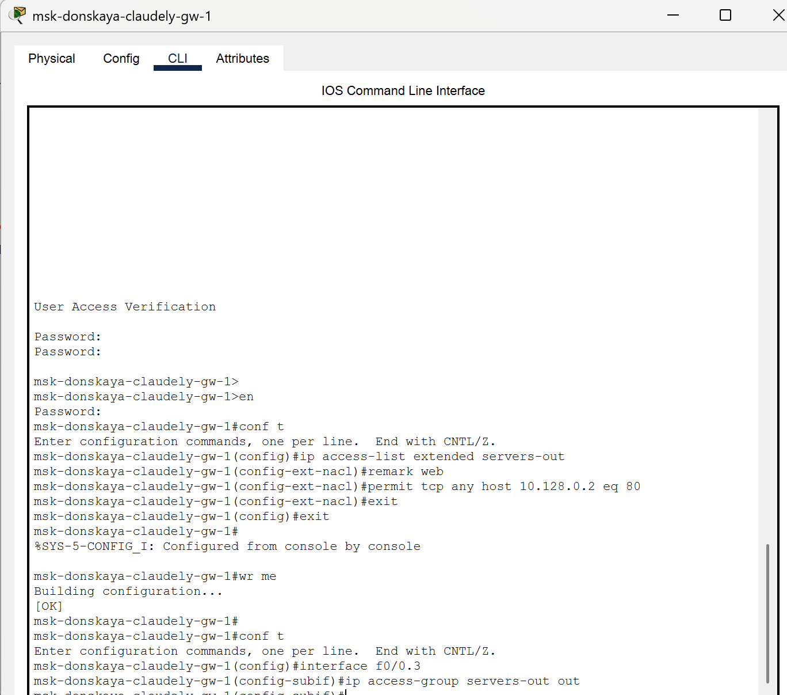{#fig:006 width=70%}

## Выполнение лабораторной работы

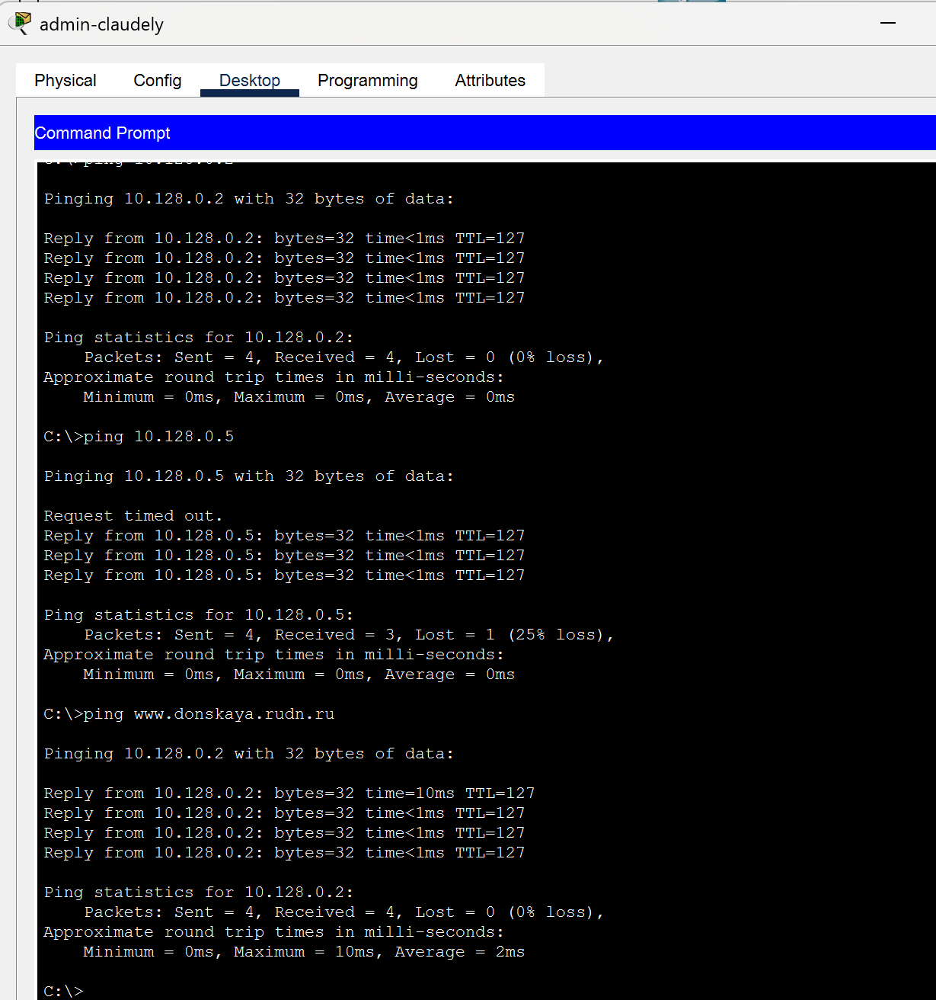{#fig:007 width=70%}

## Выполнение лабораторной работы

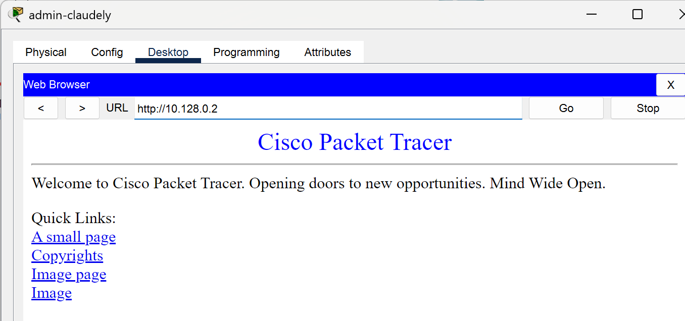{#fig:008 width=70%}

## Выполнение лабораторной работы

Настроим дополнительный доступ для администратора по протоколам Telnet и FTP. Здесь (Рис. 1.9): 
•  В список контроля доступа servers-out добавим правило, разрешающее устройству администратора с ip-адресом 10.128.6.200 доступ на web-сервер (10.128.0.2) по протоколам FTP и telnet. Убедимся, что с узла с ip-адресом 10.128.6.200 есть доступ по протоколу FTP. Для этого в командной строке устройства администратора введём ftp 10.128.0.2, а затем по запросу имя пользователя cisco и пароль cisco (Рис. 1.10). Попробуем провести аналогичную процедуру с другого устройства сети и убедимся, что доступ будет запрещён 

## Выполнение лабораторной работы

{#fig:009 width=70%}

## Выполнение лабораторной работы

{#fig:010 width=70%}

## Выполнение лабораторной работы

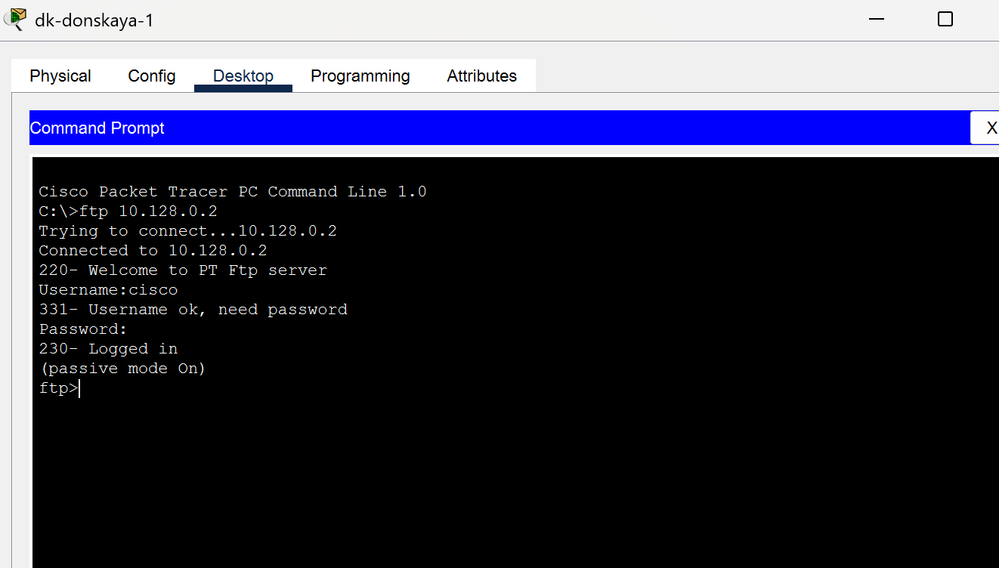{#fig:011 width=70%}

## Выполнение лабораторной работы

Настроим доступ к файловому серверу. Здесь (Рис. 1.12): 
1.  В списке контроля доступа servers-out укажем (в качестве комментария-напоминания remark file), что следующие ограничения предназначены для работы с file-сервером; 
2.  Всем узлам внутренней сети (10.128.0.0) разрешим доступ по протоколу SMB (работает через порт 445 протокола TCP) к каталогам общего пользования; 
3.  Любым узлам разрешим доступ к file-серверу по протоколу FTP. Запись 0.0.255.255 — обратная маска (wildcard mask). 

## Выполнение лабораторной работы

{#fig:012 width=70%}

## Выполнение лабораторной работы

Затем настроим доступ к почтовому серверу. Здесь (Рис. 1.13): 
1.  В списке контроля доступа servers-out укажем (в качестве комментария-напоминания remark mail), что следующие ограничения предназначены для работы с почтовым сервером; 
2.  Всем разрешим доступ к почтовому серверу по протоколам POP3 и SMTP.

## Выполнение лабораторной работы

Теперь настроим доступ для сети Other (требуется наложить ограничение на исходящий из сети Other трафик, который по отношению к маршрутизатору msk-claudely-donskaya-gw-1 является входящим трафиком). Здесь (Рис. 1.18): 
1.  В списке контроля доступа other-in укажем, что следующие правила относятся к администратору сети; 
2.  Даём разрешение устройству с адресом 10.128.6.200 на любые действия (any); 
3.  К интерфейсу f0/0.104 подключаем список прав доступа other-in и применяем к входящему трафику

## Выполнение лабораторной работы

{#fig:018 width=70%}

## Выполнение лабораторной работы

Настроим доступ администратора к сети сетевого оборудования. Здесь (Рис. 1.19): 
1.  В списке контроля доступа management-out укажем (в качестве комментария-напоминания remark admin), что устройству администратора с адресом 10.128.6.200 разрешён доступ к сети сетевого оборудования (10.128.1.0); 
2.  К интерфейсу f0/0.2 подключаем список прав доступа management-out и применяем к исходящему трафику (out).

## Выполнение лабораторной работы

{#fig:019 width=70%}

## Выполнение лабораторной работы

Проверим корректность установленных правил доступа, попытавшись получить доступ по различным протоколам с разных устройств сети к подсети серверов и подсети сетевого оборудования

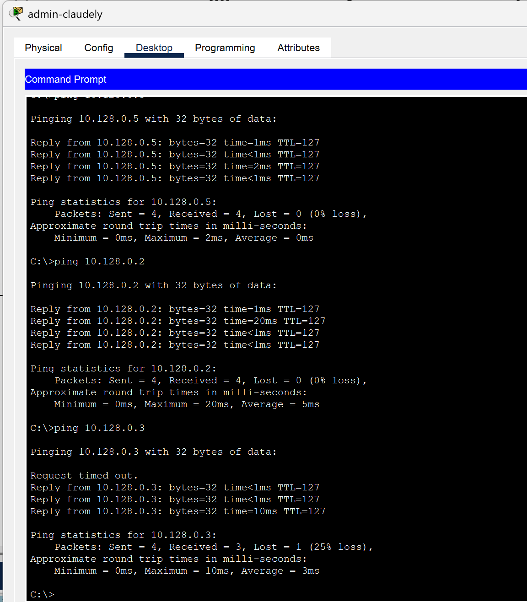{#fig:020 width=70%}

## Выполнение лабораторной работы

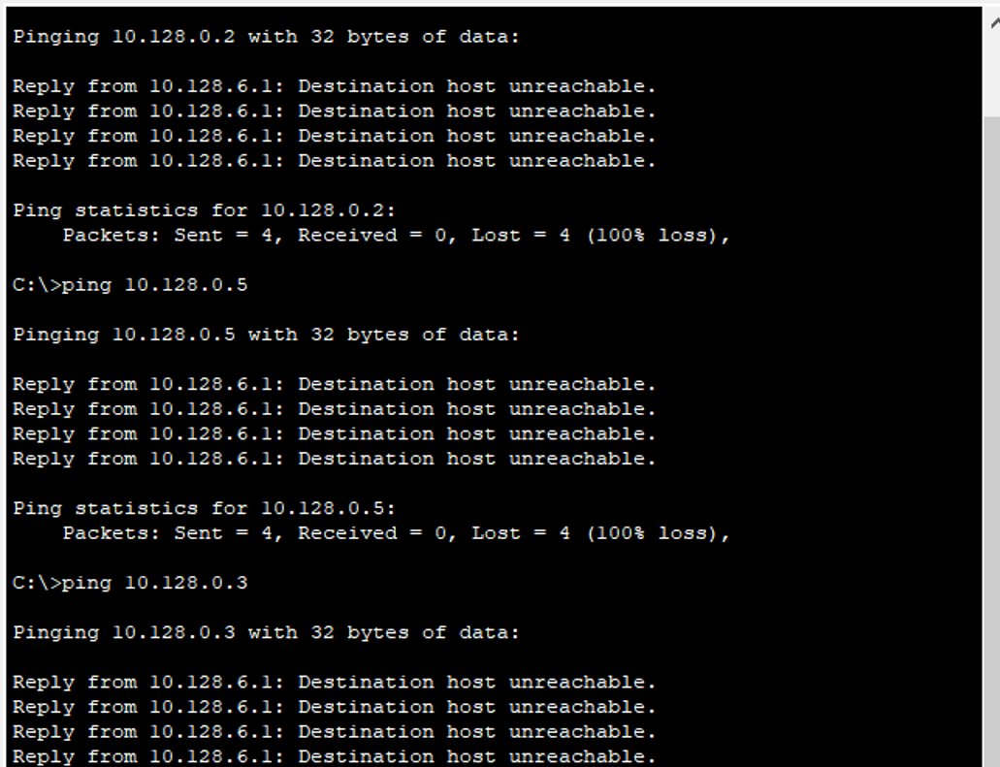{#fig:021 width=70%}

## Выполнение лабораторной работы

Разрешим администратору из сети Other на Павловской действия, аналогичные действиям администратора сети Other на Донской

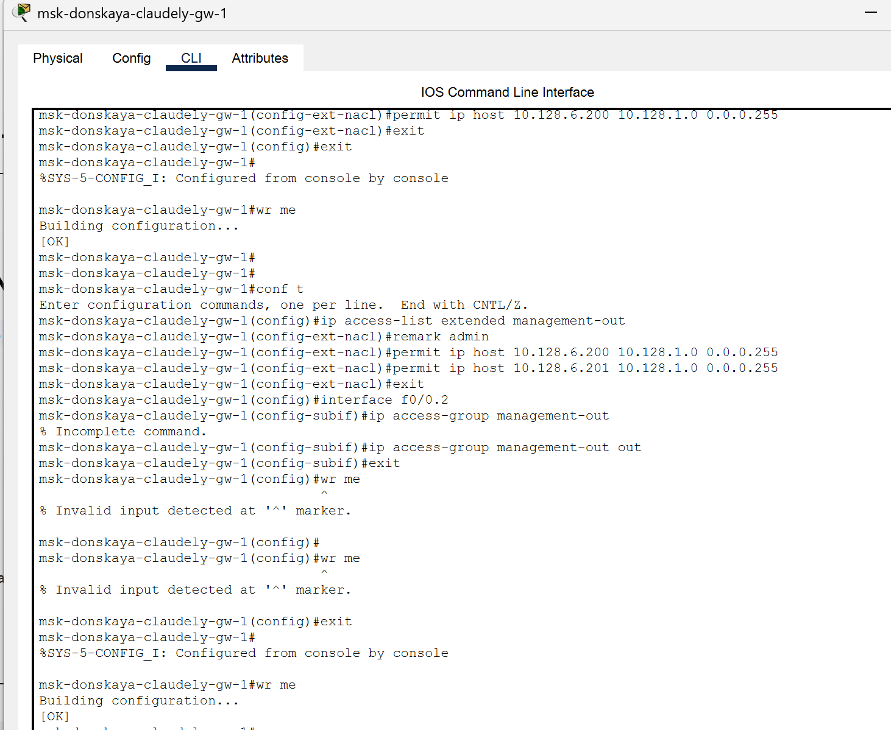{#fig:022 width=70%}

## Выполнение лабораторной работы

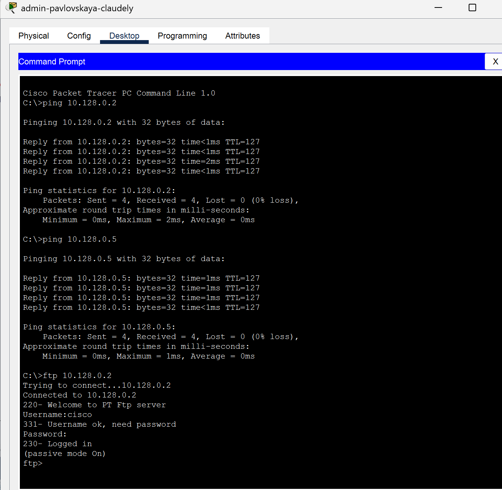{#fig:023 width=70%}

# Выводы

В ходе выполнения лабораторной работы мы освоили настройку прав доступа пользователей к ресурсам сети.

