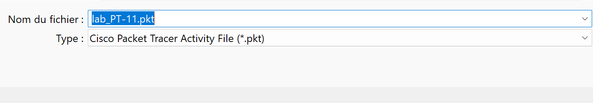
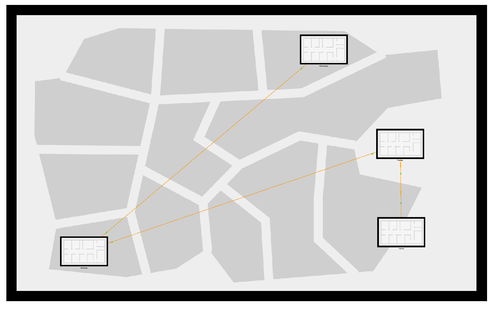
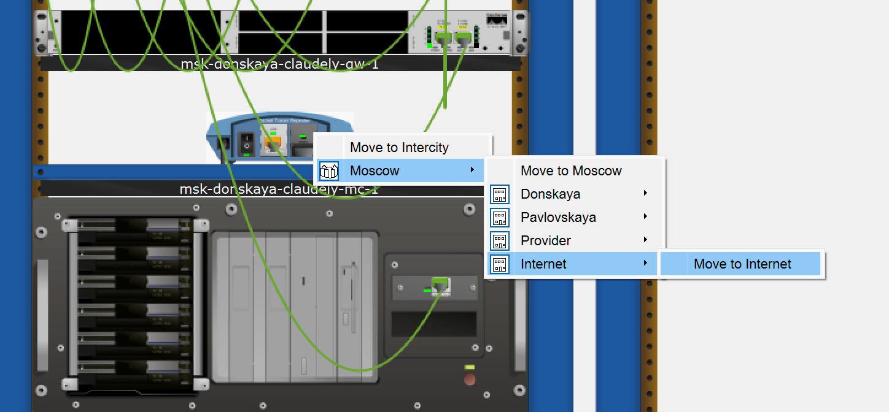
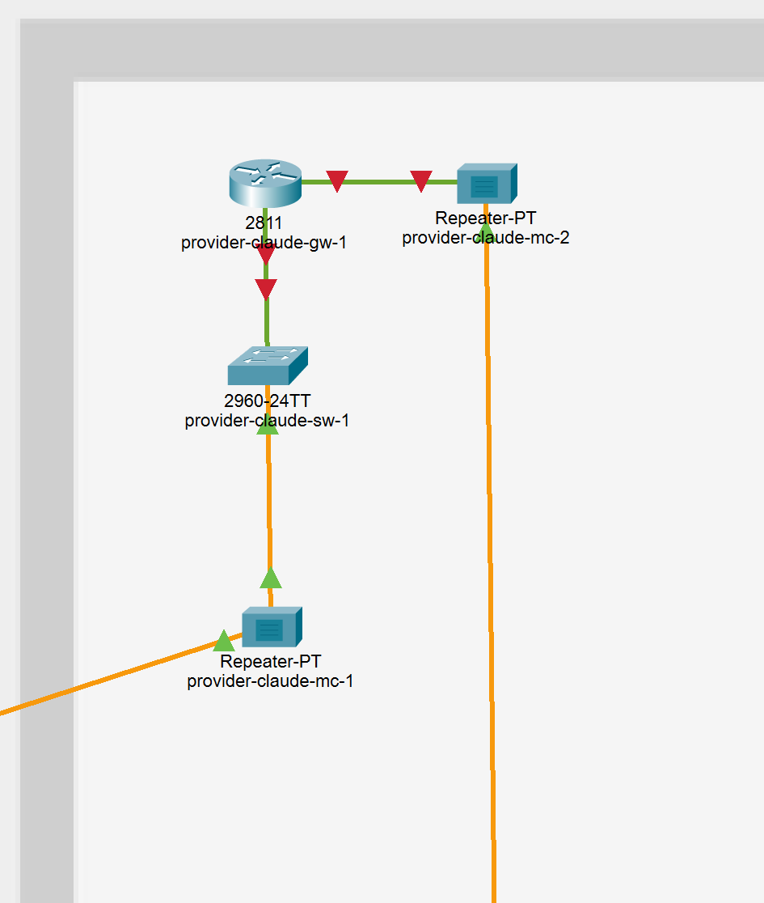
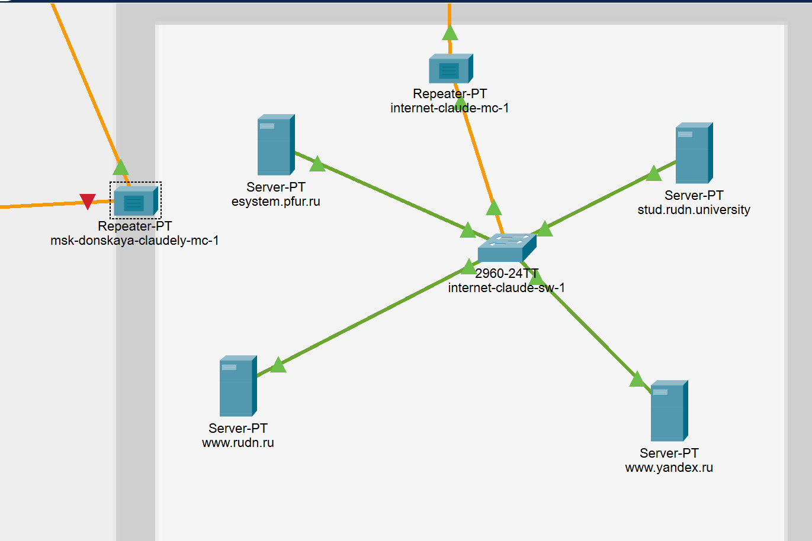
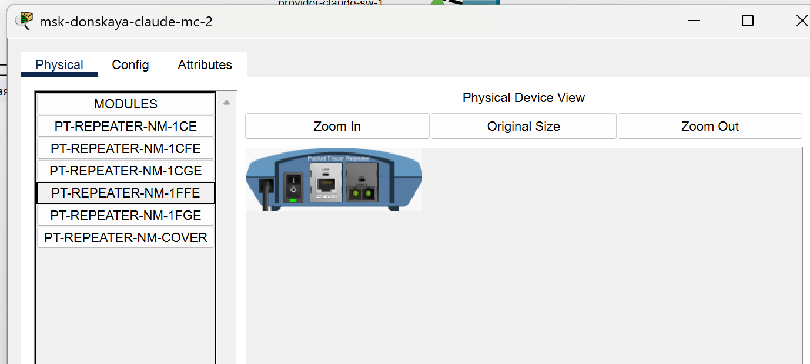
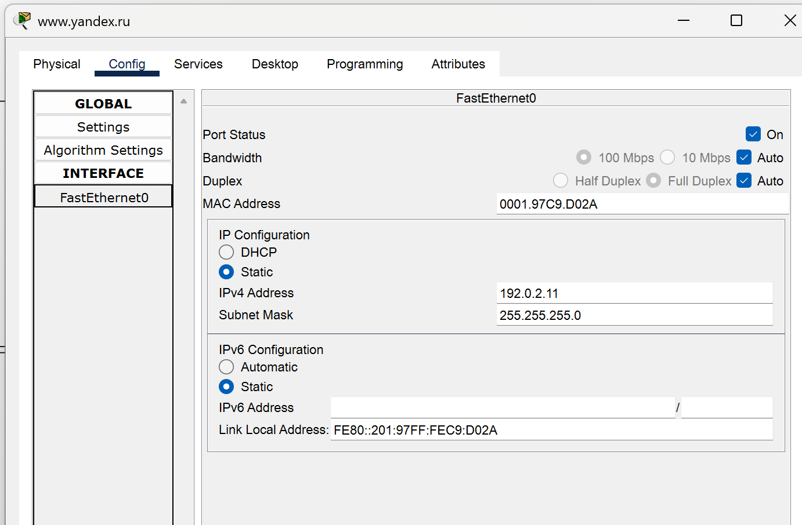
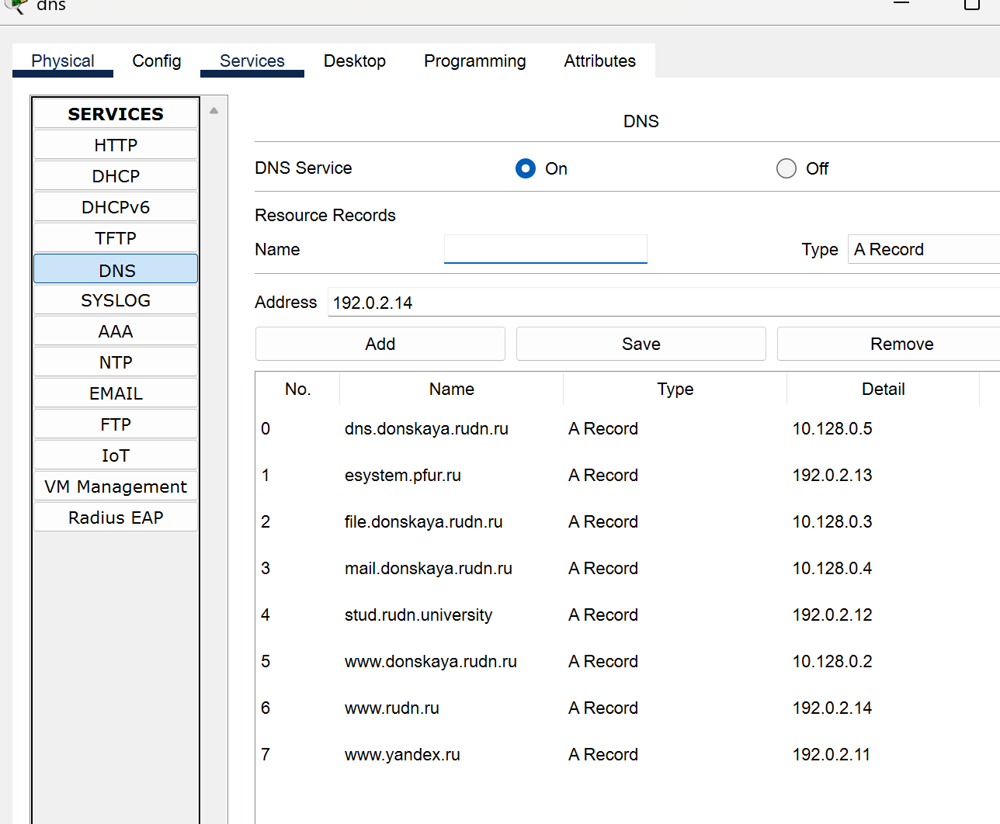

---
## Front matter
lang: ru-RU
title: Лабораторная работа №11
subtitle: Администрирование локальных сетей
author:
  - Бансимба К. Д.
institute:
  - Российский университет дружбы народов, Москва, Россия
date: 11/04/2025

## i18n babel
babel-lang: russian
babel-otherlangs: english

## Formatting pdf
toc: false
toc-title: Содержание
slide_level: 2
aspectratio: 169
section-titles: true
theme: metropolis
header-includes:
 - \metroset{progressbar=frametitle,sectionpage=progressbar,numbering=fraction}
---

# Информация

## Докладчик

:::::::::::::: {.columns align=center}
::: {.column width="70%"}

  * Бансимба Клодели Дьегра
  * студент
  * Российский университет дружбы народов
  * [1032215651@pfur.ru](mailto:1032215651@pfur.ru)
 
:::
::: {.column width="30%"}

:::
::::::::::::::

## Цель работы

Провести подготовительные мероприятия по подключению локальной сети организации к Интернету.

# Выполнение лабораторной работы

Откроем проект с названием lab_PT-10.pkt и сохраним под названием lab_PT-11.pkt. После чего откроем его для дальнейшего редактирования (рис. @fig:001).

{#fig:001 width=70%}

## Выполнение лабораторной работы

На схеме нашего проекта разместим согласно заданию лабораторной работы необходимое оборудование для сети провайдера и сети модельного Интернета (4 медиаконвертера (Repeater-PT), 2 коммутатора типа Cisco 2960-24TT, маршрутизатор типа Cisco 2811, 4 сервера). После чего присвоим названия размещённым в сети провайдера и в сети модельного Интернета объектам согласно правилам наименования

## Выполнение лабораторной работы

{#fig:002 width=70%}

## Выполнение лабораторной работы

В физической рабочей области добавим здание провайдера и здание, имитирующее расположение серверов модельного Интернета. Присвоим им соответствующие названия

{#fig:003 width=70%}

## Выполнение лабораторной работы

Перенесём из сети «Донская» оборудование провайдера и модельной сети Интернета в соответствующие здания

{#fig:004 width=70%}

## Выполнение лабораторной работы

{#fig:005 width=70%}

## Выполнение лабораторной работы

{#fig:006 width=70%}

## Выполнение лабораторной работы

На медиаконвертерах заменим имеющиеся модули на PT-REPEATERNM-1FFE и PT-REPEATER-NM-1CFE для подключения витой пары по технологии Fast Ethernet и оптоволокна соответственно

## Выполнение лабораторной работы

{#fig:007 width=70%}

## Выполнение лабораторной работы

Пропишем IP-адреса серверам согласно таблице в лабораторной работе 

{#fig:008 width=70%}

## Выполнение лабораторной работы

После чего пропишем сведения о серверах на DNS-сервере сети «Донская» 

{#fig:009 width=70%}

# Выводы

В ходе выполнения лабораторной работы мы освоили настройку прав доступа пользователей к ресурсам сети.

