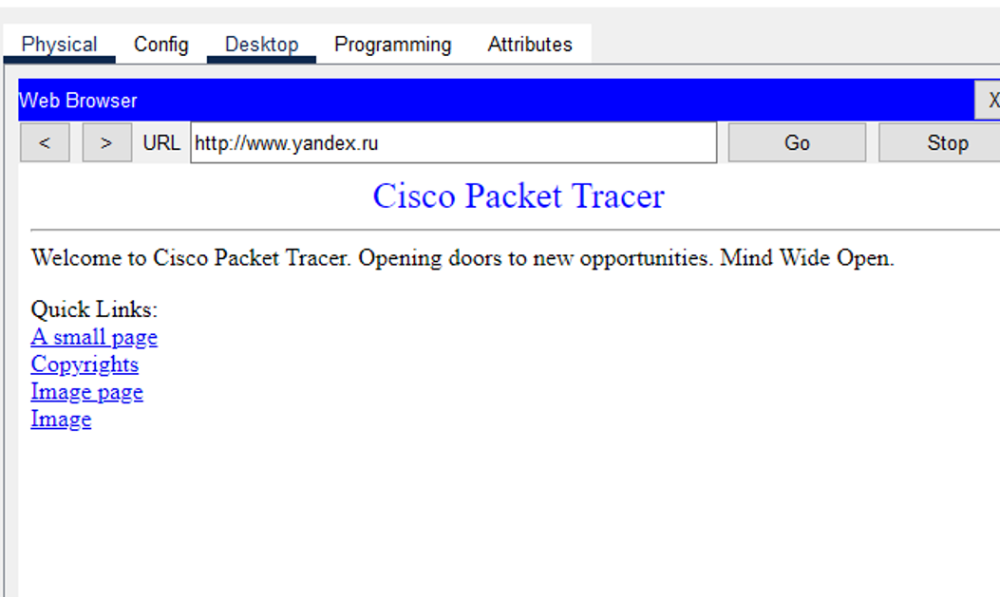

---
## Front matter
lang: ru-RU
title: Лабораторная работа №12
subtitle: Администрирование локальных сетей
author:
  - Бансимба К. Д.
institute:
  - Российский университет дружбы народов, Москва, Россия
date: 11/04/2025

## i18n babel
babel-lang: russian
babel-otherlangs: english

## Formatting pdf
toc: false
toc-title: Содержание
slide_level: 2
aspectratio: 169
section-titles: true
theme: metropolis
header-includes:
 - \metroset{progressbar=frametitle,sectionpage=progressbar,numbering=fraction}
---

# Информация

## Докладчик

:::::::::::::: {.columns align=center}
::: {.column width="70%"}

  * Бансимба Клодели Дьегра
  * студент
  * Российский университет дружбы народов
  * [1032215651@pfur.ru](mailto:1032215651@pfur.ru)
 
:::
::: {.column width="30%"}

:::
::::::::::::::

## Цель работы

риобретение практических навыков по настройке доступа локальной сети к внешней сети посредством NAT.

# Выполнение лабораторной работы

Откроем проект с названием lab_PT-11.pkt и сохраним под названием lab_PT-12.pkt. После чего откроем его для дальнейшего редактирования .

{#fig:001 width=70%}

## Выполнение лабораторной работы

Для начала сделаем первоначальную настройку маршрутизатора provider-claude-gw-1 и коммутатора provider-claude-sw-1 провайдера (зададим имя, настроим доступ по паролю и т.п.)

{#fig:002 width=70%}

## Выполнение лабораторной работы

{#fig:003 width=70%}

## Выполнение лабораторной работы

Теперь настроим интерфейсы маршрутизатора provider-claude-gw-1 и коммутатора provider-claude-sw-1 провайдера 

{#fig:004 width=70%}

## Выполнение лабораторной работы

{#fig:005 width=70%}

## Выполнение лабораторной работы

Выполним проверку командой ping с сервера www.rudn.ru на роутер провайдера

{#fig:006 width=70%}

## Выполнение лабораторной работы

Следующим шагом настроим интерфейсы маршрутизатора сети «Донская» для доступа к сети провайдера

{#fig:007 width=70%}

## Выполнение лабораторной работы

Настроим на маршрутизаторе сети «Донская» NAT с правилами, указанными в лабораторной работе

{#fig:008 width=70%} 

## Выполнение лабораторной работы

{#fig:009 width=70%}

## Выполнение лабораторной работы

{#fig:010 width=70%}

## Выполнение лабораторной работы

{#fig:011 width=70%}

## Выполнение лабораторной работы

{#fig:012 width=70%}

## Выполнение лабораторной работы

{#fig:013 width=70%}

## Выполнение лабораторной работы

{#fig:001 width=70%}

# Выводы

В ходе выполнения лабораторной работы мы приобрели практические навыки по настройке доступа локальной сети к внешней сети посредством NAT.

