---
## Front matter
title: "Отчёт по лабораторной работе №12"
subtitle: "Администрирование локальных сетей"
author: "Бансимба Клодели Дьегра, НПИбд-02-22"

## Generic otions
lang: ru-RU
toc-title: "Содержание"

## Bibliography
bibliography: bib/cite.bib

## Pdf output format
toc: true # Table of contents
toc-depth: 2
lof: true # List of figures
lot: true # List of tables
fontsize: 12pt
linestretch: 1.5
papersize: a4
documentclass: scrreprt
## I18n polyglossia
polyglossia-lang:
  name: russian
  options:
	- spelling=modern
	- babelshorthands=true
polyglossia-otherlangs:
  name: english
## I18n babel
babel-lang: russian
babel-otherlangs: english
## Fonts
mainfont: IBM Plex Serif
romanfont: IBM Plex Serif
sansfont: IBM Plex Sans
monofont: IBM Plex Mono
mathfont: STIX Two Math
mainfontoptions: Ligatures=Common,Ligatures=TeX,Scale=0.94
romanfontoptions: Ligatures=Common,Ligatures=TeX,Scale=0.94
sansfontoptions: Ligatures=Common,Ligatures=TeX,Scale=MatchLowercase,Scale=0.94
monofontoptions: Scale=MatchLowercase,Scale=0.94,FakeStretch=0.9
mathfontoptions:
## Biblatex
biblatex: true
biblio-style: "gost-numeric"
biblatexoptions:
  - parentracker=true
  - backend=biber
  - hyperref=auto
  - language=auto
  - autolang=other*
  - citestyle=gost-numeric
## Pandoc-crossref LaTeX customization
figureTitle: "Рис."
tableTitle: "Таблица"
listingTitle: "Листинг"
lofTitle: "Список иллюстраций"
lotTitle: "Список таблиц"
lolTitle: "Листинги"
## Misc options
indent: true
header-includes:
  - \usepackage{indentfirst}
  - \usepackage{float} # keep figures where there are in the text
  - \floatplacement{figure}{H} # keep figures where there are in the text
---

# Цель работы

риобретение практических навыков по настройке доступа локальной сети к внешней сети посредством NAT.

# Выполнение лабораторной работы

Откроем проект с названием lab_PT-11.pkt и сохраним под названием lab_PT-12.pkt. После чего откроем его для дальнейшего редактирования (рис. @fig:001).

{#fig:001 width=70%}

Для начала сделаем первоначальную настройку маршрутизатора provider-claude-gw-1 и коммутатора provider-claude-sw-1 провайдера (зададим имя, настроим доступ по паролю и т.п.)

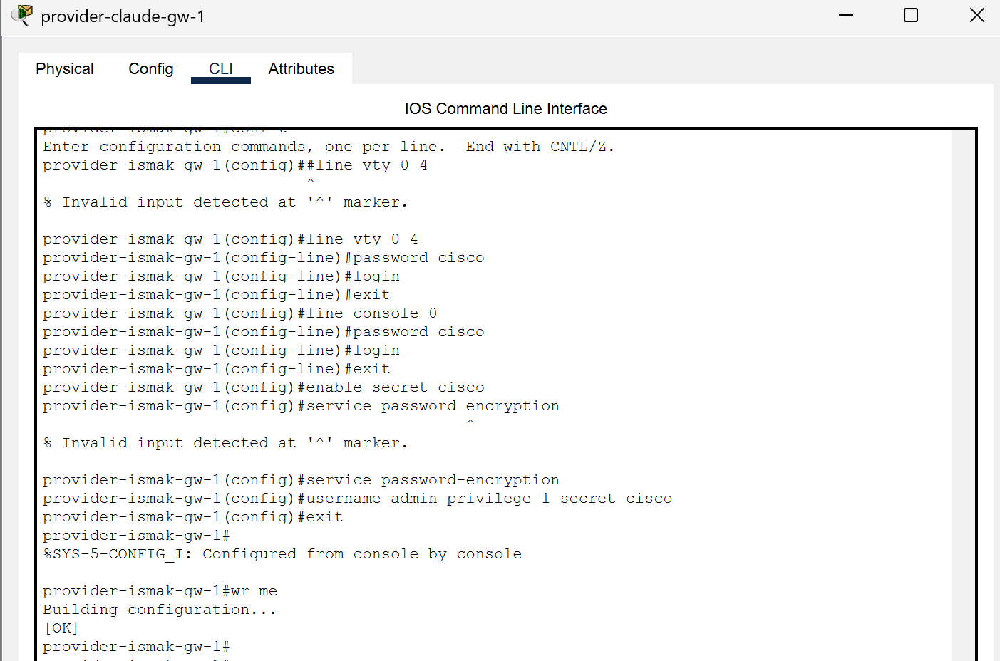{#fig:002 width=70%}

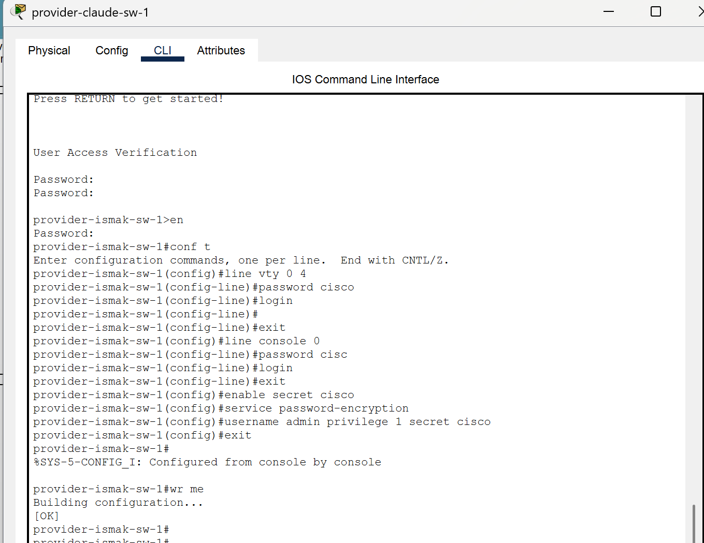{#fig:003 width=70%}

Теперь настроим интерфейсы маршрутизатора provider-claude-gw-1 и коммутатора provider-claude-sw-1 провайдера 

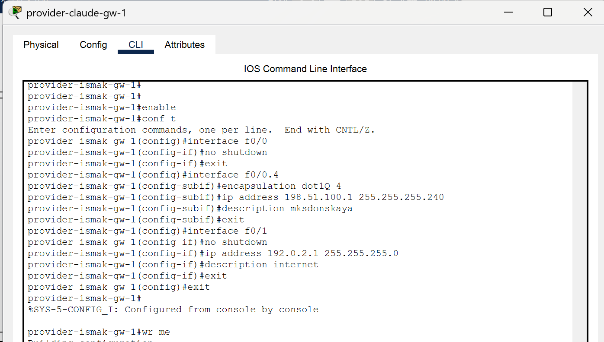{#fig:004 width=70%}

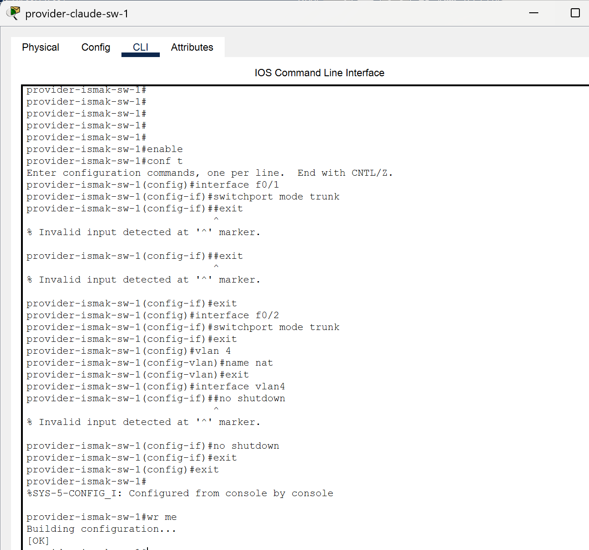{#fig:005 width=70%}

Выполним проверку командой ping с сервера www.rudn.ru на роутер провайдера

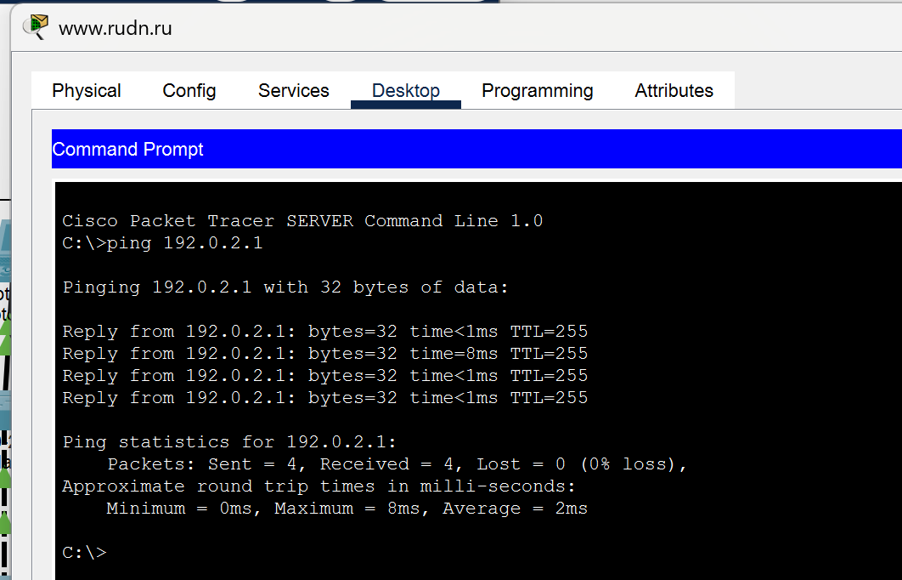{#fig:006 width=70%}

Следующим шагом настроим интерфейсы маршрутизатора сети «Донская» для доступа к сети провайдера

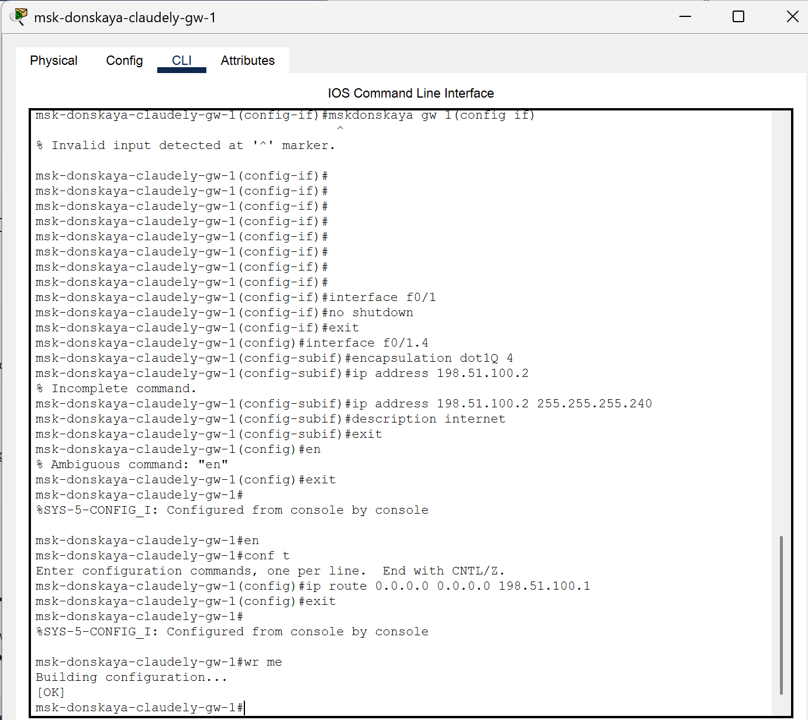{#fig:007 width=70%}

Настроим на маршрутизаторе сети «Донская» NAT с правилами, указанными в лабораторной работе

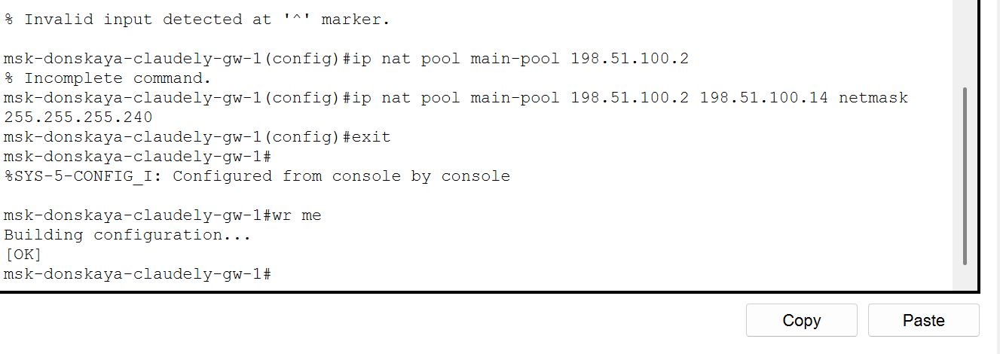{#fig:008 width=70%} 

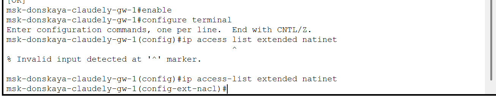{#fig:009 width=70%}

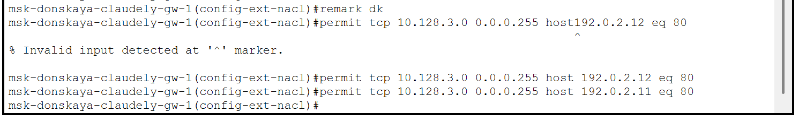{#fig:010 width=70%}

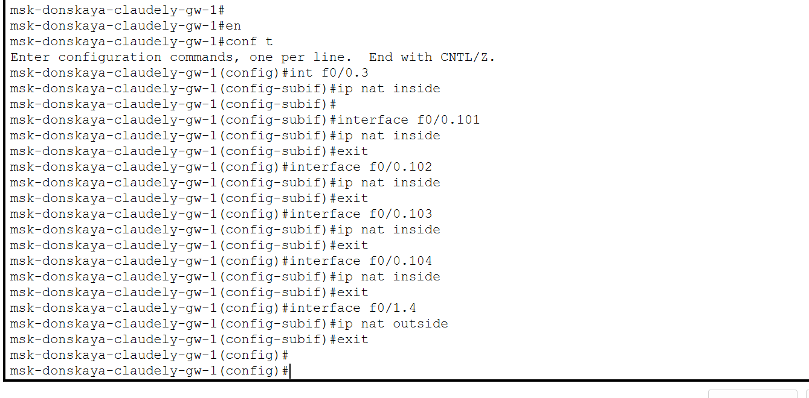{#fig:011 width=70%}

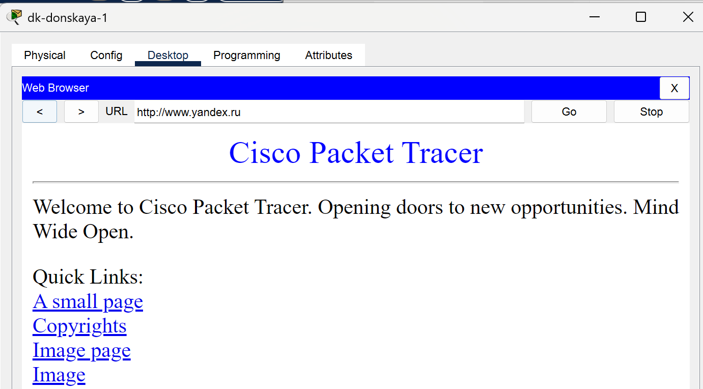{#fig:012 width=70%}

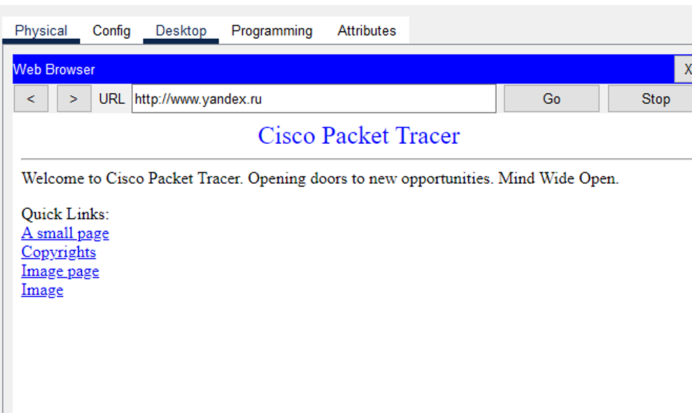{#fig:013 width=70%}
{#fig:001 width=70%}

# Выводы

В ходе выполнения лабораторной работы мы приобрели практические навыки по настройке доступа локальной сети к внешней сети посредством NAT.

# Ответы на контрольные вопросы:

1.  В чём состоит основной принцип работы NAT (что даёт наличие NAT в сети организации)? - NAT на устройстве позволяет ему соединять публичные и частные сети между собой с помощью только одного IP-адреса для группы.
2.  В чём состоит принцип настройки NAT (на каком оборудовании и что нужно настроить для из локальной сети во внешнюю сеть через NAT)? - Настроить интерфейсы на внутренних и внешних маршрутизаторах, наборы правил для преобразования IP.
3.  Можно ли применить Cisco IOS NAT к субинтерфейсам? - Да, поскольку они существуют в энергонезависимой памяти.
4.  Что такое пулы IP NAT? - Выделяемые для трансляции NAT IP.
5.  Что такое статические преобразования NAT? - Взаимно однозначное преобразование внутренних IP во внешние.
