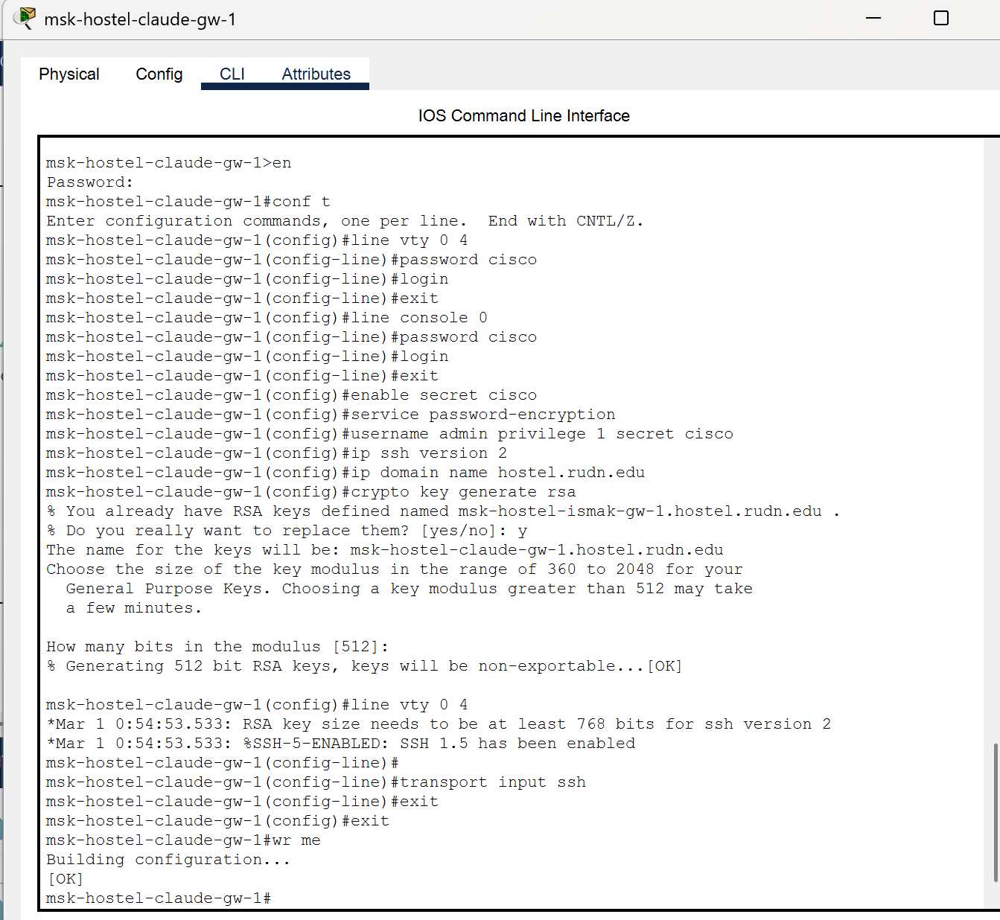

---
## Front matter
lang: ru-RU
title: Лабораторная работа №13
subtitle: Администрирование локальных сетей
author:
  - Бансимба К. Д.
institute:
  - Российский университет дружбы народов, Москва, Россия
date: 11/04/2025

## i18n babel
babel-lang: russian
babel-otherlangs: english

## Formatting pdf
toc: false
toc-title: Содержание
slide_level: 2
aspectratio: 169
section-titles: true
theme: metropolis
header-includes:
 - \metroset{progressbar=frametitle,sectionpage=progressbar,numbering=fraction}
---

# Информация

## Докладчик

:::::::::::::: {.columns align=center}
::: {.column width="70%"}

  * Бансимба Клодели Дьегра
  * студент
  * Российский университет дружбы народов
  * [1032215651@pfur.ru](mailto:1032215651@pfur.ru)
 
:::
::: {.column width="30%"}

:::
::::::::::::::

## Цель работы

Провести подготовительные мероприятия по организации взаимодействия через сеть провайдера посредством статической маршрутизации локальной сети с сетью основного здания, расположенного в 42-м квартале в Москве, и сетью филиала, расположенного в г. Сочити посредством NAT.

# Выполнение лабораторной работы

Для начала внесём изменения в схему L1 сети, добавив информацию о сети основной территории (42-й квартал в Москве) и сети филиала в г. Сочи.

# Выполнение лабораторной работы

{#fig:001 width=70%}

# Выполнение лабораторной работы

На схеме нашего проекта разместим необходимое оборудование: 4 медиаконвертера (Repeater-PT), 2 маршрутизатора типа Cisco 2811, 1 маршрутизирующий коммутатор типа Cisco 3560-24PS, 2 коммутатора типа Cisco 2950-24, коммутатор Cisco 2950-24T, 3 оконечных устройства типа PC-PT. А также присвоим им названия и проведём соединение объектов согласно скорректированной нами схеме

# Выполнение лабораторной работы

{#fig:002 width=70%}

# Выполнение лабораторной работы

На медиаконвертерах заменим имеющиеся модули на PT-REPEATERNM-1FFE и PT-REPEATER-NM-1CFE для подключения витой пары по технологии Fast Ethernet и оптоволокна соответственно

{#fig:003 width=70%}

# Выполнение лабораторной работы

Далее на маршрутизаторе msk-q42-claude-gw-1 добавим дополнительный интерфейс NM-2FE2W 

{#fig:004 width=70%}

# Выполнение лабораторной работы

В физической рабочей области Packet Tracer добавим в г.Москва здание 42-го квартала и присвоим ему название (Рис. 1.10): 

{#fig:005 width=70%}

# Выполнение лабораторной работы

Затем в физической рабочей области добавим город Сочи и в нём здание филиала, присвоим ему соответствующее название 

{#fig:006 width=70%}

# Выполнение лабораторной работы

После чего нужно перенести из сети «Донская» оборудование сети 42-го квартала и сети филиала 

{#fig:007 width=70%}

# Выполнение лабораторной работы

{#fig:008 width=70%}

# Выполнение лабораторной работы

{#fig:009 width=70%}

# Выполнение лабораторной работы

На последнем шаге выполним первоначальную настройку оборудования 

{#fig:010 width=70%}

# Выполнение лабораторной работы

{#fig:011 width=70%}
# Выполнение лабораторной работы

{#fig:012 width=70%}

# Выполнение лабораторной работы

{#fig:013 3width=70%}

# Выполнение лабораторной работы
{#fig:014 width=70%}

# Выполнение лабораторной работы

{#fig:015 width=70%}

# Выводы

В ходе выполнения лабораторной работы мы провели подготовительные мероприятия по организации взаимодействия через сеть провайдера посредством статической маршрутизации локальной сети с сетью основного здания, расположенного в 42-м квартале в Москве, и сетью филиала, расположенного в г. Сочи.

