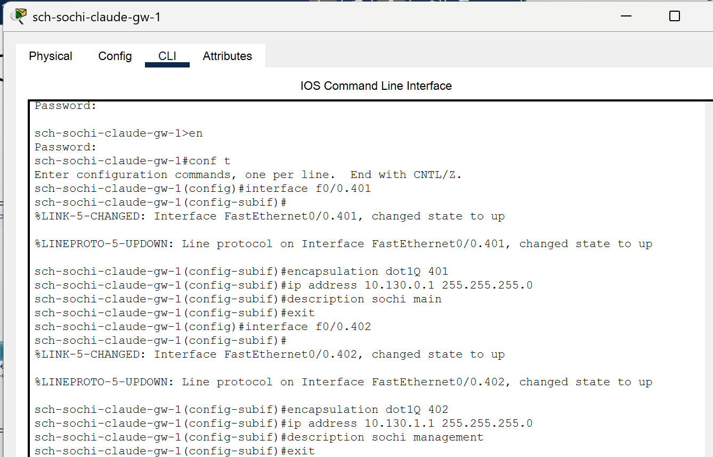

---
## Front matter
lang: ru-RU
title: Лабораторная работа №14
subtitle: Администрирование локальных сетей
author:
  - Бансимба К. Д.
institute:
  - Российский университет дружбы народов, Москва, Россия
date: 11/04/2025

## i18n babel
babel-lang: russian
babel-otherlangs: english

## Formatting pdf
toc: false
toc-title: Содержание
slide_level: 2
aspectratio: 169
section-titles: true
theme: metropolis
header-includes:
 - \metroset{progressbar=frametitle,sectionpage=progressbar,numbering=fraction}
---

# Информация

## Докладчик

:::::::::::::: {.columns align=center}
::: {.column width="70%"}

  * Бансимба Клодели Дьегра
  * студент
  * Российский университет дружбы народов
  * [1032215651@pfur.ru](mailto:1032215651@pfur.ru)
 
:::
::: {.column width="30%"}

:::
::::::::::::::

## Цель работы

Настроить взаимодействие через сеть провайдера посредством статической маршрутизации локальной сети организации с сетью основного здания, расположенного в 42-м квартале в Москве, и сетью филиала, расположенного в г. Сочи.
.

# Выполнение лабораторной работы

Теперь откроем проект с названием lab_PT-13.pkt и сохраним под названием lab_PT-14.pkt. После чего откроем его для дальнейшего редактирования.

{#fig:001 width=70%}

# Выполнение лабораторной работы

Первым делом нам нужно настроить линку между площадками. Для этого настроим интерфейсы у коммутатора provider-claudely-sw-1, маршрутизатора msk-donskaya-claudely-gw-1, маршрутизатора msk-q42-claude-gw-1, коммутатора sch-sochi-claude-sw-1 и маршрутизатора sch-sochi-claude-gw-1

{#fig:002 width=70%}

# Выполнение лабораторной работы

{#fig:003 width=70%}

# Выполнение лабораторной работы

{#fig:004 width=70%}

# Выполнение лабораторной работы

{#fig:005 width=70%}

# Выполнение лабораторной работы

{#fig:006 width=70%}

# Выполнение лабораторной работы

{#fig:007 width=70%}

# Выполнение лабораторной работы

Следующим шагом настроим площадку 42-го квартала. Для этого настроим интерфейсы у маршрутизатора msk-q42-claude-gw-1, коммутатора msk-q42-claude-sw-1, маршрутизирующего коммутатора msk-hostel-claude-gw-1 и коммутатора msk-hostel-sw-1

# Выполнение лабораторной работы

{#fig:008 width=70%}

# Выполнение лабораторной работы

{#fig:009 width=70%}

# Выполнение лабораторной работы

Далее настроим площадку в Сочи. Настроим интерфейсы у маршрутизатора sch-sochi-claude-gw-1 и у коммутатора sch-sochi-claude-sw-1

{#fig:013 width=70%}

# Выполнение лабораторной работы

атем настроим маршрутизацию между площадками. Настроим маршрутизатор msk-donskaya-claudely-gw-1, маршрутизатор msk-q42-claude-gw-1 и маршрутизатор sch-sochi-claude-gw-1

{#fig:015 width=70%}

# Выполнение лабораторной работы

{#fig:016 width=70%}

# Выполнение лабораторной работы

{#fig:017 width=70%}

# Выполнение лабораторной работы

Предпоследним шагом настроим маршрутизацию на 42 квартале. Для этого настроим маршрутизатор msk-q42-claude-gw-1 (Рис. 1.26) и маршрутизирующий коммутатор msk-hostel-claude-gw-1

# Выполнение лабораторной работы

{#fig:018 width=70%}

# Выполнение лабораторной работы

{#fig:019 width=70%}

# Выполнение лабораторной работы

И наконец последним шагом настроим NAT на маршрутизаторе msk-donskaya-claudely-gw-1 (Рис. 1.28) и выполним контрольную проверку

# Выполнение лабораторной работы

{#fig:020 width=70%}

# Выводы
В ходе выполнения лабораторной работы мы настроили взаимодействие через сеть провайдера посредством статической маршрутизации локальной сети организации с сетью основного здания, расположенного в 42-м квартале в Москве, и сетью филиала, расположенного в г. Сочи.

