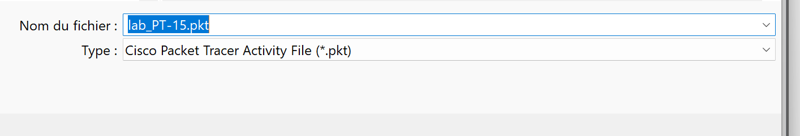
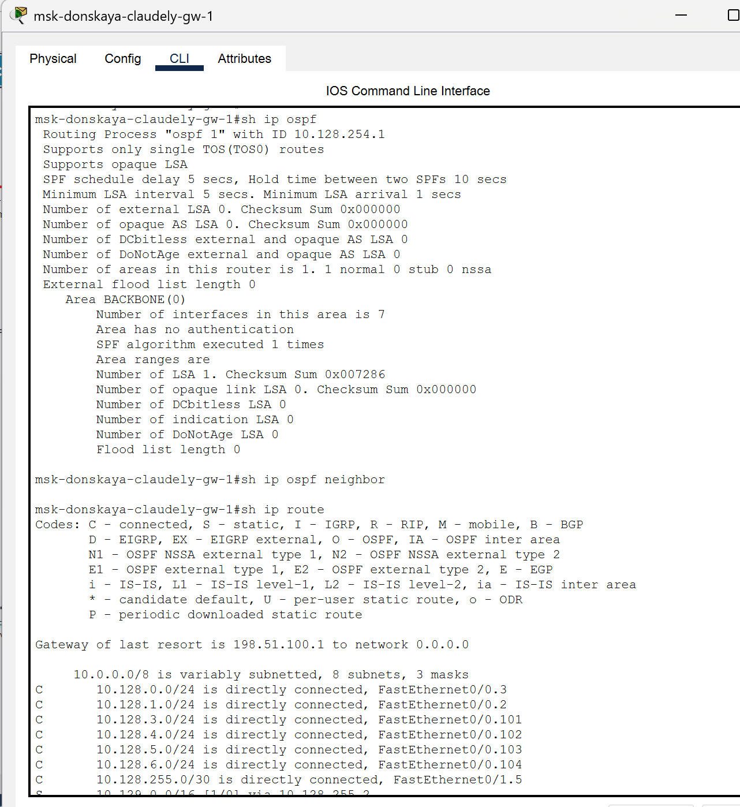
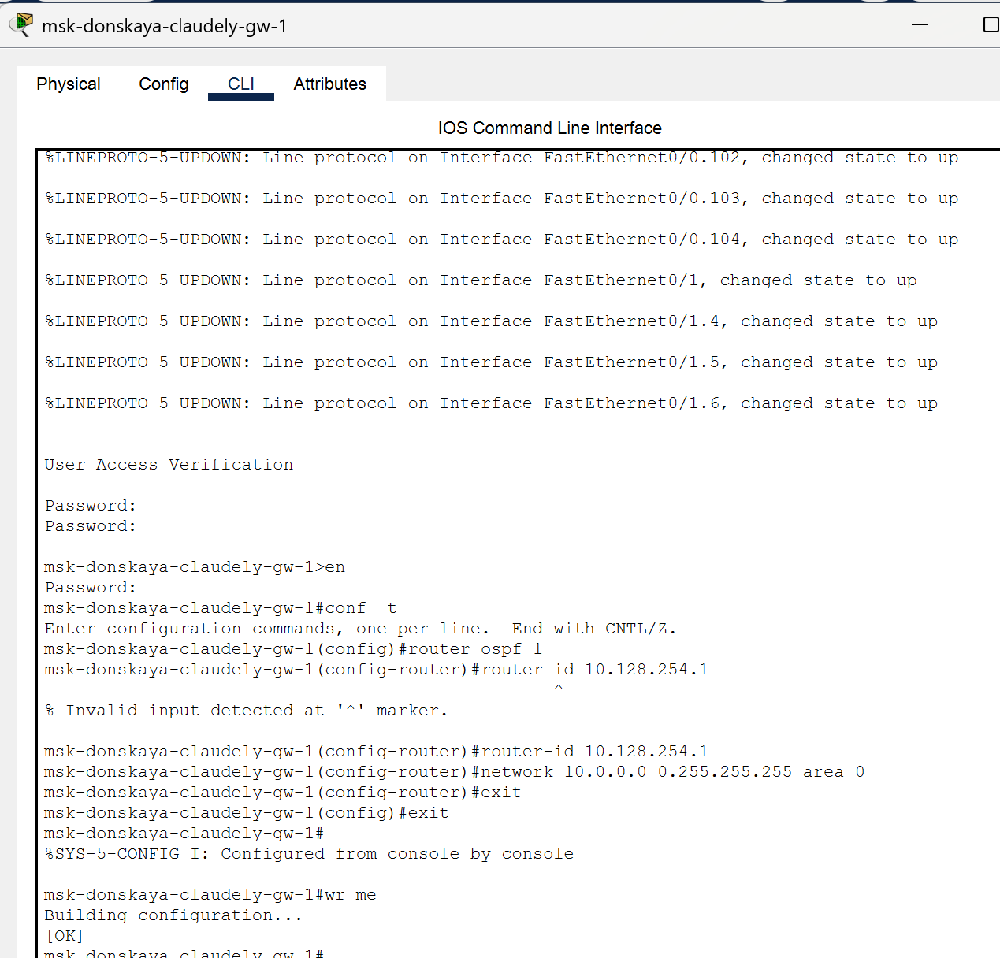
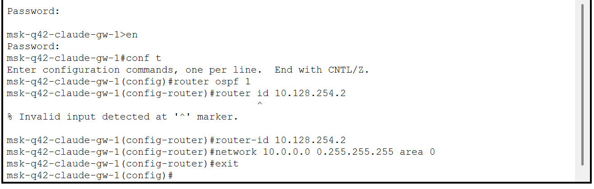
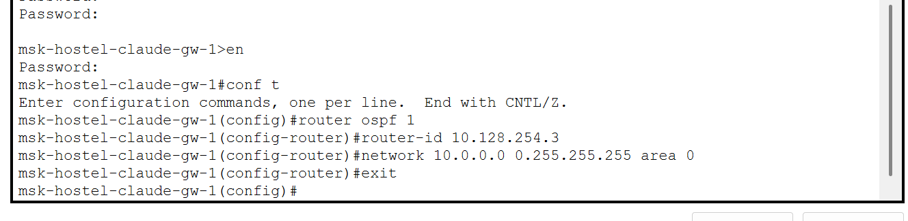
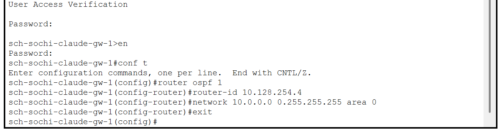
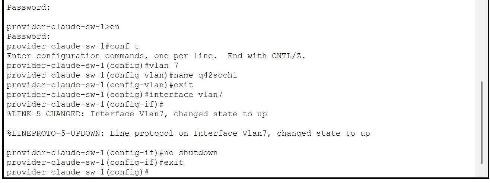
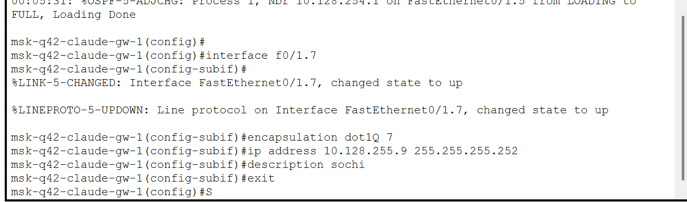
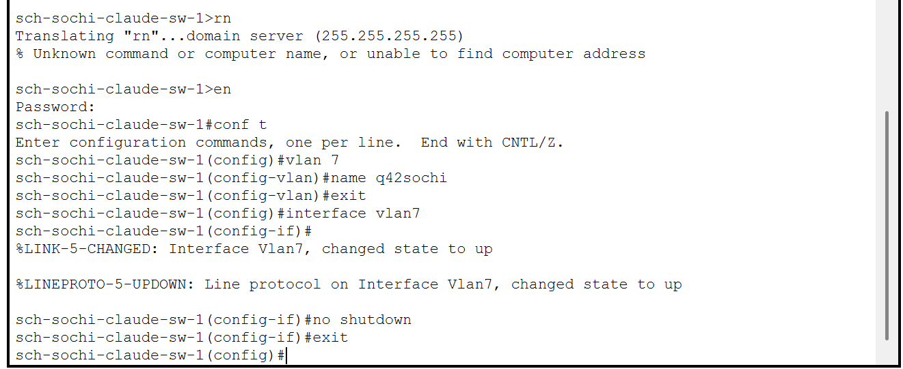
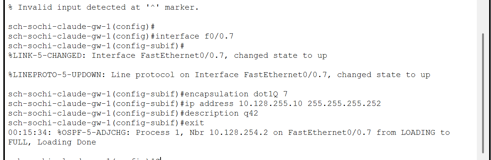

---
## Front matter
lang: ru-RU
title: Лабораторная работа №14
subtitle: Администрирование локальных сетей
author:
  - Бансимба К. Д.
institute:
  - Российский университет дружбы народов, Москва, Россия
date: 11/04/2025

## i18n babel
babel-lang: russian
babel-otherlangs: english

## Formatting pdf
toc: false
toc-title: Содержание
slide_level: 2
aspectratio: 169
section-titles: true
theme: metropolis
header-includes:
 - \metroset{progressbar=frametitle,sectionpage=progressbar,numbering=fraction}
---

# Информация

## Докладчик

:::::::::::::: {.columns align=center}
::: {.column width="70%"}

  * Бансимба Клодели Дьегра
  * студент
  * Российский университет дружбы народов
  * [1032215651@pfur.ru](mailto:1032215651@pfur.ru)
 
:::
::: {.column width="30%"}

:::
::::::::::::::

## Цель работы

Настроить динамическую маршрутизацию между территориями организации.

# Выполнение лабораторной работы

Теперь откроем проект с названием lab_PT-14.pkt и сохраним под названием lab_PT-15.pkt. После чего откроем его для дальнейшего редактирования.

{#fig:001 width=70%}

# Выполнение лабораторной работы

Для начала настроим OSPF на маршрутизаторе msk-donskaya-claudely-gw-1. Включение OSPF на маршрутизаторе предполагает, во-первых, включение процесса OSPF командой router ospf, во-вторых — назначение областей (зон) интерфейсам с помощью команды network area.

# Выполнение лабораторной работы

Идентификатор процесса OSPF (process-id) по сути идентифицирует маршрутизатор в автономной системе, и, вообще говоря, он не должен совпадать с идентификаторами процессов на других маршрутизаторах. 
Значение идентификатора области (area-id) может быть целым числом от 0 до 4294967295 или может быть представлено в виде IP-адреса: A.B.C.D. Область 0 называется магистралью, области с другими идентификаторами должны подключаться к магистрали. 

# Выполнение лабораторной работы

{#fig:002 width=70%}

# Выполнение лабораторной работы

Проверим состояние протокола OSPF на маршрутизаторе msk-donskaya-claudely-gw-1. Маршрутизаторы с общим сегментом являются соседями в этом сегменте. Соседи выбираются с помощью протокола Hello. Команда show ip ospf neighbor показывает статус всех соседей в заданном сегменте. Команда show ip ospf route (или show ip route) выводит информацию из таблицы маршрутизации

# Выполнение лабораторной работы

{#fig:003 width=70%}

# Выполнение лабораторной работы

Далее приступим к настройке: маршрутизатора msk-q42-claude-gw-1, маршрутизирующего коммутатора msk-hostel-claude-gw-1, маршрутизатора sch-sochi-claude-gw-1 

{#fig:004 width=70%}

# Выполнение лабораторной работы

{#fig:005 width=70%}

# Выполнение лабораторной работы

{#fig:006 width=70%}

# Выполнение лабораторной работы

Следующим шагом настроим линк 42-й квартал–Сочи

{#fig:007

# Выполнение лабораторной работы

{#fig:008 width=70%}

# Выполнение лабораторной работы

{#fig:009 width=70%}

# Выполнение лабораторной работы

{#fig:010 width=70%}

# Выводы

В ходе выполнения лабораторной работы мы настроили динамическую маршрутизацию между территориями организации.

