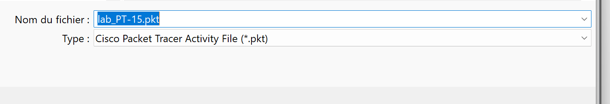
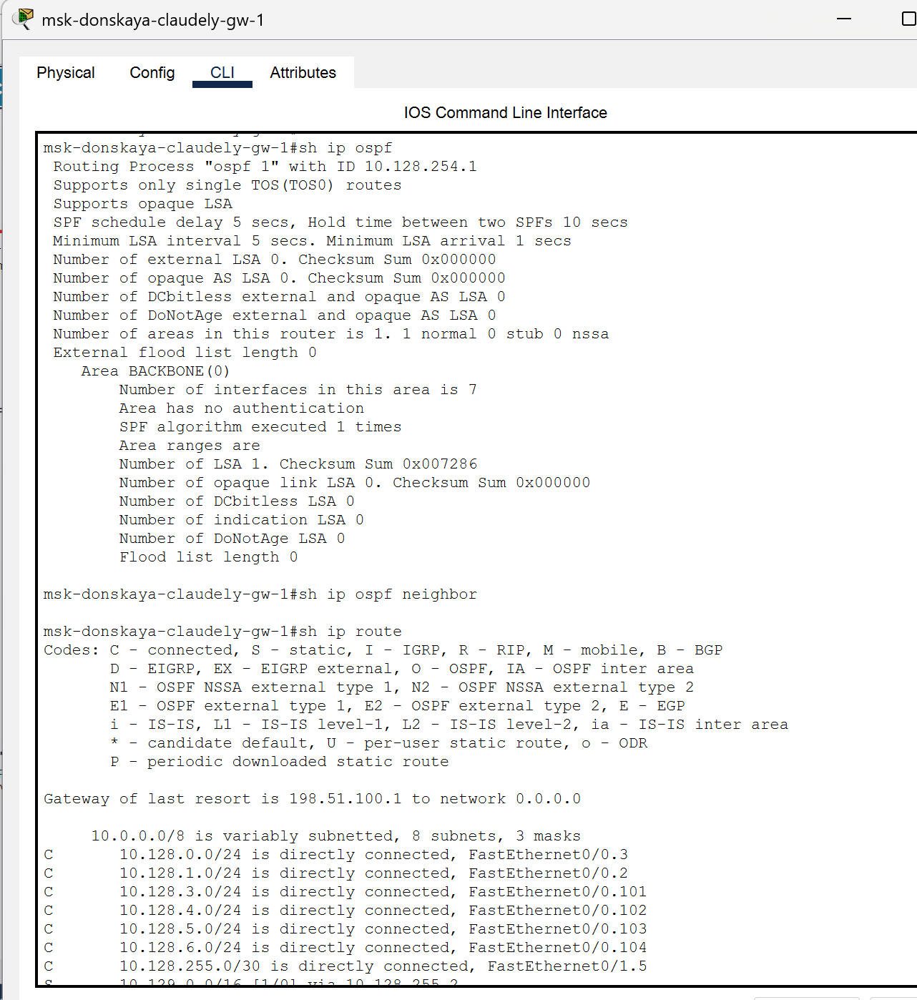
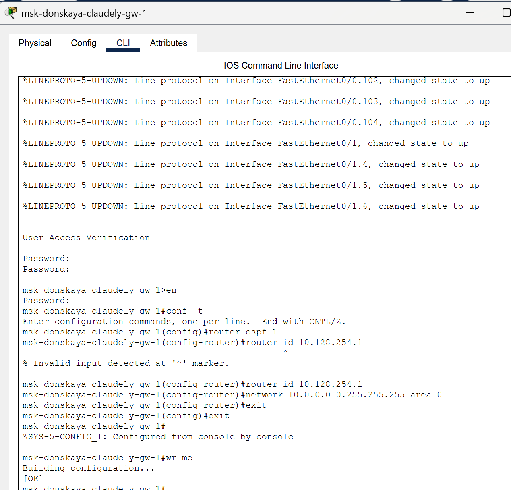
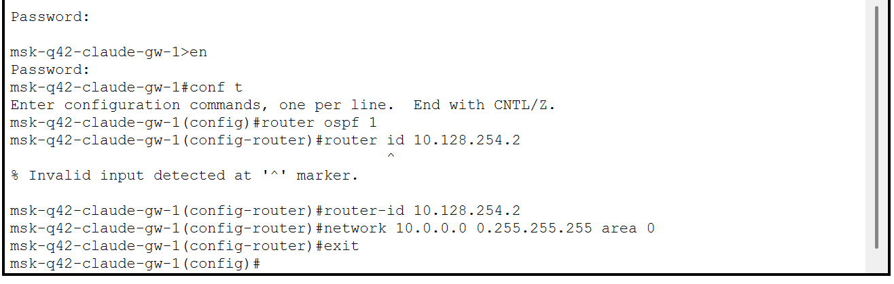
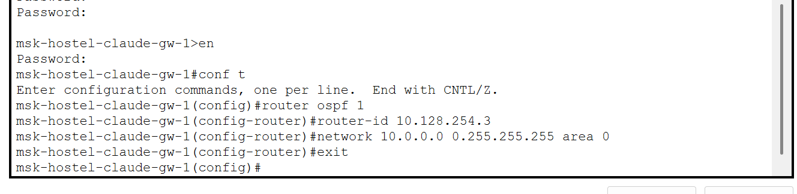
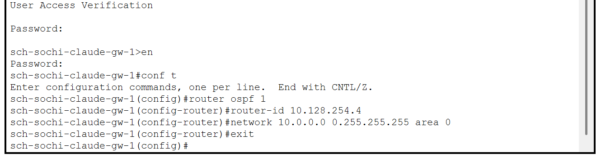
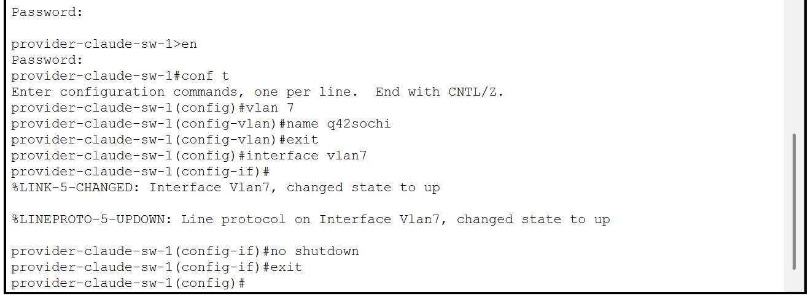
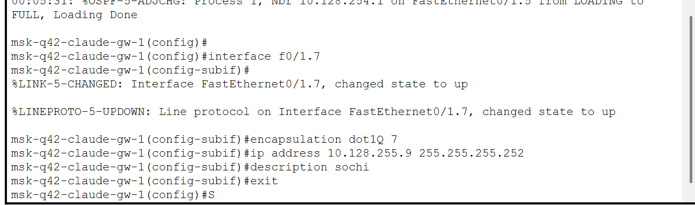
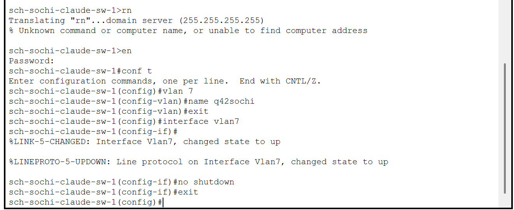
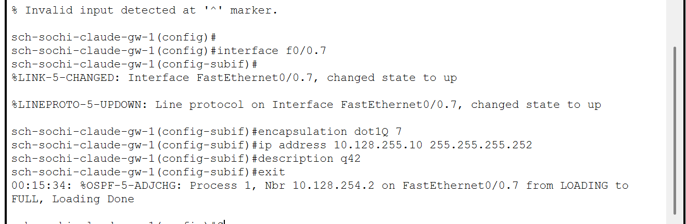

---
## Front matter
title: "Отчёт по лабораторной работе №15"
subtitle: "Администрирование локальных сетей"
author: "Бансимба Клодели Дьегра, НПИбд-02-22"

## Generic otions
lang: ru-RU
toc-title: "Содержание"

## Bibliography
bibliography: bib/cite.bib

## Pdf output format
toc: true # Table of contents
toc-depth: 2
lof: true # List of figures
lot: true # List of tables
fontsize: 12pt
linestretch: 1.5
papersize: a4
documentclass: scrreprt
## I18n polyglossia
polyglossia-lang:
  name: russian
  options:
	- spelling=modern
	- babelshorthands=true
polyglossia-otherlangs:
  name: english
## I18n babel
babel-lang: russian
babel-otherlangs: english
## Fonts
mainfont: IBM Plex Serif
romanfont: IBM Plex Serif
sansfont: IBM Plex Sans
monofont: IBM Plex Mono
mathfont: STIX Two Math
mainfontoptions: Ligatures=Common,Ligatures=TeX,Scale=0.94
romanfontoptions: Ligatures=Common,Ligatures=TeX,Scale=0.94
sansfontoptions: Ligatures=Common,Ligatures=TeX,Scale=MatchLowercase,Scale=0.94
monofontoptions: Scale=MatchLowercase,Scale=0.94,FakeStretch=0.9
mathfontoptions:
## Biblatex
biblatex: true
biblio-style: "gost-numeric"
biblatexoptions:
  - parentracker=true
  - backend=biber
  - hyperref=auto
  - language=auto
  - autolang=other*
  - citestyle=gost-numeric
## Pandoc-crossref LaTeX customization
figureTitle: "Рис."
tableTitle: "Таблица"
listingTitle: "Листинг"
lofTitle: "Список иллюстраций"
lotTitle: "Список таблиц"
lolTitle: "Листинги"
## Misc options
indent: true
header-includes:
  - \usepackage{indentfirst}
  - \usepackage{float} # keep figures where there are in the text
  - \floatplacement{figure}{H} # keep figures where there are in the text
---

# Цель работы

Настроить динамическую маршрутизацию между территориями организации.

# Выполнение лабораторной работы

Теперь откроем проект с названием lab_PT-14.pkt и сохраним под названием lab_PT-15.pkt. После чего откроем его для дальнейшего редактирования  (рис. @fig:001).

{#fig:001 width=70%}

Для начала настроим OSPF на маршрутизаторе msk-donskaya-claudely-gw-1. Включение OSPF на маршрутизаторе предполагает, во-первых, включение процесса OSPF командой router ospf, во-вторых — назначение областей (зон) интерфейсам с помощью команды network area.
Идентификатор процесса OSPF (process-id) по сути идентифицирует маршрутизатор в автономной системе, и, вообще говоря, он не должен совпадать с идентификаторами процессов на других маршрутизаторах. 
Значение идентификатора области (area-id) может быть целым числом от 0 до 4294967295 или может быть представлено в виде IP-адреса: A.B.C.D. Область 0 называется магистралью, области с другими идентификаторами должны подключаться к магистрали. 

{#fig:002 width=70%}

Проверим состояние протокола OSPF на маршрутизаторе msk-donskaya-claudely-gw-1. Маршрутизаторы с общим сегментом являются соседями в этом сегменте. Соседи выбираются с помощью протокола Hello. Команда show ip ospf neighbor показывает статус всех соседей в заданном сегменте. Команда show ip ospf route (или show ip route) выводит информацию из таблицы маршрутизации

{#fig:003 width=70%}

Далее приступим к настройке: маршрутизатора msk-q42-claude-gw-1, маршрутизирующего коммутатора msk-hostel-claude-gw-1, маршрутизатора sch-sochi-claude-gw-1 

{#fig:004 width=70%}

{#fig:005 width=70%}

{#fig:006 width=70%}

Следующим шагом настроим линк 42-й квартал–Сочи

{#fig:007

{#fig:008 width=70%}

{#fig:009 width=70%}

{#fig:010 width=70%}

# Выводы

В ходе выполнения лабораторной работы мы настроили динамическую маршрутизацию между территориями организации.

# Ответы на контрольные вопросы:

1.  Какие протоколы относятся к протоколам динамической маршрутизации? - OSPF, RIP, EIGRP.
2.  Охарактеризуйте принципы работы протоколов динамической маршрутизации. - Маршрутизаторы по протоколу делятся между собой информацией из своих таблиц маршрутизации и корректируют их в соответствии с остальными.
3.  Опишите процесс обращения устройства из одной подсети к устройству из другой подсети по протоколу динамической маршрутизации. – Вектор-Расстояние — маршрутизатор рассылает список адресов со сборным параметром расстояния (кол-во маршрутизаторов, производительность и т. д.) из доступных сетей. Состояние канала — маршрутизаторы обмениваются топологической (связи маршрутизаторов) информацией.
4.  Опишите выводимую информацию при просмотре таблицы маршрутизации. - Протокол Тип маршрута Адрес удаленной сети [Административная дистанция источника/Метрика маршрута] Следующий маршрутизатор Время последнего обновления маршрута Интерфейс.
