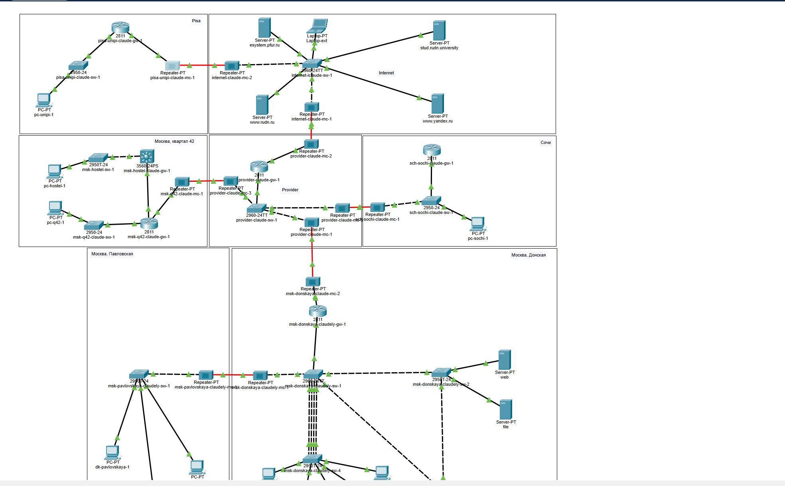
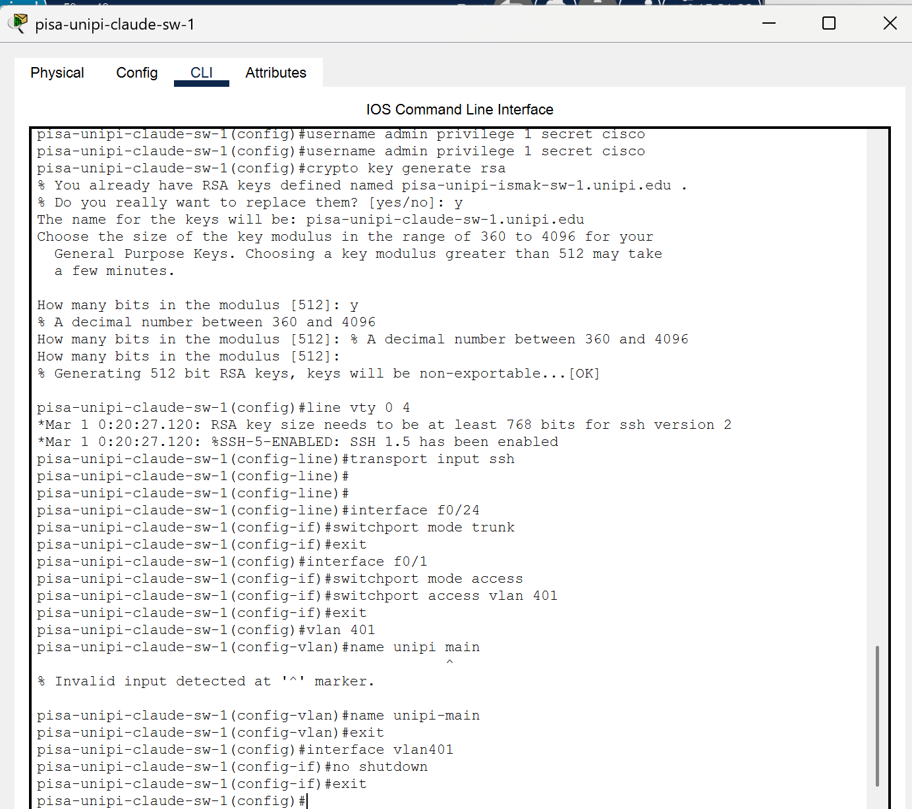

---
## Front matter
lang: ru-RU
title: Лабораторная работа №16
subtitle: Администрирование локальных сетей
author:
  - Бансимба К. Д.
institute:
  - Российский университет дружбы народов, Москва, Россия
date: 11/04/2025

## i18n babel
babel-lang: russian
babel-otherlangs: english

## Formatting pdf
toc: false
toc-title: Содержание
slide_level: 2
aspectratio: 169
section-titles: true
theme: metropolis
header-includes:
 - \metroset{progressbar=frametitle,sectionpage=progressbar,numbering=fraction}
---

# Информация

## Докладчик

:::::::::::::: {.columns align=center}
::: {.column width="70%"}

  * Бансимба Клодели Дьегра
  * студент
  * Российский университет дружбы народов
  * [1032215651@pfur.ru](mailto:1032215651@pfur.ru)
 
:::
::: {.column width="30%"}

:::
::::::::::::::

## Цель работы

Получить навыки настройки VPN-туннеля через незащищённое Интернет-соединение.

# Выполнение лабораторной работы

Откроем проект с названием lab_PT-15.pkt и сохраним под названием lab_PT-16.pkt. После чего откроем его для дальнейшего редактирования .

{#fig:001 width=70%}

# Выполнение лабораторной работы

Разместим в рабочей области проекта в соответствии с модельными предположениями оборудование для сети Университета г. Пиза

{#fig:002 width=70%}

# Выполнение лабораторной работы

{#fig:003 width=70%}

# Выполнение лабораторной работы

{#fig:004 width=70%}

# Выполнение лабораторной работы

{#fig:005 width=70%}

# Выполнение лабораторной работы

{#fig:006 width=70%}

# Выполнение лабораторной работы

{#fig:007 width=70%}

# Выполнение лабораторной работы

{#fig:008 width=70%}

# Выполнение лабораторной работы

{#fig:009 width=70%}

# Выполнение лабораторной работы

{#fig:010 width=70%}

# Выполнение лабораторной работы

{#fig:011 width=70%}

# Выполнение лабораторной работы

Далее настроим VPN на основе протокола GRE [25] 

{#fig:012 width=70%}

# Выполнение лабораторной работы

![Настройка маршрутизатора pisa-unipi-claude-gw-1.] (image/1.png){#fig:001 width=70%}%}}

# Выводы

В ходе выполнения лабораторной работы мы получили навыки настройки VPN-туннеля через незащищённое Интернет-соединение.

